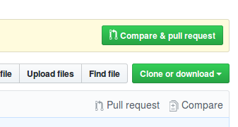
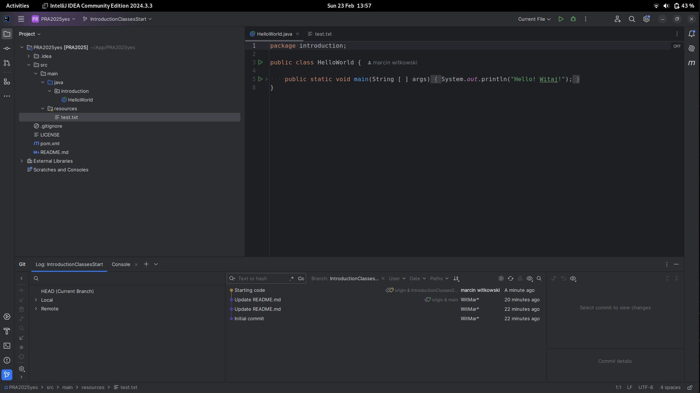
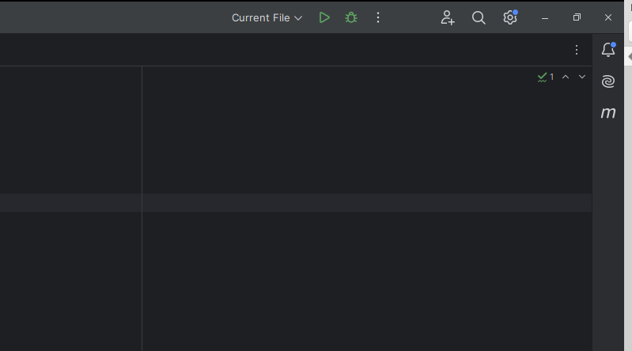

.. role:: todo

.. role:: raw-latex(raw)
            :format: latex html

==========================================
Programming Laboratory
==========================================

------------------------------------
Środowisko developerskie
------------------------------------

.. class:: important 

    Uwaga! Kod z którego będziemy korzystać na zajęciach jest dostępny na branchu **IntroductionClassesStart** w repozytorium https://github.com/WitMar/PRA2025.git . Kod końcowy można znaleźć na branchu **IntroductionClassesEnd**.

Edytor
=======

Implementując programy w języku Java, rekomendowanym (i aktualnie jednym z najpopularniejszych) IDE jest IntelliJ IDEA dostępny za darmo w wersji Community (link poniżej) (jako studenci możecie Państwo prosić o darmowy dostęp do wersji Ultimate - https://www.jetbrains.com/community/education/#students):

    | https://www.jetbrains.com/idea/download/

GIT
=======

Git:
Git to rozproszony system kontroli wersji, który pozwala na przechowywanie wersji kodu źródłowego w różnych gałęziach. Dzięki Gitowi możesz pracować nad nowymi funkcjami w oddzielnych gałęziach, a potem łączyć je z główną wersją (gałąź main lub master). Git daje ci dużą elastyczność w zarządzaniu wersjami kodu, ale nie narzuca określonego sposobu pracy z gałęziami.

Git posiada trzy stany, w których mogą znajdować się pliki: zatwierdzony, zmodyfikowany i śledzony. Zatwierdzony oznacza, że dane zostały bezpiecznie zachowane w Twojej lokalnej bazie danych. 
Zmodyfikowany oznacza, że plik został zmieniony, ale zmiany nie zostały wprowadzone do bazy danych. Śledzony - oznacza, że zmodyfikowany plik został przeznaczony do zatwierdzenia w bieżącej postaci w następnej operacji commit.

Podstawowy sposób pracy z Git wygląda mniej więcej tak:

	| * Dokonujesz modyfikacji plików w katalogu roboczym.
	|
	| * Oznaczasz zmodyfikowane pliki jako śledzone, dodając ich bieżący stan (migawkę) do przechowalni.
	|
	| * Dokonujesz zatwierdzenia (commit), podczas którego zawartość plików z przechowalni zapisywana jest jako migawka projektu w katalogu Git.

Gitflow
--------

Gitflow to konkretna metodologia rozwoju oprogramowania, która wprowadza szereg wytycznych dotyczących tworzenia i zarządzania gałęziami w projekcie. Gitflow organizuje cykl życia projektu na gałęzie przeznaczone do różnych celów, takich jak rozwój funkcji, poprawki błędów, wydania, etc. Jest to przydatne szczególnie w dużych zespołach, gdzie potrzebna jest większa kontrola nad procesem wytwarzania oprogramowania.

Podstawowe gałęzie w Gitflow:
-----------------------------

1. **`main`** - gałąź zawierająca stabilną wersję aplikacji, gotową do wdrożenia.
2. **`develop`** - gałąź, na której zbierane są wszystkie nowe funkcje i zmiany. To główna gałąź do pracy w trakcie cyklu życia projektu.
3. **`feature/`** - gałęzie wykorzystywane do pracy nad nowymi funkcjami. Są one tworzone na podstawie gałęzi `develop`.
4. **`release/`** - gałęzie przeznaczone do przygotowania nowego wydania. Pozwalają na testowanie i przygotowanie stabilnej wersji przed wdrożeniem.
5. **`hotfix/`** - gałęzie do szybkich poprawek błędów w wersji produkcyjnej.

Przykład różnic:
----------------

- **W Git** nie masz narzuconych zasad dotyczących gałęzi. Możesz pracować na jednej gałęzi lub tworzyć własne.
- **W Gitflow** masz określoną strukturę gałęzi, która wspomaga organizację pracy zespołowej. Zawsze pracujesz na gałęzi `develop` do tworzenia funkcji, a potem tworzysz gałęzie `release` i `hotfix`, jeśli jest to konieczne.

.. class:: center
	
	|a10|
	
.. |a10| image:: git.png	

.. class:: tag 

	Zadanie 1

Jeżeli nie posiadasz konta na platformie GitHub to załóż na nim konto
	
	| https://github.com/
	
Otwórz repozytorium

	| https://github.com/WitMar/PRA2025.git
	
Skopiuj adres http repozytorium do tego by otworzyć je w IntelliJ. Otwórz **Idea intellij** na swoim komputerze.

W przypadku, gdy uruchamiasz edytor poraz pierwszy zobaczysz wyskakujące okno i wybierz z niego **Project from version control**, w przypadku, gdy nie jest to Twoje pierwsze uruchomienie wejdź na **File-> New -> Project From Version Control** i następnie jako opcję wybierz (powinna być domyślnie wybrana) **Git**.

Skopiuj w pokazującym się nowym oknie adres dostępny po wybraniu na stronie GitHub opcji **CloneOrDownload** (uwaga wybierz adres z opcja HTTPS, adres w opcji SSH nie zadziała!!).

.. class:: center
	
	|1|
	

Domyślnie po uruchomieniu znajdujesz się na branchu **Main**, który u nas zawiera tylko plik Readme.
Wybierz w lewym dolnym rogu aplikacji nazwę brancha i przenieś się na branch **IntroductionClassesStart** (kliknij prawym przyciskiem myszy i checkout).

.. class:: center
	
	|a2|
	
.. |a2| image:: develop.png

Powinieneś uzyskać następujący efekt - z dokładnością do nazwy klasy. Uwaga jeśli kod nie jest pokolorowany tak jak oczekujesz (jak w przykładzie na dole) znaczy to, że środowisko nie rozpoznało automatycznie twojego pliku Mavena:

.. class:: center
	
	|kod|
	

W przypadku gdy środowisko nie wykrylo ustawień Maven (nie ma z prawej strpny na pasku kategorii z "m") wybierz ikonkę lupki i wpisz maven, wybierz opcję **Add Maven Project**.

.. class:: center
	
	|amm|
	

.. class:: center
	
	|aMV|
	
.. |aMV| image:: mavenAdd.png

Następnie znajdź katalog do którego ściągnąłeś kod i wybierz plik **pom.xml**. Powinieneś otrzymać poniższy wynik (spójrz na ikonki przy plikach!). Z prawej strony ekranu pojawiła się zakładka **Maven**, wybierz w niej opcję **COMPILE** i uruchom (zielony trójkąt w zakładce lub kliknij dwa razy napis compile).

.. class:: center
	
	|a3|
	

Jeżeli nadal kod nie jest dobrze pokolorowany wejdź w opcje **File -> Project Structure**, ustaw wersje Javy na 17 w zakładce **Project** oraz składni w zakładce **Module** też na java 17.

.. class:: center
	
	|a33|
	
.. |a33| image:: projectsettings.png

Sprawdź wersje kompilatora używanego przez IDE **File -> settings -> compiler**, też wybierz wersję Java 17.

.. class:: center
	
	|a113|
	
.. |a113| image:: java10.png
   
MAVEN
=======

Maven to system budowania aplikacji, który pomaga nam zautomatyzować proces kompilacji i generowania plików uruchomieniowych **jar-ów, war-ów** itp. Narzuca on specyficzną strukturę projektu.

    | * **pom.xml** – główny plik konfiguracji Maven
    
    | 
    
    | * **/src/main** – katalog, gdzie znajdziemy pliki naszego programu, są tam dwa podkatalogi: java – tutaj trafiają wszystkie klasy (cały kod naszego modułu)
    
    |   
    
    | * **resources** – tutaj będą wszystkie pliki, które nie są kodem, np. grafiki, pliki XML, konfiguracje w przypadku projektów webowych będziemy mieli także katalog webapp, który jest używany do umieszczania wszystkich treści webowych

    |

    | * **/src/test** - ma podobną strukturę jak katalog *main* z tą różnicą, że jest on wykorzystywany tylko w trakcie automatycznych testów (będzie to tematem kolejnych zajęć)
    
    |
    
    | * **/target** – tutaj trafia skompilowany projekt (czyli np. w postaci wykonywalnego pliku JAR lub aplikacji webowej WAR)

W prawym górnym rogu znajdziemy zakładkę "Maven". Jeżeli nie masz takiej zakładki włączysz ją poprzez wybranie 
**View -> Tool Windows -> Maven**.

Po rozwinięciu powinniśmy widzieć listę instrukcji (jeżeli nie wybieramy odśwież - dwie zielone strzałki, jak nie pomoże klikamy plusik i wskazujemy na plik **pom.xml** w naszym projekcie i ok).

.. class:: tag 

    Zadanie 2
    
Wykonaj w zakładce Mavena **Clean + Install**, powinieneś otrzymać komunikat BUILD SUCCESS

.. class:: center
	
	|a22|
	
.. |a22| image:: cleanInstall.png

Po tym etapie plik Main.java powinien mieć obok nazwy klasy kółeczko, jeżeli tak nie jest najlepiej powtórz wszystkie operacje od początku.

Więcej o Mavenie można znaleźć np tutaj:

    | https://kobietydokodu.pl/7-maven-i-tajemnice-pliku-pom-xml/

    | http://tutorials.jenkov.com/maven/maven-tutorial.html

Maven dokumentacja:

    | https://maven.apache.org/guides/getting-started/index.html 
    
Tworzenie pliku Jar w Maven:

    | http://www.baeldung.com/executable-jar-with-maven       
    
.. class:: tag 

    Zadanie 3
    
Spróbuj uruchomić klasę Main.java (pracy klik myszki i wybór opcji **Run**). Wykonaj to samo na pliku z rozszerzeniem .jar (*java -jar nazwa_pliku*) z katalogu o nazwie target. Zobacz jaki będzie efekt.

Dodaj do pliku Maven definicje manifestu dla pliku Jar. Aby to zrobić skorzystamy z dostępnego tzw. pluginu do Mavena. 

.. code:: XML

    <build>
        <plugins>
            <plugin>
                <groupId>org.apache.maven.plugins</groupId>
                <artifactId>maven-jar-plugin</artifactId>
                <version>2.4</version>
                <configuration>
                    <archive>
                        <manifest>
                            <mainClass>introduction.HelloWorld</mainClass>>
                        </manifest>
                    </archive>
                </configuration>
            </plugin>
        </plugins>
    </build>
    
**Main class** jest ścieżką do uruchamianej klasy.   
Uruchom plik jar raz jeszcze i zobacz wynik.    

Logger
===========

Bardzo ważnym i pomocnym elementem projektu informatycznego jest logowanie komunikatów / błędów. Szczególnie użyteczne są możliwości dzielenia logów na poziomy, zapisywanie automatyczne do pliku, a także możliwość analizy aplikacji wielowątkowych. Przykładem biblioteki do logowania jest **log4j**.

Aby używać w naszym projekcie biblioteki **log4j** dodajmy do naszego projektu (do pliku mavena **pom.xml**) zależność do biblioteki logowania log4j wklejając tam:

.. class:: highlight

.. code:: XML

    <dependencies>
        <dependency>
            <groupId>log4j</groupId>
            <artifactId>log4j</artifactId>
            <version>1.2.17</version>
        </dependency>
    </dependencies>

W ogólności jeżeli chcemy dodać bibliotekę log4j do projektu, aby znaleźć odpowiedni wpis wystarczy w google wpisać *maven log4j*. Pierwszy link powinien zaprowadzić nas na stronę:

    | https://mvnrepository.com/artifact/log4j/log4j 
    
Po wyborze wersji zobaczymy wpis:    

    | https://mvnrepository.com/artifact/log4j/log4j/1.2.17

Uwaga! Za pierwszym razem dodaliśmy tag **dependencies** w przyszłości będziemy tylko wklejać odpowiednie dependencje pomiędzy ten tag.

Odśwież zakładkę Mavena powieneś widzieć na niej nową kategorię o nazwie **Dependencies** a w niej jeden wpis na temat log4j.

Teraz dodamy do klasy Main.java wywołanie loggera. Dodaj do klasy zmienną globalną:

.. code:: python

    Logger log = Logger.getLogger("name");
    
Uwaga! Dodając nowy obiekt zwróć uwagę, że korzystać z biblioteki **log4j**, gdyż w Javie jest wiele bibliotek o nazwie Logger, i wykorzystanie innej nie zadziała tak jak chcemy. Innymi słowy spójrz czy w powstałym imporcie w nazwie klasy jest **log4j**.

Dodaj w metodzie main() wywołanie:

.. code:: python

    log.info("message");

.. class:: tag 

    Zadanie 4
    
Uruchom klasę Main.java zobacz czy widzisz wiadomość "message".

Log4j
------

Powód dla którego nie widzisz wiadomości jest to, że nie zdefiniowaliśmy ustawień loggera, w związku z czym informacje na nim zapisywane nie są nigdzie przekazywane.

Aby stworzyć pliku ustawień musimy utworzyć w katalogu **Resources** plik o nazwie **log4j.properties**;

Wklej do pliku następujące ustawienia:

.. code:: python

    # Root logger option
    log4j.rootLogger=DEBUG, stdout, file

    # Redirect log messages to console
    log4j.appender.stdout=org.apache.log4j.ConsoleAppender
    log4j.appender.stdout.Target=System.out
    log4j.appender.stdout.layout=org.apache.log4j.PatternLayout
    log4j.appender.stdout.layout.ConversionPattern=%d{yyyy-MM-dd HH:mm:ss} %-5p %c{1}:%L - %m%n

    # Redirect log messages to a log file, support file rolling.
    log4j.appender.file=org.apache.log4j.RollingFileAppender
    log4j.appender.file.File=log.log
    log4j.appender.file.MaxFileSize=5MB
    log4j.appender.file.MaxBackupIndex=10
    log4j.appender.file.layout=org.apache.log4j.PatternLayout
    log4j.appender.file.layout.ConversionPattern=%d{yyyy-MM-dd HH:mm:ss} %-5p %c{1}:%L - %m%n

Ustawienia mówią o tym by wszystkie logi o statusie ponad DEBUG były wypisywane na ekran i zapisywane w pliku log.log.   

Więcej informacji o log4j można doczytać tutaj:

    | https://www.mkyong.com/logging/log4j-hello-world-example/
    
.. class:: tag 

    Zadanie 5

Uruchom klasę Main.java, powinieneś zobaczyć na ekranie komunikat "message". W katalogu projektu powinnien też zostać stworzony plik o nazwie **log.log**.

JAR
-----    
   
JAR jest skompilowanym uruchamialnym plikiem javy. Możesz go uruchomić z IDE lub z konsoli wpisując komendę *java -jar filename*.
   
Spróbujmy uruchomić nasz skompilowany plik jar ponownie. Jak widać nie pojawia się w nim linijka z loggera. Jest to wynikiem tego, że domyślnie jar nie zawiera bibliotek i zależności w sobie oczekują że będą dostępne w katalogu uruchomieniowym.
Standardową opcją jest jednak "pakowanie" ich w pliku jar tak by był on samodzielnie uruchamialnym się programem. W tym celu musimy użyć innego pluginu Mavena.

Dodaj do pliku pom.xml (w odpowiednie miejsce!!) następujący kod:

.. class:: highlight

.. code:: XML
            
	<build>
		<plugins>
		<plugin>
			<groupId>org.apache.maven.plugins</groupId>
			<artifactId>maven-assembly-plugin</artifactId>
			<configuration>
			<descriptorRefs>
				<descriptorRef>jar-with-dependencies</descriptorRef>
			</descriptorRefs>
			<archive>
				<manifest>
					<mainClass>com.howtodoinjava.app.MainClass</mainClass>
				</manifest>
			</archive>
			</configuration>
		<executions>
			<execution>
				<id>make-assembly</id>
				<phase>package</phase>
				<goals>
				<goal>single</goal>
				</goals>
			</execution>
		</executions>
		</plugin>	
		</plugins>
	</build>
    
.. class:: tag 
    
    Zadanie 6

Skompiluj projekt używając **Clean + Install** w Maven i uruchom plik .jar z katalogu target, powinien zadziałać.

Commit
---------

.. class:: tag 
    
    Zadanie 7

Zakommituj swój kod do repozytorium pod nowy branch o nazwie IntroductionClassesWithLogger.
    
Commit w IntelliJ
------------------

    :todo:`Ctrl + k` służy do commitowania kodu lokalnie do repozytorium

    :todo:`Ctrl + Shift + k` służy do commitowania kodu do zewnętrznego repozytorium, aby wybrać nową nazwę brancha kliknij na nazwę brancha w okienku komitowania.

    :todo:`Ctrl + t` służy do odświeżania projektu - ściągania zmian z serwera

Przy pierwszym połączeniu powinniśmy być zapytani o użytkownika i hasło. Można też połączyć "na stałe" intellij z kontem na github przez ustawienia **Settings->Version Control->GitHub**.    
    
Inne: 

By rozwiązać konflikty należy zmergować się z kodem do którego commitujemy i rozwiązać konflikty w nowo otwartym oknie.

Aby ściągnąć kod danego commita do siebie bez merga gałęzi możemy wykonać operację **Cherry Pick**

GIT large files
---------------------

Czasem chcemy zapisać w repozytorium duże pliki (po kilkadziesiąt lub więcen megabajtów). Z reguły pliki takie nie zmieniają swojej postaci - są to media lub np modele sztucznej inteligencji. GIT przechowuje każdą wersję kodu jako kopię wszystkich plików, w takim
wypadku nasze repozytorium gwałtownie zwiększałoby swój rozmiar. Rozwiązaniem jest stosowanie tzw GLS czyli przechowywania w osobnym miejscu tylko zmieniających się wersji tych plików. 

	| https://docs.github.com/en/repositories/working-with-files/managing-large-files/configuring-git-large-file-storage
	
	| https://git-lfs.github.com/

Finalny kod
------------

W przypadku problemów (zgubiłeś się lub byłeś nieobecny) finalny kod powstały na zajęciach możesz znaleźć na gałęzi **IntroductionClassesEnd**.
	
