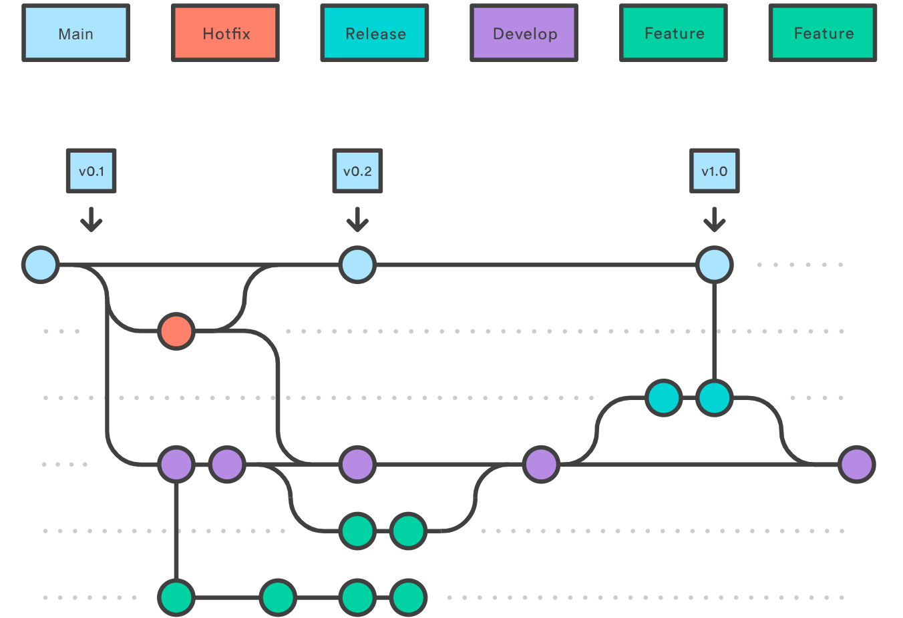
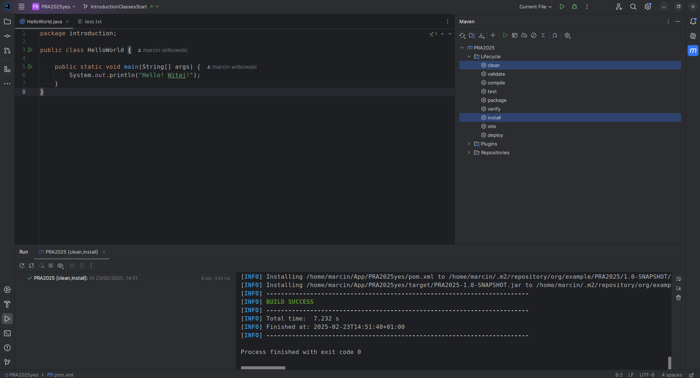

.. role:: todo

.. role:: raw-latex(raw)
            :format: latex html

==========================================
Programming Laboratory
==========================================

------------------------------------
Integrated Development Environment
------------------------------------

.. class:: important 

    Attention! The code for this classes can be found on the branch **IntroductionClassesStart** in the https://github.com/WitMar/PRA2020-PRA2021 repository. The ending code in the branch **IntroductionClassesEnd**.

Editor
=======

In the Java environment, the recommended IDE is IntelliJ IDEA available in the free Community version here (as a student you can ask for a free Ultimate version - https://www.jetbrains.com/community/education/#students):

    | https://www.jetbrains.com/idea/download/

GIT
=======

GIT is a software version control system (repository of code).

Every project under the distributed version control system Git, goes through three stages — Modified, Staged, and Committed.. **Modified** means that data has been safely stored in your local database. **Staged** means that the file has been changed and are ready to be send to repository. **Committed** - means that the modified file was send to repository. **Commit** is a set of new files that are being added to a project as part of the modification.

The basic way to work with Git looks something like this:

| * You modify the files in the working directory.
|
| * You mark the modified files as tracked by adding their current status (snapshot) to the vault.
|
| * You commit, during which the contents of files from the vault are saved as a project snapshot in the Git directory.

GIT FLOW your project is saved in a tree-like structure which consist of **branches**, depending on their roles they can be called tags, releases etc. Main branch in the repository is called a **master**. 

.. class:: center
	
	|a10|
	

.. class:: tag 

    Task 1

Create account on GitHub
	
	| https://github.com/
	
Open repository

	| https://github.com/WitMar/PRA2020-PRA2021
	
Select **Fork** to download the repository to your own account (this way you would be able to commit changes made on your computer).

Open IdeaJ, if you open it for the first time then choose **Project from version control**. Otherwise choose **File -> New -> Project From Version Control -> Git**.

Copy the address available after choosing **CloneOrDownload** (the HTTPS version, not the SSH one!)

.. class:: center
	
	|1|
	
.. |1| image:: clone.png

By default what you would see is a **master** branch of the repository. Go to lower right corner of the IDE and choose branch **IntroductionClassesStart**

.. class:: center
	
	|a2|
	
.. |a2| image:: develop.png

Note if the code is not highlighted properly it means that the environment did not automatically find your Maven file. If this is the case you can choose search icon on tools menu (top right corner) and write maven, choose option **Add Maven Project**.

.. class:: center
	
	|aMV|
	
.. |aMV| image:: mavenAdd.png

Next find the directory in which you download the project code and choose **pom.xml** file. You should obtain given below result (check icon next to java file!). 

.. class:: center
	
	|a3|
	
.. |a3| image:: screen.png

If the icon and java code is still not properly colored check options:

Choose **File -> Project Structure** set up (if there is something else than 11) Java version in tab **Project** and syntax version in tab **Module**.

.. class:: center
	
	|a33|
	
.. |a33| image:: projectsettings.png

Check compilation version in the IDE settings **File -> Settings -> Compiler**

.. class:: center
	
	|a113|
	
.. |a113| image:: java10.png
   
MAVEN
=======

Maven is an application development system that helps us automate the process of compiling and generating jar files, war files, etc. It also imposes a specific project structure:

    | * **pom.xml** – main configuration file
    
    | 
    
    | * **/src/main** – a directory where we can find files of our program, there are two sub-directories: java - all classes are here (the whole code of our module)
    
    |   
    
    | * **resources** – here will be all files that are not a code, e.g. graphics, XML files, configurations for web projects we will also have a webapp directory, which is used to put all web content

    |

    | * **/src/test** - has a similar structure to the *main* directory, with the difference that it is used only during automated tests
    
    |
    
    | * **/target** – here a compiled project goes (i.e. in the form of an executable JAR file or a WAR web application)

In the upper-right corner you will find the "Maven" tab. If it is not there go to **View -> Tool Windows -> Maven**.

After unfolding, we should see a list of instructions (if we do not choose to refresh - two rounded green arrows, if not, we will click the plus and point to **pom.xml** in our project).

.. class:: tag 

    Task 2
    
Choose in Maven tab **Clean + Install**, you should get BUILD SUCCESS message

.. class:: center
	
	|a22|
	

The Main.java file in your code should have round green circle next to it, if not repeat the steps from the beginning again.

More information about Maven can be found here (you can run maven also from console if you wish):

    | http://tutorials.jenkov.com/maven/maven-tutorial.html

Maven documentation:

    | https://maven.apache.org/guides/getting-started/index.html 
    
Creating maven files for executable java files:

    | http://www.baeldung.com/executable-jar-with-maven       
    
.. class:: tag 

    Task 3
    
Try to run class Main.java (right click with mouse and then choose **Run**). Try to run .jar file in the target directory. See what happens. We will fix it in a moment.

Logger
===========

A very important and helpful element of an IT project is logging messages / errors. Particularly useful are the ability to split logs into levels, save them automatically to a file, and the ability to analyze multithreaded applications. An example of a login library in java is **log4j**.

In order to use library we have to add a dependency (to the **pom.xml** file) in the maven setting file:

.. class:: highlight

.. code:: XML

    <dependencies>
        <dependency>
            <groupId>log4j</groupId>
            <artifactId>log4j</artifactId>
            <version>1.2.17</version>
        </dependency>
    </dependencies>

We want to add the log4j library to find the appropriate entry, just enter maven log4j in google. The first link should lead us to the appriopriate page:

    | https://mvnrepository.com/artifact/log4j/log4j 
    
After choosing the version, we will see the entry:  

    | https://mvnrepository.com/artifact/log4j/log4j/1.2.17

The first time we add a dependecy we add the **dependencies** tag in the xml. In the future, we'll just paste the appropriate dependencies between this tag.

Refresh Maven tab (choose round arrows). You should see new section in the tab called Dependencies with one element log4j dependency.
    
Add to class main.java logger.

.. code:: python

    Logger log = Logger.getLogger("name");
    
and in main method add

.. code:: python

    log.info("message");

.. class:: tag 

    Task 4
    
Try to run class Main.java, see if you can see the message "message".

Log4j
------

The reason why you can't see the message is that you did not set up the logger (meaning did not specify its settings).

In order to add setting to logger create the file **log4j.properties** in the **Resources** directory

Fill out this file as follows:

.. code:: python

    # Root logger option
    log4j.rootLogger=DEBUG, stdout, file

    # Redirect log messages to console
    log4j.appender.stdout=org.apache.log4j.ConsoleAppender
    log4j.appender.stdout.Target=System.out
    log4j.appender.stdout.layout=org.apache.log4j.PatternLayout
    log4j.appender.stdout.layout.ConversionPattern=%d{yyyy-MM-dd HH:mm:ss} %-5p %c{1}:%L - %m%n

    # Redirect log messages to a log file, support file rolling.
    log4j.appender.file=org.apache.log4j.RollingFileAppender
    log4j.appender.file.File=log.log
    log4j.appender.file.MaxFileSize=5MB
    log4j.appender.file.MaxBackupIndex=10
    log4j.appender.file.layout=org.apache.log4j.PatternLayout
    log4j.appender.file.layout.ConversionPattern=%d{yyyy-MM-dd HH:mm:ss} %-5p %c{1}:%L - %m%n

More examples on Log4j can be found at:

    | https://www.mkyong.com/logging/log4j-hello-world-example/
    
.. class:: tag 

    Task 5
    
Try to run class Main.java, now you should be able to see the message "message". Also in your project directory there should be created a file called **log.log**.

JAR
-----    
   
JAR is a java executable file. You can run jar from IDE or from console using *java -jar filename* command.
   
The jar file need to have a so-called manifest (run path) in order to run. Add the following code to **pom.xml**:

.. class:: highlight

.. code:: XML
    
    <build>
        <plugins>
            <plugin>
                <groupId>org.apache.maven.plugins</groupId>
                <artifactId>maven-assembly-plugin</artifactId>
                <executions>
                    <execution>
                        <phase>package</phase>
                        <goals>
                            <goal>single</goal>
                        </goals>
                        <configuration>
                            <finalName>${project.artifactId}-${project.version}</finalName>
                            <attach>false</attach>
                            <appendAssemblyId>false</appendAssemblyId>
                            <archive>
                                <manifest>
                                    <mainClass>
                                        introduction.HelloWorld
                                    </mainClass>
                                </manifest>
                            </archive>
                            <descriptorRefs>
                                <descriptorRef>jar-with-dependencies</descriptorRef>
                            </descriptorRefs>
                        </configuration>
                    </execution>
                </executions>
            </plugin>
        </plugins>
    </build>
    
Main class is the path to class that shall be run when jar is executed.

.. class:: tag 
    
    Task 6

Compile project using Clean + Install in Maven and run the .jar again, it should be working now.

Commit
---------

.. class:: tag 
    
    Task 7

Commit your code to repository as a new branch named IntroductionClassesWithLogger.
    
Commit w IntelliJ
------------------

    :todo:`Ctrl + k` to push code to local the repository

    :todo:`Ctrl + Shift + k` to commit code to remote repository

    :todo:`Ctrl + t` to synchronize code with repository (download code from remote repository)

Other: 

In case of conflicts in order to resolve conflicts, one must merge with the code to which we commit and resolve conflicts in the newly opened window.

Final Code
------------

In case of any problems (you get lost or were absent) you can find final code of the classes in branch named **IntroductionClassesEnd**.

	
	
