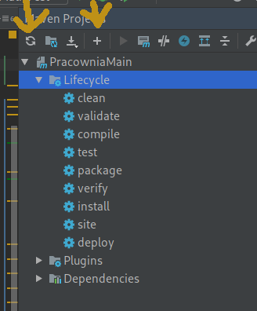
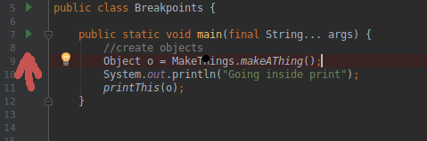
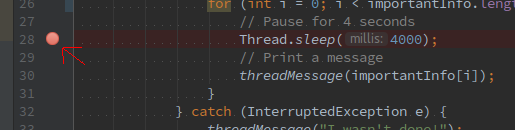
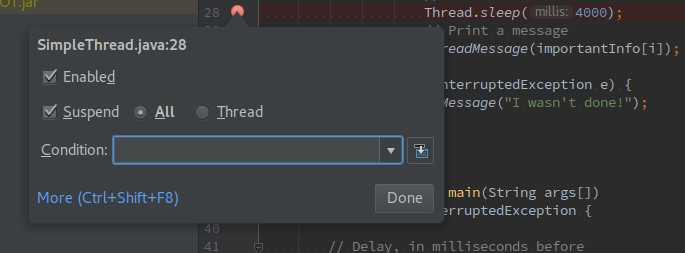
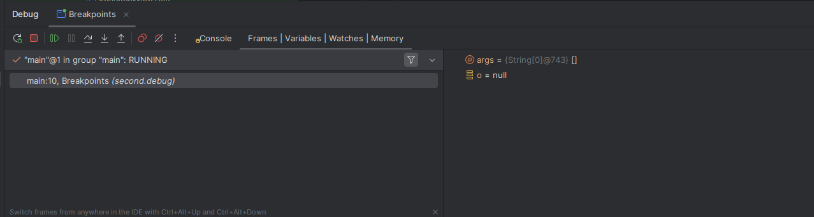
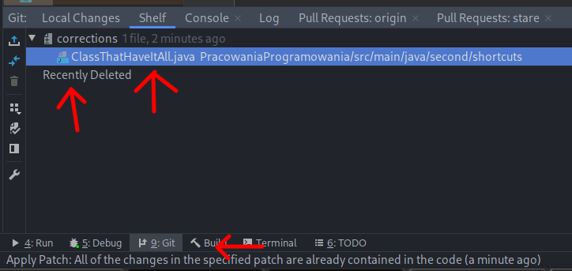

.. role:: todo

.. role:: hold

.. role:: important

.. role:: badimportant

.. role:: raw-latex(raw)
            :format: latex html
            
==========================================
Programming Laboratory
==========================================

.. class:: important 

    Attention! The code for this classes can be found on the branch **TestAndDebugStart** in the https://github.com/WitMar/PRA2020-PRA2021 repository. The ending code in the branch **TestAndDebugEnd**.
      
------------------------------
Debugging and testing in Java 
------------------------------

Summary of 1st classes
========================

What do should know after the first class:

    | * The project is divided into source catalogs - **src**, test files - **test**, resources - **resources**. Each of them having its specific purpose.

    | * In the project directory there is a file called **pom.xml** containing Maven settings, in this file we add links to external libraries and settings for building the application.
    
    | * The logger settings can be found in the file **log4.properties** in the **resources** directory. Whenever we use other library that require settings we put them in an appropriate named file in the resources directory.
        
    | * We work with Git branches - every new functionality (class topic) is assumed to be on a separate branch.

Git refresh changes from repository
=====================================
    
In order to download changes (synchronize) with Git repository, click **Ctr + T**, and if it does not help, choose **VCS-> Git-> Fetch** from the menu.      
    
Synchronization of the Git code with the original repository
==============================================================

Go to **VCS -> Git -> Remotes**

Add entry for the host repository

     | https://github.com/WitMar/PRA2020-PRA2021
    
give it some name.

Choose :hold:`Ctrl + T` to refresh dependencies.

If it does not work in order to download the changes select **VCS -> Git -> fetch**.

Then, on the branch list in the bottom right corner of the screen, you should see the branches from Class and from your repository.

Go to branch **TestAndDebugStart**   

Since we are moving into new repository it is possible that you need to set up maven again. Go to Maven Tab and check if you see the goals (Lifecycle, Plugin, Dependencies) if not try to refresh Maven. If this does not help choose the little plus and choose **pom.xml** from your local hard drive. Afterward click refresh in Maven again. That should help - check if your .java files have green circle next to them in the **Project view** tab.

.. class:: center
	

    
Useful IDE shortcuts in IdeaJ
=================================

List of IdeaJ shortcuts:

     | https://resources.jetbrains.com/storage/products/intellij-idea/docs/IntelliJIDEA_ReferenceCard.pdf

:hold:`Alt + Enter` (or a ligthbulb) show a hint for the IDE error solution
    
:hold:`Ctrl + W`,  :hold:`Ctrl + Shift + W` select the entire section, extend the selection, narrow the selection.

:hold:`Ctrl + Shift + F` search string in Project

:hold:`Ctrl + Shift + N` search for a file by name

:hold:`Shift + Shift` search everywhere

:hold:`Alt + Insert` generate code

:hold:`Ctrl + /` comment on the line

:hold:`Ctrl + Shift + /` uncomment lines

:hold:`Ctrl + E` files last opened

:hold:`Ctrl + Alt + L` format the code with default formatting settings

:hold:`Tab`, :hold:`Shift + Tab` indent, undo indent

:hold:`Shift + F6` change the name

:hold:`Ctrl + Shift + Alt + T` refactor

:hold:`Ctrl + Alt + M` Extract the method

:hold:`Alt + Right / Left` go to next previous tab

:hold:`Ctrl + Alt + Right / Left` navigate back/forward

:hold:`Alt + F7` find usages

:hold:`Ctrl + (click on method name)` show usage

:hold:`Ctrl + Alt + (click on method name)` show the implementation

:hold:`Ctrl + K` is used to commit the code locally to the repository

:hold:`Ctrl + Shift + K` is used to commit code to an external repository

:hold:`Ctrl + T` is used to refresh the project - download changes from the server

:badimportant:`Attention!!` If you use Linux or other non-Windows operating system (or a remote desktop) some of those shortcuts might be already reserved in the system, then you either need to change the system settins or change them in **Settins->Keymap** in Intellij

.. class:: tag

    Task

Move (if you are not there yet) to branch **TestAndDebugStart**.

Search for a class named **ClassThatHaveItAll** (Ctrl + Shift + N).

Format the code (Ctrl + Alt + L) in computers at University for system linux this shortcut is design to log out from account. Change the shortcut setting in the system if you want to use this shortcut in IntelliJ.

Add to the class a parameter

.. class:: highlight

.. code:: java

    List<Long> list;

Choose an automatic error correction (Alt + Enter).

Then select (Alt + Insert) to generate the constructor, and setters and getters for the class.

Find the interface called **InterfaceOne** (Ctr + Shift + f). Search for the use and implementations of the method **printMe()** (Ctrl + click on the method name) by clicking on either the definition or the usage of the method.

Find usages of the method **printMe** (Alt+F7).

Check how to move between tabs (Alt + right/left) and navigate to previous changes (Ctrl + Alt + right/left).

Debug
======

You can run code execution in Debug mode by choosing **Run -> Debug** or by choosing the right mouse button on the class and then **Debug**.

You can also click on the green triangle next to the class name to **Run** or **Debug** the Class

.. class:: center
	

What is debugging?

    | https://www.codeproject.com/Articles/991643/What-is-Debugging-How-to-Debug-A-Beginners-Guide

Helpful in debugging are the so-called **breakpoints**, places in which we want the execution to stop in execution so that we can check variables values. To add a breakpoint, click next to the line number so that a red dot appears.

.. class:: center
	

After clicking right mouse button on the dot, we can also specify a special condition on which the breakpoint should work.

.. class:: center

After launching the debug mode, the debug window appears on the bottom of the screen. You can find there the current values of the variables. Additionally, we can choose by :hold:`Alt + F8` or by clicking on the calculator icon a window for evaluation of expressions. Expression can be useful in debugging large structures like lists which are hard to go through one-by-one.

.. class:: center

With the appropriate settings, it is also possible to debug applications running on the server at runtime (more on this subject in future classes).

.. class:: tag

    Task

Run the **Breakpoints** class. What error has occurred ?

Debug the execution of the class **Breakpoints**.

To stop the call, add a breakpoint in the class.

Use **F8** (or the down arrow on the debug panel) to move the code execution line by line.

Use StepInto - **F7** (right-down arrow on the debug panel) to enter the method call.

Find and correct the error.    

.. class:: tag

    Task

Start the class **EvaluateExpressions**. What error has occurred?

Set the breakpoint in the **ProcessElementAtIndex** method.

Open the evaluation window and enter in it a line **list.get(index)**.

Choose **F9** (green triangle on the debug panel) to movo onto the next breakpoint execution and preview the variable values.

To check how the list look like enter in evaluation window

.. class:: highlight

.. code:: java

    Collections.reverse(list); 
    list

Find and correct the error.

.. class:: tag

    Task
    
Run the class **ConditionalBreak**. What error has occurred?

On line 18, set the normal breakpoint is it easy to find the error?

Set the conditional breakpoint to stop when **!everythingIsOk**.

As you might notice breakpoint is not working, move it to the line 19.

Run the code, what caused the error?

Shelve ans Stash
==================

Shelve
-------

Sometimes you need to switch between different tasks with things left unfinished and then return back to them. IntelliJ IDEA provides you with a few ways to conveniently work on several different features without losing your work:

    * create new branch for separate code

    * stash or shelve pending changes
    
Stashing changes is very similar to shelving. The only difference is in the way patches are generated and applied. Stashes are generated by Git, and can be applied from within IntelliJ IDEA, or outside it. Patches with shelved changes are generated by IntelliJ IDEA and are also applied through the IDE. Also, stashing involves all uncommitted changes, while when you put changes to a shelf, you can select some of the local changes instead of shelving them all.   

:badimportant:`You cannot shelve unversioned files, which are files that have not been added to version control.`

In the **Local Changes** view on **Git** tab under the code, right-click the files or the changelist you want to put to a shelf and select **Shelve** changes from the context menu. 

.. class:: center

Stash
-----

Sometimes it may be necessary to revert your working copy to match the HEAD commit but you do not want to lose the work you have already done.

To stash choose **Git | VCS Operations | Stash Changes**, to unstash choose **Git | VCS Operations | Unstash Changes**.

If you want to create a new branch on the basis of the selected stash instead of applying it to the branch that is currently checked out, type the name of that branch in the As new branch field. 

JUnit
=======

JUnit is the most popular library for writing code tests in Java. The tests are aimed at controlling the quality of the code, check various call paths, as well as maintain error-free state of the code.

The Maven build process by default runs **all tests** in the process of creating an executable file.

First, we need to add in the **pom.xml** file the dependence for the test module.

    | https://mvnrepository.com/artifact/junit/junit/4.12

In our branch, a test class is already created, but to add a new one, the following operations should be performed:

Enter the class **AdvanceMath** and select :hold:`Ctrl + Shift + T`, click create to create new Test. To achieve the same thing differently you can choose the class name and click :hold:`Alt + Enter` and select create test.

The JUnit library uses the so-called annotations. Before each method that is designed to be run as a test, we put **@Test**.

Another important annotation is **@Before** which allows us to define the operations that will be performed before running each test.

Sample testing class:

.. class:: highlight

.. code:: java

    package second.junit;

    import org.apache.log4j.Logger;
    import org.junit.Assert;
    import org.junit.Before;
    import org.junit.Test;

    import static org.junit.Assert.*;
    
    public class AdvanceMathTest {

        AdvanceMath math;
        final static Logger logger = Logger.getLogger(AdvanceMath.class);

        @Before
        public void setUp(){
            logger.info("Run setUp");
            math = new AdvanceMath();
        }
    
        @Test
        public void additionTest() {
            Integer a = math.addition(1,4);
            assertTrue(a==5);
        }
    
        @Test
        public void additionTestString() {
            long a = math.addition("1",4);
            Assert.assertEquals(5L, a);
        }
        
        
        @Test(expected = Exception.class)
        public void additionTestString2() {
            int a = math.addition("a1",4);
        }
        
    }
    
You can run the test by clicking on the class and choosing **run** or by the Maven tab -> **Test**. Tests are also executed automatically when you perform **Install** in Maven.    

Examples of using the JUnit library:

     | http://www.mkyong.com/tutorials/junit-tutorials/
    
It is recommend you to look at examples on how to test lists and maps.

AssertJ
--------

For checking state of the variables after test were performed we can use a library called AssertJ. 

Add in the **pom.xml** file the dependence for the assertj module.

    | https://mvnrepository.com/artifact/org.assertj/assertj-core/3.17.2
        
        
Check **Frodo.java** class from test folder.        
        
Documentation of the library:
    
    | https://assertj.github.io/doc/ 

.. [*] Material sources:
	
https://imagej.net/Debugging_Exercises	

https://www.jetbrains.com/help/idea/work-on-several-features-simultaneously.html#shelve

Extra
======

Good practices of code development
------------------------------------

* Make indents inside loops and if-statements 

.. class:: highlight

.. code:: java

    function foo() {
        if ($maybe) {
            do_it_now();
            again();
        } else {
            abort_mission();
        }
        finalize();
    }

* You can deal with curly brackets also like this:    
    
.. class:: highlight

.. code:: java
    
    function foo()
    {
        if ($maybe)
        {
            do_it_now();
            again();
        }
        else
        {
            abort_mission();
        }
        finalize();
    }
        
* Use blank lines consistently and as required. Blank lines may be used for separating  code lines or line groups semantically for readability.        

* Character count of a line should be limited for readability. 
        
* Name variables, procedures, functions in sensible way, start with small letter and introduce new word with capital letter

.. class:: highlight

.. code:: java

    studentsCounter;
    listIterator;
    averageOverLastWeek;
    findBestInClass();
    computeAverage();
    
* Name classes in sensible way, start with capital letter and introduce new word with capital letter    

.. class:: highlight

.. code:: java

    NightShift;
    FastCar;

* Name constant values with all capital letters, separate words with **_**

.. class:: highlight

.. code:: python

    DAYS_IN_THE_WEEK();
    NUMBER_OF_SHIFTS();
    
* Using space chars in code should also be consistent in whole application. Generally, situations below are suitable for using spaces:

* Between operators and operands: 

.. class:: highlight

.. code:: java

    a += b , c = 0; (a == b)

* Between statement keywords and brackets: 

.. class:: highlight

.. code:: java
    
    if (value) {, public class A { 

* After ';' char in loops: 

.. class:: highlight

.. code:: java

    for (int i = 0; i < length; i++) 

* Between type casters and operands: 

.. class:: highlight

.. code:: java

    (int) value , (String) value
    
