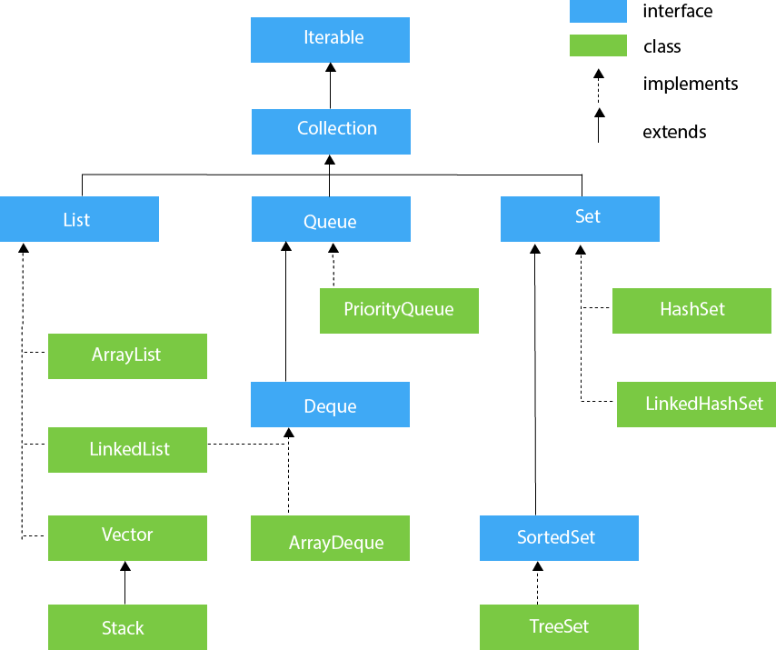

.. role:: todo

.. role:: hold

.. role:: raw-latex(raw)
            :format: latex html

==========================================
Pracownia Programowania
==========================================

.. class:: important 

    Uwaga! Kod do zajęć znajduje się na gałęzi **StreamsClassesStart** w repozytorium https://github.com/WitMar/PRA2025 . Kod końcowy w gałęzi **StreamsClassesEnd**.

Jeżeli nie widzisz odpowiednich gałęzi na GitHubie wykonaj **Ctr+T**, a jak to nie pomoże to wybierz z menu **Git->Fetch**.     
   
------------------------------
Interfejsy w Javie
------------------------------

Interfejs w Javie to zbiór abstrakcyjnych metod, które określają, jakie operacje musi implementować klasa, ale nie zawierają ich implementacji (do Javy 8). Interfejsy pozwalają na definiowanie kontraktów, które klasy muszą spełniać, co ułatwia programowanie obiektowe oraz zapewnia elastyczność i wielokrotne dziedziczenie (ponieważ klasa może implementować wiele interfejsów).

Od Javy 8 interfejsy mogą zawierać również metody domyślne (*default methods*) i statyczne (*static methods*), które mają implementację.

Przykład interfejsu w Javie
~~~~~~~~~~~~~~~~~~~~~~~~~~~~~~~~~  

1. Definiowanie interfejsu:

.. class:: highlight

.. code:: java

    interface Zwierze {
        void dajGlos(); // Metoda abstrakcyjna (brak implementacji)
    }

2. Implementacja interfejsu w klasie:

.. class:: highlight

.. code:: java

    class Pies implements Zwierze {
        @Override
        public void dajGlos() {
            System.out.println("Hau Hau!");
        }
    }

3. Implementacja interfejsu w innej klasie:

.. class:: highlight

.. code:: java

    class Kot implements Zwierze {
        @Override
        public void dajGlos() {
            System.out.println("Miau Miau!");
        }
    }

4. Użycie interfejsu:

.. class:: highlight

.. code:: java

    public class Main {
        public static void main(String[] args) {
            Zwierze pies = new Pies();
            Zwierze kot = new Kot();

            pies.dajGlos(); // Wywoła "Hau Hau!"
            kot.dajGlos();  // Wywoła "Miau Miau!"
        }
    }

Podsumowanie
~~~~~~~~~~~~~~~~~~~~

- Interfejsy definiują kontrakt dla klas.
- Klasa może implementować wiele interfejsów (co nie jest możliwe w przypadku dziedziczenia klas).
- Od Javy 8 interfejsy mogą zawierać metody domyślne i statyczne z implementacją.
- Pozwalają na luźniejsze powiązania między komponentami w programowaniu obiektowym.

    
----------------
Kolekcje
----------------

Kolekcje w Java:

.. class:: center
	
	|col|
	

.. class:: center
	
	|map|
	
.. |map| image:: map.png	

Przykłady:

.. class:: highlight

.. code:: java

	List<Integer> list = new ArrayList<>();
	Set<Integer> list = new HashSet<>();
	
Interfejs mówi nam, że operujemy na obiekcie Listy ze wszystkimi jej możliwościami natomiast prawa strona mówi nam z jakiej implementacji będziemy korzystać (np. dla ArrayList wstawianie elementu na środku listy będzie szybkie, natomiast dla LinkedList wydajniejsza będzie operacja usuwania elementu z listy).	
	
	
Mapy
~~~~~~~~~~~~~~~~~~~~~~~~~	

Mapy to struktury danych opartych na relacji klucz-wartość, w niektórych językach struktura ta jest nazywana słownikiem. Najpopularniejszą implementacją Mapy jak HashMapa oparta na funkcji skrótu mapującej klucz na miejsce w pamięci.
	
HashMap nie daje żadnej gwarancji wzlędem kolejności elementów na mapie. Oznacza to, że nie możemy przyjąć żadnej kolejności podczas iteracji po kluczach czy wartościach hash mapy:

.. class:: highlight

.. code:: java

	@Test
	public void whenInsertObjectsHashMap_thenRandomOrder() {
		Map<Integer, String> hashmap = new HashMap<>();
		hashmap.put(3, "TreeMap");
		hashmap.put(2, "vs");
		hashmap.put(1, "HashMap");
    
		assertThat(hashmap.keySet(), containsInAnyOrder(1, 2, 3));
	}

Elementy w TreeMap są sortowane zgodnie z ich naturalną kolejnością.	
  
  
    
------------------------------
Fluent API
------------------------------

Termin "Fluent Interface" został wymyślony przez Martina Fowlera i Erica Evansa. Fluent API oznacza zbudowanie API w taki sposób, aby spełniało następujące kryteria:

    | * Programista może bardzo łatwo zrozumieć interfejs API.
    | * Interfejs API może wykonać szereg działań na raz (w Javie możemy to zrobić za pomocą szeregu wywołań metod (łańcuchy metod)).
    | * Nazwa każdej metody powinna być związana z domeną, w której operuje.
    | * Interfejs API powinien być wystarczająco sugestywny, tak by wskazać użytkownikom interfejsu API, co robić dalej i jakie możliwe operacje mogą podjąć użytkownicy w danym momencie.
    
Najczęstsze zastosowanie to tworzenie tzw. **The Fluent Interface builder** dobra praktyka mówi, żeby używać go, gdy konstruktor ma więcej niż cztery lub pięć parametrów, tworzymy wtedy specjalną klasę konstruktora, która pomaga w tworzeniu obiektów.

Główną ideą jest by zamiast:      

.. class:: highlight

.. code:: java

	Person(String name, Title title) {
		this.name = name;
		this.title = title;
	}
    
	Person adam = new Person("Adam Z.", Title.PROF);
	 
użyć łatwiejszej w analizie fasady otaczającej konstruktor w formie tzw. **buildera**:

.. class:: highlight

.. code:: java

  public class PersonBuilderBuilder implements IPersonBuilder {
    Title title;
    String name;

    public Person build() {
        Person person = new Person(this.name, this.title);
        return person;
    }

    @Override
    public IPersonBuilder withName(String name) {
        this.name = name;
        return this;
    }

    @Override
    public IPersonBuilder withTitle(Title title) {
        this.title = title;
        return this;
    }
  }

    PersonBuilderBuilder personBuilder = new PersonBuilderBuilder();
    Person person = personBuilder.withName("Marcin Witkowski")
            .withTitle(Title.DR)
            .build();
            
Co znacznie ułatwia odczytanie i zrozumienie kodu.

W powyższym przykładzie używamy również interfejsów, które w ogólności nie są konieczne do stosowania (zadane metody możemy zaimplementować także bez występowania interfejsu), popatrz także na przykład:

 | http://www.javabyexamples.com/builder-vs-fluent-interface/

Ten sam pomysł można zastosować nie tylko w przypadku budowy nowego obiektu, ale także do zarządzania obiektami i ich metodami.

Kluczowym elementem tej techniki jest to, że implementacja **fluent API** wymaga przekazania tego samego obiektu jako wyniku funkcji (**return this**).

Ponownie w przykładzie używamy interfejsu, który w ogólności nie jest konieczny:

.. class:: highlight

.. code:: java

  public class Person implements IPerson {
    List<Person> friends = new ArrayList<>();
    String name;
    Enum title;

    @Override
    public IPerson addFriend(Person friend) {
        this.friends.add(friend);
        return this;
    }
  }

Aby dodać znajomego dla osoby, wykonujemy metodę addFriend(), która zwraca obiekt **IPerson**, który pozwala nam korzystać łańcuchowo z innych metod (podobnie działają potoki w systemach operacyjnych).
      
.. class:: highlight

.. code:: java

	adam.addFriend(Ben).addFriend(Barrack).addFriend(John);
	
.. class:: tag    
    
    Task 1: Builder

Przejdź do klasy MainFluentApi i stwórz obiekt klasy Person korzystając z Buildera. Sprawdź czy możesz stworzyć obiekt korzystając z konstruktora klasy poprzez operator **new Person()**.

.. class:: tag    
    
    Task 2: Friends

Stwórz dwie inne osoby i dodaj je jako przyjaciół pierwszej z osób.

.. class:: tag    
    
    Task 3: Hello

Zaimplementuj metodę sayHelloToFriends w klasie  Person tak by wypisywała ona na ekran \"Hello <person name>\". Sprawdź czy implementacja działa.

------------------------------
Wyrażenia Lambda w Javie
------------------------------

Wyrażenia lambda (*lambda expressions*) zostały wprowadzone w Javie 8 i umożliwiają bardziej zwięzły zapis funkcji anonimowych. Ułatwiają pracę z interfejsami funkcyjnymi, co prowadzi do bardziej czytelnego i zwięzłego kodu.

Składnia
~~~~~~~~~~~~~~~~~~~~~~~~

Wyrażenie lambda składa się z:

- Listy parametrów w nawiasach :todo:`(param1, param2, ...)`
- Strzałki :todo:`->`, oddzielającej parametry od ciała wyrażenia
- Ciała wyrażenia, które może być pojedynczą instrukcją lub blokiem kodu

Przykład
~~~~~~~~~~~~~~~~~~~~~~~~

.. class:: highlight

.. code:: java

    @FunctionalInterface
    interface Kalkulator {
        int operacja(int a, int b);
    }

    public class Main {
        public static void main(String[] args) {
            Kalkulator dodawanie = (a, b) -> a + b;
            System.out.println("Wynik: " + dodawanie.operacja(5, 3)); // Wynik: 8
        }
    }

Zastosowanie
~~~~~~~~~~~~~~~~~~~~~~~~

- Programowanie funkcyjne
- Przetwarzanie kolekcji z *Stream API*
- Obsługa zdarzeń w GUI
- Współpraca z interfejsami funkcyjnymi w Javie (np. `Runnable`, `Comparator`)

Podsumowanie
~~~~~~~~~~~~~~~~~~~~~~~~

- Lambda expressions upraszczają kod i eliminują potrzebę stosowania klas anonimowych.
- Można je stosować tylko w interfejsach funkcyjnych (z jedną metodą abstrakcyjną).
- Znacząco poprawiają czytelność i zwięzłość kodu.

Function
~~~~~~~~~~~~~~~~~~~~~~~~            
    
Function to specjalny interfejs w javie do definiowania funkcji. Posiada on trzy główne metody. 

Wyróżniamy trzy rodzaje funkcji : **Function** (która przyjmuje i zwraca argumenty), **Consumer** (która przyjmuje arumenty, ale nic nie zwraca) oraz **Producer** (który produkuje dane, ale nie pobiera argumentów). 

apply() 
^^^^^^^^
apply uruchamia wykonanie funkcji dla zadanych parametrów

.. class:: highlight

.. code:: java
  
  Function<Integer, Double> half = a -> a / 2.0; 
    // apply the function to get the result 
  System.out.println(half.apply(10)); 

addThen()
^^^^^^^^^
zwraca funkcje złożoną, gdzie funkcja będąca argumentem zostanie wykonana po oryginalnej funkcji

.. class:: highlight

.. code:: java

  Function<Integer, Double> half = a -> a / 2.0; 
  // Now treble the output of half function 
  half = half.andThen(a -> 3 * a); 
  // apply the function to get the result 
  System.out.println(half.apply(10)); 

identity()
^^^^^^^^^^^
zwraca funkcję identycznościową (zwracającą na wyjście to co podamy na wejściu).

.. class:: highlight

.. code:: java

  Function<Integer, Double> half = a -> a / 2.0;
  // Now treble the output of halffunction 
  half = half.andThen(Function.identity());
  // apply the function to get the result 
  System.out.println(half.apply(2));   
  
Do definiowania funkcji możemy użyć **wyrażeń Lambda**.

Przykłady funkcji i ich wywołań znajdziesz w klasie **Functions.java**.

.. class:: tag    
    
    Task 4: Process

Wykorzystaj lambda expression w klasie MainFluentAPI tak by metoda processFriends() czyściła listę przyjaciół. Uwaga w wyrażeniu lambda możemy też zapisać funkcję jako :todo:`params -> {many operations + return}`.

Zrób to samo z funkcją processFriendsInPlace() ta funkjca jest Consumentem więc nie musisz zwracać argumentu!.

.. class:: tag    
    
    Task 5: Best friend

Zaimplementuj funkcję wyboru **best friend** tak by wybierała jako najlepszego przyjaciela pierwszy element listy przyjaciół. Sprawdź co stanie się gdy lista będzie pusta.

----------------------------
Operator :todo:`::` w Javie
----------------------------

Operator :todo:`::` w Javie, zwany **referencją do metody** (*method reference*), jest skróconą formą wyrażeń lambda. Pozwala na przekazywanie metod jako argumentów do innych metod.

Rodzaje referencji do metod
~~~~~~~~~~~~~~~~~~~~~~~~~~~~~~~~~~~~~~~~~~~~~~~~

1. **Referencja do metody statycznej**

.. class:: highlight

.. code:: java

    class Utils {
        static int kwadrat(int x) {
            return x * x;
        }
    }

    public class Main {
        public static void main(String[] args) {
            Function<Integer, Integer> funkcja = Utils::kwadrat;
            System.out.println(funkcja.apply(5)); // Wynik: 25
        }
    }

2. **Referencja do metody instancyjnej**

.. class:: highlight

.. code:: java

    class Printer {
        void drukuj(String tekst) {
            System.out.println(tekst);
        }
    }

    public class Main {
        public static void main(String[] args) {
            Printer printer = new Printer();
            Consumer<String> funkcja = printer::drukuj;
            funkcja.accept("Witaj, świecie!"); // Witaj, świecie!
        }
    }

3. **Referencja do konstruktora**

.. class:: highlight

.. code:: java

    class Osoba {
        String imie;
        Osoba(String imie) {
            this.imie = imie;
        }
    }

    public class Main {
        public static void main(String[] args) {
            Function<String, Osoba> konstruktor = Osoba::new;
            Osoba osoba = konstruktor.apply("Jan");
            System.out.println(osoba.imie); // Jan
        }
    }

Podsumowanie
~~~~~~~~~~~~~~~~~~~~~~~~

- Operator :todo:`::` jest skrótem dla wyrażeń lambda, gdy wywołujemy istniejące metody.
- Może być używany do odwoływania się do metod statycznych, metod instancyjnych i konstruktorów.
- Ułatwia kodowanie, sprawiając, że wyrażenia są bardziej czytelne i zwięzłe.

------------	
Strumienie
------------

Tradycyjnie w Javie do przechodzenia po kolekcjach korzystaliśmy z jawnych iteratorów  

.. class:: highlight

.. code:: java

    List <String> names = new ArrayList <>();
    for (Student student: students) {
        if (student.getName ().startsWith("A")) {
            names.add (student.getName ());
        }
    }

Wykorzystując strumienie korzystamy z tzw. *wewnętrznych iteracji* zapisanych za pomocą Fluent API, to znaczy logika iteracji po elementach jest dla nas ukryta a skupiamy się na ich przetwarzaniu.        
        
.. class:: highlight

.. code:: java

  List <String> namesNewJava = students.stream()
                .map(student -> student.getName())
                .filter (name-> name.startsWith("A"))
                .collect (Collectors.toList());
    
			
Operacje na strumieniach
~~~~~~~~~~~~~~~~~~~~~~~~~

Operacja na strumieniach dzielimy na **pośrednie** i **końcowe** (terminalne). Operacje pośrednie zwracają jako wynik działania strumień (czyli są elementem wywołań łańcuchowych). W powyższym przykładzie takimi
operacjami są *map i filter*. Operacje terminalne kończą przetwarzanie, zwykle agregują one wyniki, zliczają wartości, albo też nic nie wykonują (np. operacja foreach może 
być terminalna). Powyżej przykładem takiej operacji jest *collect*.

Dla operacji numerycznych stworzono specjalne strumienie **IntStream, DoubleStream, and LongStream.**

.. class:: highlight

.. code:: java

	IntStream.rangeClosed(1, 10).forEach(num -> System.out.print(num));
	// ->12345678910
	IntStream.range(1, 10).forEach(num -> System.out.print(num));
	// ->123456789
	
Budowa strumieni
~~~~~~~~~~~~~~~~~~~~~~~~~

Stream stałych i elementów tablicy i wykorzystanie funkcji forEach do przejścia przez strumień.

.. class:: highlight

.. code:: java

	Stream.of("This", "is", "Java8", "Stream").forEach(System.out::println);
	
	String[] stringArray = new String[]{"Streams", "can", "be", "created", "from", "arrays"};
	Arrays.stream(stringArray).forEach(System.out::println);

---------------------
Elementy strumieni
---------------------

Aby przetworzyć obiekt na strumień wykorzystujemy metodę **stream()**. Następnie korzystamy z operacji by przetwarzać dane strumieniowe. 

.. class:: tag    
    
    Task 7: Strumienie

Zobacz w klasie **MainStreams** jakiego typu jest poniższy obiekt:

.. class:: highlight

.. code:: java

	whatIsIt = students.stream().filter(s -> s.getName().length() > 2);

**Filter**
~~~~~~~~~~~
	
Wybiera elementy ze strumienia względem danego warunku

.. class:: highlight

.. code:: java

	students.stream()
			.filter(student -> student.getScore() >= 60)
			.collect(Collectors.toList());

**Map**
~~~~~~~~~
	
Zmienia przetwarzany element na coś innego, czyli pobiera element jednego typu i zwraca element innego typu. W praktyce najczęściej służy do wyciągnięcia jakiś atrybutów z obiektów. 

.. class:: highlight

.. code:: java

	students.stream()
		.map(Student::getName)
		.collect(Collectors.toList());
	
The *Student::getName* jest tzw. **method reference**, skrótowym odwołaniem się do metody z klasy. Czyli na obiekcie typu Student, który przyjdzie ze streama wywołujemy metodę *getName()*, zadziała tylko z obiektem odpowiedniego typu.

Równoważnie możemy zapisać taki strumień jako:

.. class:: highlight

.. code:: java

	students.stream()
		.map(student -> student.getName())
		.collect(Collectors.toList());
			
			
**Distinct**
~~~~~~~~~~~~~~~
			
Usuwa powtórzenia

.. class:: highlight

.. code:: java

	students.stream()
			.map(Student::getName)
			.distinct()
			.collect(Collectors.toList());

**Limit**			
~~~~~~~~~~
	
Ogranicza liczbę elementów w strumieniu do podanej liczby.

**Sorted**		
~~~~~~~~~~~~

Sortuje elementy w naturalnym dla nich porządku.

.. class:: highlight

.. code:: java

	students.stream()
			.map(Student::getName)
			.sorted()
			.collect(Collectors.toList());	
			
Z pomocą klasy Comparator możemy definiować sortowania różnego typu

.. class:: highlight

.. code:: java

	//Sorting names if the Students in descending order
	students.stream()
			.map(Student::getName)
			.sorted(Comparator.reverseOrder())
			.collect(Collectors.toList());
	//Sorting students by First Name and Last Name both
	students.stream()
			.sorted(Comparator.comparing(Student::getFirstName).
					thenComparing(Student::getLastName))
			.map(Student::getName)
			.collect(Collectors.toList());
	//Sorting students by First Name Descending and Last Name Ascending
	students.stream()
			.sorted(Comparator.comparing(Student::getFirstName)
					.reversed()
					.thenComparing(Student::getLastName))
			.map(Student::getName)
			.collect(Collectors.toList());
			
**FlatMap**
~~~~~~~~~~~~~

Działa podobnie jak mapa, tylko jako wynik zwraca strumień przetworzonych elementów.

.. class:: highlight

.. code:: java

	List<Integer> numbers = Arrays.asList(1, 2, 3, 4);
	List<List<Integer>> mapped = 
					numbers.stream()
					.map(number -> Arrays.asList(number -1, number, number +1))
					.collect(Collectors.toList());
	
	System.out.println(mapped); //:> [[0, 1, 2], [1, 2, 3], [2, 3, 4], [3, 4, 5]]
	
	List<Integer> flattened = 
					numbers.stream()
					.flatMap(number -> Arrays.asList(number -1, number, number +1).stream())
					.collect(Collectors.toList());
					
	System.out.println(flattened);  //:> [0, 1, 2, 1, 2, 3, 2, 3, 4, 3, 4, 5]			
			
--------------------			
Elementy Terminalne
--------------------

**Collect**	
~~~~~~~~~~~~
	
Zbiera elementy strumienia w listę.
			
.. class:: highlight

.. code:: java

	students.stream()
			.filter(student -> student.getScore() >= 60)
			.collect(Collectors.toList());
			
.. class:: important 

    Ważne: Collect zwraca nowy obiekt! Nową listę, mapę, zbiór etc. ale wartości są te same co w przetwarzanej kolekcji.	

grupowanie i partycjonowanie

.. class:: highlight

.. code:: java

	Map<Long, List<Student>> studentsByYear = students.stream()
				.collect(groupingBy(Student::getYear));
	
	Map<Boolean, List<Student>> groups =
                students.stream().collect(Collectors.partitioningBy(s -> s.getName().startsWith("A")));	

**Match**	
~~~~~~~~~~~
	
Match stosujemy gdy interesuje nas występowanie w strumieniu elementu o danych własnościach.	
	
.. class:: highlight

.. code:: java

	//Check if at least one student has got distinction
	Boolean hasStudentWithDistinction = students.stream()
			.anyMatch(student -> student.getScore() > 80);
	
	//Check if All of the students have distinction
	Boolean hasAllStudentsWithDistinction = students.stream()
			.allMatch(student -> student.getScore() > 80);
	
	//Return true if None of the students are over distinction
	Boolean hasAllStudentsBelowDistinction = students.stream()
			.noneMatch(student -> student.getScore() > 80);							

**Find**	
~~~~~~~~~~

Pozwala znajdować obiekt w strumieniu o danych włanościach, możemy wybrać dowolny dopasowany obiekt lub pierwszy dopasowany.	
	
.. class:: highlight

.. code:: java	

	//Returns any student that matches to the given condition
	students.stream().filter(student -> student.getAge() > 20)
				.findAny();
	//Returns first student that matches to the given condition
	students.stream().filter(student -> student.getAge() > 20)
				.findFirst();

**Reduce**	
~~~~~~~~~~~
	
Pozwala zredukować strumień danych do pojedynczej wartości. 

.. class:: highlight

.. code:: java	

	//Summing without passing an identity
	Optional<integer> sum = numbers.stream()
			.reduce((x, y) -> x + y);
	//Product without passing an identity
	Optional<integer> product = numbers.stream()
			.reduce((x, y) -> x * y);
			
**ForEach**
~~~~~~~~~~~~

Wykonanie operacji dla każdego elementu z listy.

.. class:: highlight

.. code:: java

	students.stream()
			.filter(student -> student.getScore() >= 60)
			.foreach(student -> {
				System.out.println("Brawo");
				student.assignGradeInUsos(5);
			});
					

**RemoveIf**
~~~~~~~~~~~~~

Usuwanie (w miejscu!) elementów z kolekcji spełniających zadany warunek.

			
.. class:: highlight

.. code:: java

	students.removeIf(student -> student.getScore() >= 60)
		
.. class:: tag    
    
    Task 8: Streams przykłady

Przejrzyj przykłady wykorzystania strumieni z klasy **StreamExamples**.

Zaimplementuj korzystając ze strumieni brakujące metody w klasie **Tasks**. 
Sprawdź uruchamiając **TasksTest** czy dobrze wykonałeś zadanie.

-----------------------------------	    
Zmienne lokalne w strumieniach
-----------------------------------

Poniższy kod się nie skompiluje:

.. class:: highlight

.. code:: java

  int i = 0;
  IntStream.range(1, 10).forEach(number -> {
      if (number < i) {
          System.out.println("Smaller");
          i++;
      }
  });

Podstawowym powodem, dla którego kompilacja się nie powiedzie, jest przechwycenie przez lambda wyrażenie wartości **i**, co oznacza wykonanie jej kopii w momencie inicjalizacji. Wymuszenie, by zmienna była ostateczna, pozwala uniknąć wrażenia, że ​​zwiększenie **i** wewnątrz lambda mogłoby faktycznie zmodyfikować parametr metody **i**.

Podczas gdy to się skompiluje:

.. class:: highlight

.. code:: java

 private int i =0;
 
 public void method() {
    IntStream.range(1, 10).forEach(number -> {
         if (number < i) {
             System.out.println("Smaller");
             i++;
         }
     });
  }

Mówiąc najprościej, chodzi o to, gdzie przechowywane są zmienne składowe. Zmienne lokalne znajdują się na stosie, ale zmienne globalne składowe są na stercie. Ponieważ mamy do czynienia z pamięcią sterty, kompilator może zagwarantować, że lambda będzie miała dostęp do najnowszej wartości zmiennej.

Z drugiej strony zmiana wartości zmiennych w strumieniu może powodować problemy podczas ich równoległego wykonywania, dlatego jest uznawana za złą praktykę. Strumienie powinny być bezstanowe i jako takie nie wymieniać między sobą informacji (zmiennych, parametrów itp).

.. class:: highlight

.. code:: java

     IntStream stream = IntStream.range(1, 100);
     stream.parallel().forEach(number -> {
        if (number > i) {
            System.out.println(i + " smaller than + number);
            i+=2;
        }
      });

.. class:: tag    
    
    Task 9: Local variables
    
Odkomentuj kod w klasie **MainStreams.java** by zobaczyć dlaczego należy unikać takiego podejścia.

.. class:: highlight

.. code:: java

        //LocalVariables example = new LocalVariables();
        //example.method();      
      
------------------------------
Laziness
------------------------------

W teorii języka programowania leniwa ewaluacja (lazy evaluation) lub call-by-need jest strategią ewaluacji, która opóźnia ocenę wyrażenia, dopóki nie będzie potrzebna jego wartość. W Java 8 Streams API potoki są konstruowany leniwie i przechowywane jako zestaw instrukcji. Dopiero gdy wywołamy operację terminalną, potok zostaje uruchomiony.

Innymi słowy, strumienie są **leniwe**, ponieważ operacje pośrednie nie są oceniane, dopóki nie zostanie wywołana operacja terminala (może nawet nigdy, jeśli strumienie nie zawierają terminala!). Dzięki temu strumienie mogą przetwarzać duże zbiory danych z wysoką wydajnością.

Gdy operacja terminala kończy się w czasie końcowym, nawet jeśli dane wejściowe ze strumienia są nieskończone, nazywa się to short-circuiting. Java 8 Streams API optymalizuje przetwarzanie strumienia za pomocą operacji short-circuiting. Metody Short Circuit kończą przetwarzanie strumienia, gdy tylko zostaną spełnione ich warunki.

.. class:: highlight

.. code:: java

        // lazy evaluation - it does not matter where you put the limit
        IntStream.range(1, 100)
                .map(a -> {
                    if (a > 10) {
                        try {
                            Thread.sleep(5000);
                        } catch (InterruptedException e) {
                            e.printStackTrace();
                        }
                    }
                    return a;
                }).limit(5)
                .forEach(a -> System.out.println(a));

Operacje pośrednie są podzielone na operacje bezstanowe i stanowe. Operacje bezstanowe, takie jak filtr i mapowanie, nie zachowują stanu z poprzednio widzianego elementu podczas przetwarzania nowego elementu — każdy element może być przetwarzany niezależnie od operacji na innych elementach. Operacje stanowe, takie jak distinct i sorting, mogą uwzględniać stan z poprzednio widzianych elementów podczas przetwarzania nowych elementów.

Operacje stanowe mogą wymagać przetworzenia wszystkich danych wejściowych przed wygenerowaniem wyniku.

Spójrz na przykład w klasie **MainLazy**.

.. class:: tag    
    
    Task 10: Sorting

Sprawdź efekt wywołania jeżeli posortujemy stream przed limit.

.. class:: highlight

.. code:: java

    Stream.of("Sun", "Set", "Run", "Stream").filter(word -> {
            System.out.println(word);
            return word.startsWith("S");
        }).limit(2).forEach(System.out::println);
        

Czy wynik zmienia się wraz ze zmianą miejsca sorted() - przed i za limit? 
Teraz miejsce limit jest istotne!      

.. [*] Used materials from:
	
	| https://www.eclipse.org/collections/
	| https://dzone.com/articles/java-fluent-api-design
	| https://kamiljozwiak.net/fluent-api/
	| https://www.baeldung.com/java-lambda-effectively-final-local-variables
	| https://github.com/vfarcic/java-8-exercises
	| https://www.javatpoint.com/collections-in-java
    
