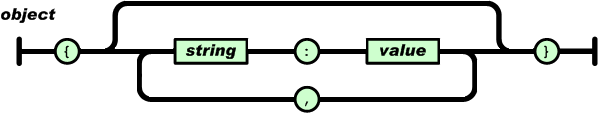
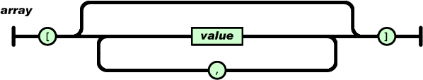
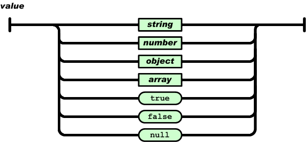

========================
Pracowania Programowania
========================

--------------
JSON & XML 
--------------

* Co-author: Tomasz Ziętkiewicz*

.. class:: important 

    Attention! The code for this classes can be found on the branch **JSONandXMLStart** in the https://github.com/WitMar/PRA2020-PRA2021 repository. The ending code in the branch **JSONandXMLEnd**.
    
If you do not see the right branches on GitHub, click **Ctr + T**, and if it does not help, choose **VCS-> Git-> Fetch** from the menu.    

JSON
====
JSON (JavaScript Object Notation) http://www.json.org/ is a lightweight, text-based data exchange format.

It is based on a subset of JavaScript.

JSON is widely used to store and transmit structured data in text form its features are:

- it is human-readable
- it is widely distributed - you can find libraries for almost any language (list at http://www.json.org) 

Example JSON
~~~~~~~~~~~~~
.. code:: json
        
    {
        "artist": "Pink Floyd",
        "title": "Dark Side of the moon",
        "year": 1973,
        "tracks": [
            {
                "track#": 1,
                "title": "Speak to Me/Breathe",
                "length": "3:57",
                "music": ["Mason"]
            },
            {
                "track#": 2,
                "title": "On the run",
                "length": "3:50",
                "music": ["Waters", "Gilmour"]
            }
        ]
    }

Everyday life example: `API rowerów miejskich <http://www.poznan.pl/mim/plan/map_service.html?mtype=pub_transport&co=stacje_rowerowe>`_

JSON Syntax 
~~~~~~~~~~~~~

In JSON we have two main data structures:

- **object** (object, dictionary, map)
   set of key-value pairs

.. code:: json

        {
        "title": "Dark Side of the Moon",
        "year": 1973,
        "tracks#": 9
        }

.. class:: center
	
	|obj|
	

            
- **array** (table, list)
   an ordered set of values

.. code:: json

    {
        "name":"John",
        "age":30,
        "cars":[ "Ford", "BMW", "Fiat" ]
    } 

.. class:: center
	
	|arr|
	

    

Seven types of values

.. class:: center
	
	|val|
	

    

XML
===

XML (Extensible Markup Language) - markup language, which, like JSON, enables serialization and exchange of structural data in text form.

XML syntax
~~~~~~~~~~~~

In an XML document, we can separate *content* and *markup* (special characters).

The tags are between "<" and ">" or "&" and ";".

The content of the document is all characters that are not markers.

Tagi
----
- element beginning tag:

.. code:: xml

   <album>

- element end tag:

.. code:: xml

   </album>

- empty tag:

.. code:: xml

    <album />

Element
-------

The element starts with the start tag, ends with the end tag, or is an empty tag.

Between the tags there is the content of the element, which can be either plain text or nested elements.

The start and empty tags can contain attributes, or key-value pairs.

We write the name of the key without quotes and values between quotes.

.. code:: xml

        <track number="3" title="Time" length="3:57">
            Ticking away the moments that make up a dull day
            You fritter and waste the hours in an offhand way
            Kicking around on a piece of ground in your home town
            Waiting for someone or something to show you the way
        </track>

Comments
----------

Comments are placed between the "<! -" and "->" tags.

Example of an XML
~~~~~~~~~~~~~~~~~~~

.. code:: xml

    <?xml version="1.0" encoding="UTF-8"?> 
    <album title="Dark Side of the Moon" year="1973">
        <track number="1" title="Speak to Me/Breathe">
            Breathe, breathe in the air
            Don't be afraid to care
            Leave but don't leave me
            Look around and choose your own ground
            For long you live and high you fly
            Smiles you'll give and tears you'll cry
            And all you touch and all you see
            Is all your life will ever be
        </track>
        <track number="2" title="On the run" />
        <track number="3" title="Time" length="3:57">
            Ticking away the moments that make up a dull day
            You fritter and waste the hours in an offhand way
            Kicking around on a piece of ground in your home town
            Waiting for someone or something to show you the way
        </track>
    </album>

Everyday life example: `API rowerów miejskich, XML <https://nextbike.net/maps/nextbike-official.xml?city=192>`_

Serialization / Deserialization
===============================

Serialization - a process involving the transformation of data structures or the state of an object into a sequential form that allows saving or transferring this data and potentially reconstructing data structures or objects at a later time / by another process / computer (deserialization).

For example, serialization may consist in saving objects generated by our program to a JSON file for later loading of these objects back into the program in order to continue calculations.

JSON and XML are examples of formats well suited for data serialization in a human-readable way. You can also serialize data in a binary form, which is incomprehensible to humans.

Jackson
~~~~~~~~~~~

`Jackson <https://github.com/FasterXML/jackson>`_ - a set of data processing tools for Java ("suite of data-processing tools for Java").

The main component is the JSON generator/parser, allowing, among others, to deserialize/ serialize to and from JSON in Java.

It has numerous modules that add support for other data formats, including XML, YAML or CSV.

The home page of the project does not work, but the project is actively developed on `GitHub <https://github.com/FasterXML/jackson>`_.

`Archived version of the home page <https://web.archive.org/web/20170801130759/http://wiki.fasterxml.com/JacksonHome>`_.

.. class:: tag

    Task 1: Serialization to JSON by Jackson (already done in the starting branch)

Add the Jackson library dependencies to pom.xml

.. class:: important 

    Hint: You can find appriopriate dependency on the website `maven dependency details <https://github.com/FasterXML/jackson-databind/#maven>`_.

Create two employees (objects of the Employee class). Let one employee be the superior and the other his subordinate.

Give an address to each employee.

Use om.fasterxml.jackson.databind.ObjectMapper to save (serialize) the supervisor object to the json file.

Example:

    | https://www.mkyong.com/java/how-to-convert-java-object-to-from-json-jackson/

    | http://www.baeldung.com/jackson-object-mapper-tutorial

.. class:: tag    

    Task 2: De-serialization with JSON.

Restore the supervisor from the JSON file created in task 1. The code is included in the repository but you need to copy the file to resources and change it name to employee.json. 

.. class:: tag

    Task 3: Annotations

In Java, the notation of `lowerCamelCase <https://en.wikipedia.org/wiki/CamelCase>`_ is used to write class field names.

In JSON there is no accepted standard of notation (`discussion on StackOverflow <https://stackoverflow.com/questions/5543490/json-naming-convention>`_).

By default, the fields in JSON generated by Jackson have the same names as the fields in the class we serialize.

Add annotations to the modeled classes that change the name of the salary to "money" and annotations to ignore the "pesel" field in serialization.

.. class:: important 

    Hint: Find proper tags in `documentation <https://github.com/FasterXML/jackson-databind/#annotations-changing-property-names>`_.

.. class:: tag

    Task 4: Deserialization of the generic types

Create a json file containing a list of several employees.

Load this list into the ArrayList <Employee> collection.

.. class:: important 

    Hint: Please use the `3 minute tutorial <https://github.com/FasterXML/jackson-databind/#3-minute-tutorial-generic-collections-tree-model>`_.

In case of strange behaviour of the java (no file found error - null InputStream) try to copy file to top folder and resource folder.    

Jackson XML
-------------

Jackson has a `module <https://github.com/FasterXML/jackson-dataformat-xml>`_
extending it to support XML serialization.

To use XML instead of JSON, just change the "ObjectMapper" to XmlMapper ":

.. code:: Java

     ObjectMapper xmlMapper = new XmlMapper ();

More info:     
     
    http://www.baeldung.com/jackson-xml-serialization-and-deserialization

.. class:: tag

    Task 5: XML

Using an existing JacksonSerialization class, modify it or create a new class to allow serialization / deserialization to / from XML format.

Add the xml files to the root/resources directory corresponding to existing json files.

.. class:: important 

    Hint: You do not have to create the contents of xml files yourself, you can generate them using the appropriate methods.

.. class:: important     

    Hint: Remember to add a library to pom.xml. The appropriate entry can be found in the `XML module GitHub repository <https://github.com/FasterXML/jackson-dataformat-xml#maven-dependency>`_.

.. class:: tag    
    
    Task 6: Joda Time

Add a field

.. code:: java

    DateTime birthDate 
    
to the Employee class containing the date of birth of the employee.

Add annotations on it

.. code:: java

    @JsonFormat(shape = JsonFormat.Shape.STRING, pattern = "yyyy-MM-dd HH:mm:ss.SSSZ")

Try to serialize and then deserialize the object of the modified class.

.. class:: important 

    Hint: You may need the `jackson-datatype-ioda module <https://github.com/FasterXML/jackson-datatype-joda>`_. 
    
You need to register the Joda module in the mapper. 

    | https://stackoverflow.com/questions/29523169/register-jodamodule-in-jax-rs-application

.. class:: tag

    Task 7: Recursive references

Note that in JSON, entire objects with dependencies are printed. What would happen if employee X had a subordinate Y whose subordinate would be X again? We would get infinite recursion and error in serialization. To avoid this, we can use the annotation

Uncomment 61 line in ModeObjectCreator.java and add:

 .. code:: java

    @JsonIdentityInfo(generator=ObjectIdGenerators.IntSequenceGenerator.class,
            property="refId", scope=Employee.class)
    public class Employee { ... }

That will cause objects to be printed only once, and multiple references will use Id as a reference.

More on this topic:

    http://www.baeldung.com/jackson-bidirectional-relationships-and-infinite-recursion
    
Extra - classes from xml schema
==========================================

Classes from XML / JSON with JAXB
~~~~~~~~~~~~~~~~~~~~~~~~~~~~~~~~~~

Generate classes from Json / Json Schema :

	http://www.jsonschema2pojo.org/
	
	
Generate classes form XML schema using Linux command

Uncomment class **UnmarshallerExample.java** 

 .. code:: bash

	xjc
	
First create XSD schema file **classes.xsd**:

 .. code:: xml

	<?xml version="1.0" encoding="UTF-8" standalone="yes"?>
	<schema version="1.0" xmlns:xs="http://www.w3.org/2001/XMLSchema"
           xmlns="http://www.w3.org/2001/XMLSchema" targetNamespace="www.wmi.amu.edu.pl"
           xmlns:tns="www.wmi.amu.edu.pl" elementFormDefault="qualified">

    <element name="employee" type="tns:employee"/>

    <complexType name="employee">
        <sequence>
            <element name="name" type="string" minOccurs="0"/>
            <element name="salary" type="double"/>
            <element name="designation" type="string" minOccurs="0"/>
            <element name="address" type="tns:address" minOccurs="0"/>
        </sequence>
        <attribute name="id" type="int" use="required"/>
    </complexType>

    <complexType name="address">
        <sequence>
            <element name="city" type="string" minOccurs="0"/>
            <element name="line1" type="string" minOccurs="0"/>
            <element name="line2" type="string" minOccurs="0"/>
            <element name="state" type="string" minOccurs="0"/>
            <element name="zipcode" type="long"/>
        </sequence>
    </complexType>
	</schema>
		
Go into the directory where schema is saved and run command

 .. code:: bash
 
	mkdir output	
	xjc -d output -p model2 classes.xsd
	
The clasess should be generated to directory output with package name **model2**.

Create xml file **classes.xml** :

.. code:: xml
 
	<?xml version="1.0" encoding="UTF-8"?>
	<tns:employee id="1" xmlns:tns="www.wmi.amu.edu.pl">
  	  <tns:name>Marcin Witkowski</tns:name>
  	  <tns:salary>100</tns:salary>
  	  <tns:designation>Poznan</tns:designation>
  	  <tns:address>
  	      <tns:city>Poznan</tns:city>
  	      <tns:line1>Uniwersytetu 78</tns:line1>
  	      <tns:zipcode>60606</tns:zipcode>
  	  </tns:address>
	</tns:employee>

Check how Intellij helps you with giving hints on how to create the XML.

Add dependency to JAXB

.. code:: xml

    <dependency>
            <groupId>javax.xml.bind</groupId>
            <artifactId>jaxb-api</artifactId>
            <version>2.2.11</version>
        </dependency>
        <dependency>
            <groupId>com.sun.xml.bind</groupId>
            <artifactId>jaxb-core</artifactId>
            <version>2.2.11</version>
        </dependency>
        <dependency>
            <groupId>com.sun.xml.bind</groupId>
            <artifactId>jaxb-impl</artifactId>
            <version>2.2.11</version>
        </dependency>
        <dependency>
            <groupId>javax.activation</groupId>
            <artifactId>activation</artifactId>
            <version>1.1.1</version>
        </dependency>
		
Serialize the XML with UnmarshallerExample class.
