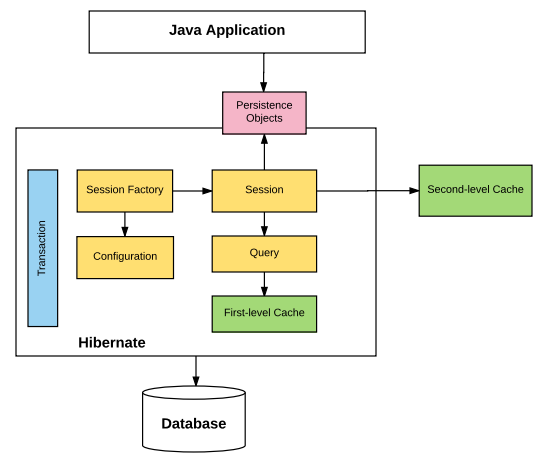
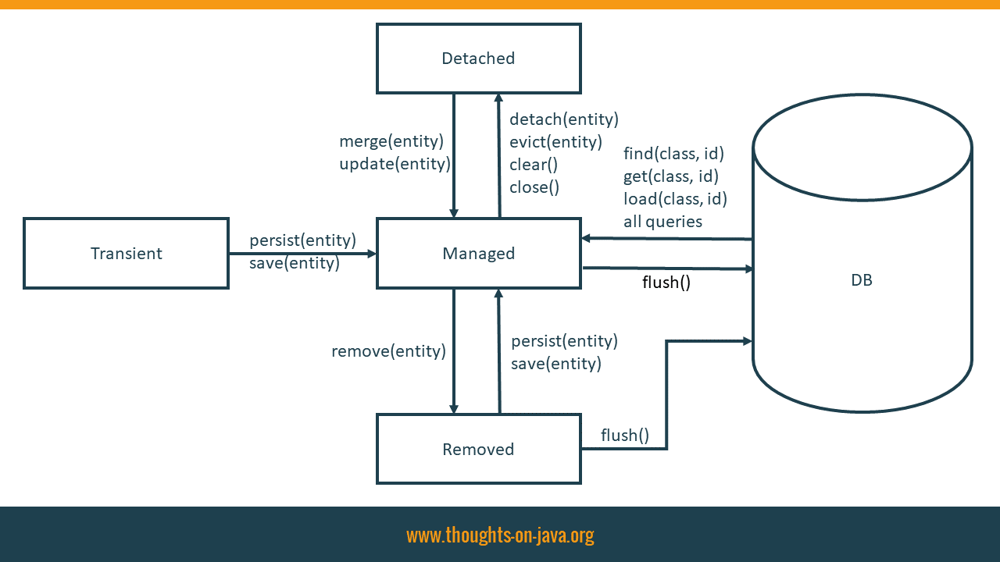

.. role:: todo

.. role:: hold

.. role:: raw-latex(raw)
            :format: latex html

==========================================
Pracownia Programowania
==========================================

------------------------------
ORM
------------------------------

.. class:: important 

    Uwaga! cały kod znajduje się na gałęzi **hibernateStart** w repozytorium https://github.com/WitMar/PRA2024 . Kod końcowy w gałęzi **hibernateEnd**.
    
Jeżeli nie widzisz odpowiednich gałęzi na GitHubie wykonaj **Ctr+T**, a jak to nie pomoże to wybierz z menu **VCS->Git->Fetch**.    

ORM
=====

ORM to skrótowe oznaczenie pojęcia "mapowanie obiektowo-relacyjne" (od angielskiego *Object-Relational Mapping*). Chodzi więc o zamianę (mapowanie) danych w postaci tabelarycznej (relacji w bazie danych) na obiekty, albo w drugą stronę. Pomaga ono przyspieszyć proces rozwoju aplikacji, dbając o takie aspekty, jak zarządzanie transakcjami, automatyczne generowanie klucza głównego, zarządzanie połączeniami z bazą danych i tłumaczeniem zapytań na język SQL. Jest nowoczesnym podejściem do zagadnienia współpracy z bazą danych, wykorzystującym filozofię programowania obiektowego.

Elementy ORM
---------------

	| 1. Mechanizm specyfikowania metadanych opisujących odwzorowanie klas na relacje w bazach danych

	| 2. API do zarządzania cyklem życia obiektów
    
	| 3. Język lub API do wykonywania zapytań. Najpopularniejsza implementacja technologii odwzorowania obiektowo-relacyjnego dla aplikacji Java to Hibernate (dla C# to LinQ)
    
Architektura
=============

.. class:: center
	
	|arch|
	

    
Elementy:

    | * Konfiguracja : zwykle zapisywany w plikach hibernate.properties lub hibernate.cfg.xml. Jest używany przez Session Factory do ustawień połączenia z bazą i czasem mapowania obiektów (plik xml).
    
    | * Session factory : Hibernate wykorzystuje session factory do tworzenia sesji. Session Factory używa informacji konfiguracyjnych z wyżej wymienionych plików, aby odpowiednio utworzyć instancję obiektu sesji. Możemy tworzyć wiele sesji w ramach jednego połączenia.
    
    | * Sesja : reprezentuje interakcję między aplikacją a bazą danych w dowolnym momencie. Jest ona reprezentowana przez klasę org.hibernate.Session. 
    
    | * Zapytanie (query) : Umożliwia aplikacjom wysyłanie zapytań do bazy danych o jeden lub więcej przechowywanych w niej obiektów. Hibernate udostępnia różne techniki zapytań do bazy danych, w tym NamedQuery i Criteria API.
    
    | * Pamięć podręczna pierwszego poziomu : reprezentuje domyślną pamięć podręczną używaną przez obiekt sesji Hibernate podczas interakcji z bazą danych. Jest również nazywany pamięcią podręczną sesji i buforuje obiekty w ramach bieżącej sesji. Wszystkie żądania z obiektu Session do bazy danych muszą przechodzić przez pamięć podręczną pierwszego poziomu lub pamięć podręczną sesji. Należy zauważyć, że pamięć podręczna pierwszego poziomu jest dostępna dopóki obiekt sesji aktywny.
    
    | * Transakcja : umożliwia osiągnięcie spójności danych i wycofanie w przypadku, gdy coś pójdzie nie tak.
    
    | * Persistent object : są to zwykłe obiekty Java (POJO), które zostają utrwalone jako jeden z wierszy w powiązanej tabeli w bazie danych przez hibernate. Można je skonfigurować w plikach konfiguracyjnych (hibernate.cfg.xml lub hibernate.properties) lub z adnotacją @Entity.
    
    | * Pamięć podręczna drugiego poziomu: służy do przechowywania obiektów w sesjach. Musi to być jawnie włączona i konieczne jest zapewnienie dostawcy (implementacji) pamięci podręcznej. Jedną z popularnych implementacji pamięci podręcznej drugiego poziomu jest EhCache.
    
    
Zależności
============

Żeby korzystać z Hibernate potrzebne nam będzie na pewno pakiet hibernate-core oraz sterownik bazy danych.

.. class:: highlight

.. code:: xml

        <!-- Hibernate resources -->
        <dependency>
            <groupId>org.hibernate</groupId>
            <artifactId>hibernate-entitymanager</artifactId>
            <version>5.4.33.Final</version>
        </dependency>
        <dependency>
            <groupId>org.hibernate</groupId>
            <artifactId>hibernate-core</artifactId>
            <version>5.4.33.Final</version>
        </dependency>
        <dependency>
            <groupId>org.hibernate</groupId>
            <artifactId>hibernate-validator</artifactId>
            <version>6.2.5.Final</version>
        </dependency>
        <dependency>
            <groupId>org.hibernate.common</groupId>
            <artifactId>hibernate-commons-annotations</artifactId>
            <version>4.0.2.Final</version>
            <classifier>tests</classifier>
        </dependency>
        <dependency>
            <groupId>org.hibernate.javax.persistence</groupId>
            <artifactId>hibernate-jpa-2.0-api</artifactId>
            <version>1.0.1.Final</version>
        </dependency>

        <!-- Java Bind -->
        <dependency>
            <groupId>com.sun.xml.bind</groupId>
            <artifactId>jaxb-impl</artifactId>
            <version>2.3.0</version>
        </dependency>
        <dependency>
            <groupId>javax.xml.bind</groupId>
            <artifactId>jaxb-api</artifactId>
            <version>2.2.4</version>
        </dependency>

        <!-- Database -->
        <dependency>
            <groupId>org.hsqldb</groupId>
            <artifactId>hsqldb</artifactId>
            <version>2.5.0</version>
        </dependency>
        <dependency>
            <groupId>org.postgresql</groupId>
            <artifactId>postgresql</artifactId>
            <version>42.1.1</version>
        </dependency>
        
W naszym projekcie będziemy korzystać z bazy **HSQL (bazy zapisywanej w pamięci)** ale w domu proszę uruchomić przykład z PostgreSQL lub jakąś bazą dostępną online np:  
	
	https://remotemysql.com/login.php
    
Konfiguracja Hibernate
=======================

Konfiguracje Hibernate zapisujemy w pliku  **hibernate.cfg.xml**, **hibernate.properties** lub **persistence.xml** . 

Uwaga! W zależności od tego z jakich elementów korzystamy biblioteka przy wywołaniu szuka automatycznie określonych plików w ścieżce projektu w celu odnalezienia konfiguracji.

W pliku musimy wyspecyfikować: 

    | szczegóły dostępu do bazy danych, adres, hasło, user, lokalizacja,
    
    | język stosowanych zapytań sql,
    
    | ew. listę klas mapowanych na tabele baz danych

    | **dialect** określa jak hibernate ma komunikować się z bazą danych
    
    | **show_sql** - true pokaże nam zapytania SQL tworzone przez hibernate (głównie do debugowania). 

    | **hbm2dll** określa sposób zachowania względem schematu bazy danych. **create** oznacza że tworzymy za każdym razem schemat od nowa. Dostępne wartości to create, **validate** (tylko walidacja schematu nie zmienianie go) oraz **uptade** (automatyczne dostosowywanie zmian w schemacie ale nie usuwanie wcześniejszych elementów). Gdy już raz go stworzymy polecam zmienić wartość na *validate* lub *update*. Uwaga! Czasem update może powodować dziwne błędy jak "table not found".

Przykładowe ustawienia dostępu do bazy danych dla bazy PostgreSQL:    

.. class:: highlight

.. code:: xml

    <?xml version="1.0" encoding="UTF-8"?>
    <persistence version="2.1" xmlns="http://xmlns.jcp.org/xml/ns/persistence"
                 xmlns:xsi="http://www.w3.org/2001/XMLSchema-instance"
                 xsi:schemaLocation="http://xmlns.jcp.org/xml/ns/persistence
                                     http://xmlns.jcp.org/xml/ns/persistence/persistence_2_1.xsd">
        <persistence-unit name="hibernate-dynamic" transaction-type="RESOURCE_LOCAL">
            <properties>
                <!-- Configuring JDBC properties -->
                <property name="javax.persistence.jdbc.url" value="jdbc:postgresql://localhost:5432/postgres"/>
                <property name="javax.persistence.jdbc.user" value="postgres"/>
                <property name="javax.persistence.jdbc.password" value="postgres"/>
                <property name="javax.persistence.jdbc.driver" value="org.postgresql.Driver" />
    
                <!-- Hibernate properties -->
                <property name="hibernate.dialect" value="org.hibernate.dialect.PostgreSQLDialect"/>
                <property name="hibernate.hbm2ddl.auto" value="create"/>
                <property name="hibernate.format_sql" value="false"/>
                <property name="hibernate.show_sql" value="true"/>
    
            </properties>
        </persistence-unit>
    </persistence>
     
**Uwaga!** żeby uruchomić program z powyższymi ustawieniami w domu powinieneś mieć zainstalowany serwer PostgreSQL lub zmienić adres serwera w ustawieniach. Informacje o instalacji PostgreSQL powinieneś łatwo znaleźć w internecie.Do podejrzenia danych w bazie postgresql polecam wykorzystać program **pgAdmin**.    
    
Konfiguracja wykorzystująca uczelnianą bazę PostgreSQL (change username and password to your own):

.. class:: highlight

.. code:: xml

    <?xml version="1.0" encoding="UTF-8"?>
    <persistence version="2.1" xmlns="http://xmlns.jcp.org/xml/ns/persistence"
                xmlns:xsi="http://www.w3.org/2001/XMLSchema-instance"
                xsi:schemaLocation="http://xmlns.jcp.org/xml/ns/persistence
                                    http://xmlns.jcp.org/xml/ns/persistence/persistence_2_1.xsd">
        <persistence-unit name="hibernate-dynamic" transaction-type="RESOURCE_LOCAL">
            <properties>
                <!-- Configuring JDBC properties -->
                <property name="javax.persistence.jdbc.url" value="jdbc:postgresql://psql.wmi.amu.edu.pl:5432/mw?ssl=true&amp;sslfactory=org.postgresql.ssl.NonValidatingFactory"/>
                <property name="javax.persistence.jdbc.user" value="mw"/>
                <property name="javax.persistence.jdbc.password" value="riustsdardswify"/>
                <property name="javax.persistence.jdbc.driver" value="org.postgresql.Driver" />

                <!-- Hibernate properties -->
                <property name="hibernate.dialect" value="org.hibernate.dialect.PostgreSQLDialect"/>
                <property name="hibernate.hbm2ddl.auto" value="create"/>
                <property name="hibernate.format_sql" value="false"/>
                <property name="hibernate.show_sql" value="true"/>
            </properties>
        </persistence-unit>
    </persistence>

Na zajęciach wykorzystywać będziemy bazę HSQL uruchamianą w pamięci komputera:

.. class:: highlight

.. code:: xml

    <?xml version="1.0" encoding="UTF-8"?>
    <persistence version="2.1" xmlns="http://xmlns.jcp.org/xml/ns/persistence"
                xmlns:xsi="http://www.w3.org/2001/XMLSchema-instance"
                xsi:schemaLocation="http://xmlns.jcp.org/xml/ns/persistence
                                    http://xmlns.jcp.org/xml/ns/persistence/persistence_2_1.xsd">
        <persistence-unit name="hibernate-dynamic" transaction-type="RESOURCE_LOCAL">
            <properties>
                <!-- Configuring JDBC properties -->
                <property name="javax.persistence.jdbc.url" value="jdbc:hsqldb:mem:PRA"/>
                <property name="javax.persistence.jdbc.user" value="sa"/>
                <property name="javax.persistence.jdbc.password" value=""/>
                <property name="javax.persistence.jdbc.driver" value="org.hsqldb.jdbc.JDBCDriver" />
    
                <!-- Hibernate properties -->
                <property name="hibernate.dialect" value="org.hibernate.dialect.HSQLDialect"/>
                <property name="hibernate.hbm2ddl.auto" value="create"/>
                <property name="hibernate.format_sql" value="false"/>
                <property name="hibernate.show_sql" value="true"/>
    
            </properties>
        </persistence-unit>
    </persistence>
    
.. class:: tag 

    Zadanie 1
    
Dodaj do katalogu **resources** podkatalog **META-INF** a w nim plik **persistence.xml** wklej do niego powyższą zawartość.

**WAŻNE**, jeśli zobaczysz błąd:

.. class:: highlight

.. code:: xml

	Initial SessionFactory creation failed.javax.persistence.PersistenceException: No Persistence provider for EntityManager named hibernate-dynamic
    Exception in thread "main" java.lang.NullPointerException
    
Oznacza to najprawdopodobniej, że Hibernate nie może znaleźć ustawień (lub całego pliku), sprawdź ustawienia resource, ścieżki katalogów, nazwe entity managera itp.

    
Mapowanie - adnotacje
=======================

Oznaczenie odwzorowania między tabelami bazy danych a klasą realizowane jest za pomocą mechanizmu adnotacji.

    | **@Entity** adnotacja służąca do określenia, że dana klasa ma być odwzorowana na encję bazy danych.

    | **@Table** określa właściwości tabeli (np. nazwę, definicja ograniczeń itp.), jeżeli nie będzie tej adnotacji nazwą tabeli będzie nazwa klasy

    | **@Id** oznaczamy klucz główny tabeli

    | **@Column** określa właściwości kolumny tabeli (np. nazwę, czy musi być unikalne, czy może być puste), gdy nie jest zdefiniowana kolumna będzie miała taką nazwę jak pole klasy.

    | **@GeneratedValue** oznacza że wartość tego pola będzie automatycznie generowana

.. class:: highlight

.. code:: java

    package hibernate.model;

    import javax.persistence.*;

    @Entity
    @Table(name = "EMPLOYEE", uniqueConstraints = {
            @UniqueConstraint(columnNames = {"first_name","last_name"})})
    public class Employee {
    
        @Id @GeneratedValue
        @Column(name = "id")
        private int id;
    
        @Column(name = "first_name")
        private String firstName;
    
        @Column(name = "last_name")
        private String lastName;
    
        @Column(name = "salary")
        private int salary;
    
        @Column(name = "PESEL", nullable = false, unique = true)
        private int pesel;
    
        public Employee() {}
    
        public int getId() {
            return id;
        }
    
        public void setId( int id ) {
                this.id = id;
        }
    
        public String getFirstName() {
             return firstName;
        }

        public void setFirstName( String first_name ) {
            this.firstName = first_name;
        }
    
        public String getLastName() {
            return lastName;
        }
    
        public void setLastName( String last_name ) {
            this.lastName = last_name;
        }
    
        public int getSalary() {
            return salary;
        }

            public void setSalary( int salary ) {
            this.salary = salary;
        }
    
        public int getPesel() {
            return pesel;
        }
    
        public void setPesel(int pesel) {
            this.pesel = pesel;
        }
    }
    
.. class:: tag 

    Zadanie 2
    
Uruchom klasę **CreateModel** zobacz jakie tabele i zależności tworzy Hibernate.
    

Collections mapping
====================

Proste kolekcje typów prostych możemy definiować za pomocą adnotacji @ElementCollection

.. class:: highlight

.. code:: java

    @Entity(name = "Employee")
    public static class Employee {
    
        @Id
        private Long id;
    
        @ElementCollection
        private List<String> phones = new ArrayList<>();

        ...

    }
    
.. class:: tag 

    Zadanie 3
    
Dodaj kolekcję **numerów telefonów** do Pracownika, zobacz jak są mapowane w bazie danych przez Hibernate.

W pliku log4j.properties wklej wiersz    
    
.. class:: highlight

.. code:: java

    log4j.logger.org.hibernate=info

Określa poziom komunikatów logowania z hibernacji. Zobacz, co się zmieniło.

Stany encji
==============

Oprócz samego mapowania obiektowo-relacyjnego, jednym z problemów, które Hibernate miał rozwiązać, jest problem zarządzania obiektami podczas wykonywania programu. Pojęcie "persisted context" jest rozwiązaniem Hibernata dla tego problemu. Persisted contex może być traktowany jako kontener lub pamięć podręczna pierwszego poziomu dla wszystkich obiektów, które zostały załadowane lub zapisane w bazie danych podczas sesji.

Każda instancja obiektu w aplikacji pojawia się w jednym z trzech głównych stanów w odniesieniu do kontekstu trwałości sesji:

    | * przejściowy (transient) - ta instancja nie jest i nigdy nie była związana z sesją; ta instancja nie ma odpowiednich wierszy w bazie danych; zwykle jest to tylko nowy obiekt, który stworzyłeś, aby zapisać do bazy danych (nie posiada własnego id);
    
    | * persistent (managed) - ta instancja jest powiązana z unikalnym identyfikatorem w obiekcie Session. Może istnieć fizycznie w bazie danych lub nie. Każda dokonana na obiekcie zmiana będzie automatycznie śledzona i propagowana do bazy danych.
    
    | * odłączone (detached) - ta instancja była kiedyś podłączona do sesji (w stanie trwałym), ale teraz nie jest; instancja wchodzi w ten stan, jeśli usuniesz ją z kontekstu, wyczyścisz lub zamkniesz sesję.

Ważne jest, aby od samego początku zrozumieć, że wszystkie metody (persist, save, update, merge) nie powodują od razu odpowiednich instrukcji SQL UPDATE lub INSERT. Rzeczywiste zapisanie danych w bazie danych następuje po dokonaniu transakcji lub opróżnieniu sesji (flush()).

.. class:: center
	
	|ass10|
	

EntityManager vs SessionManager
=================================

Są dwa standardy obsługi sesji w hibernate, oparty na sesji i oparty na starszym standardzie JPA z wykorzystaniem EntityManagera.

W naszych przykładach będziemy używać obiektu **Session**.

Jeśli podczas pracy z Entity Managerem potrzebujesz obiektów Session możesz je również uzyskać za pomocą:

.. class:: highlight

.. code:: java

    Session session = entityManager.unwrap( Session.class );
    SessionImplementor sessionImplementor = entityManager.unwrap( SessionImplementor.class );

    SessionFactory sessionFactory = entityManager.getEntityManagerFactory().unwrap( SessionFactory.class );

Metody Session
=========================

Get method
------------

Metoda get służy do pobierania jednego obiektu na podstawie jego klucza. Kluczem do wyszukania obiektu jest pole, które ma adnotację **@Id**. Przykładowe użycie:

.. class:: highlight

.. code:: java

    session.get(Employee.class, 1L);

    session.byId( Employee.class ).load( 1L );
        
    // get only reference not the whole object
    book.setWorker( session.load( Employee.class, 1L ) );
    
pobierze nam obiekt typu Employee o identyfikatorze równym 1.

Jeśli ta metoda nie znajdzie obiektu w bazie danych, zwraca wartość null.

Możliwe jest również zwrócenie obiektu typu Optional z Java 8:

.. class:: highlight

.. code:: java

    Optional<Employee> optionalPerson = session.byId( Employee.class ).loadOptional( 1L );
    
Pobieranie listy obiektów z listy id'ków

.. class:: highlight

.. code:: java

    List<Employee> employees = session
		.byMultipleIds( Employee.class )
		.multiLoad( 1L, 2L, 3L );

Save method
---------------

Możesz użyć tej metody, aby wstawić nowy obiekt do stanu zarządzanego. 

.. class:: highlight

.. code:: java
    
    Employee emp = new Employee();
    session.save( person );

Przenosi nowy obiekt do stanu *zarządzanego*. Metoda save sprawia, że ​​obiekt jest zarządzalny, tj. wszelkie zmiany w nim wprowadzone (w ramach jednej metody z adnotacją @Transactional lub metod, które ta metoda wywołuje) zostaną utrwalone w bazie danych.

Merge method
---------------

Za pomocą tej metody można przenieść istniejący obiekt ze stanu *detached* do stanu *zarządzanego*. Przykład:

.. class:: highlight

.. code:: java
    
    Employee person = session.byId( Employee.class ).load( 1L );
    //Clear the Session so the person entity becomes detached
    session.clear();
    person.setName( "Mr. John Doe" );

    person = (Employee) session.merge( person );
    
Weryfikacja stanu obiektu za pomocą Hibernate API

.. class:: highlight

.. code:: java

    boolean contained = session.contains( person );    

Delete method
---------------

Metoda delete służy do usuwania obiektów.

.. class:: highlight

.. code:: java

    session.delete( person );

More information:

    | https://docs.jboss.org/hibernate/orm/5.4/javadocs/org/hibernate/Session.html
    
Przykład
========

Klasa zapisująca i czytająca element z bazy danych:

.. class:: highlight

.. code:: java

    class Manager {

       public static void main(String[] args) {

        System.out.println("Start");

        EntityManager entityManager = null;

        EntityManagerFactory entityManagerFactory = null;

        try {

            // FACTORY NAME HAS TO MATCHED THE ONE FROM PERSISTED.XML !!!
            entityManagerFactory = Persistence.createEntityManagerFactory("hibernate-dynamic");

            entityManager = entityManagerFactory.createEntityManager();
            Session session = entityManager.unwrap(Session.class);

            //New transaction
            session.beginTransaction();

            // Create Employee
            Employee emp = createEmployee();

            // Save in First order Cache (not database yet)
            session.save(emp);

            Employee employee = session.get(Employee.class, emp.getId());
            if (employee == null) {
                System.out.println(emp.getId() + " not found! ");
            } else {
                System.out.println("Found " + employee);
            }

            System.out.println("Employee " + employee.getId() + " " + employee.getFirstName() + employee.getLastName());

            employee.setLastName("NowakPRE" + new Random().nextInt()); // No SQL needed
            //changeFirstGuyToNowak(session);

            //Commit transaction to database
            session.getTransaction().commit();

            System.out.println("Done");

            session.close();

        } catch (Throwable ex) {
            // Make sure you log the exception, as it might be swallowed
            System.err.println("Initial SessionFactory creation failed." + ex);
        } finally {
            entityManagerFactory.close();
        }

    }

Flush
------

Aby wymuśić synchronizacje persistence context, czyli przesłanie stanu obiektów do bazy danych można wykonać metodę **flush()**. Stan kontekstu jest też czasem synchronizowany automatycznie za nas:

.. class:: highlight

.. code:: xml

	From time to time the Session will execute the SQL statements needed to synchronize the JDBC connection's state with the state of objects held in memory. This process, flush, occurs by default at the following points

     - before some query executions

     - from org.hibernate.Transaction.commit()

     - from Session.flush()

.. class:: tag 

    Zadanie 4   
    
Przejdź debuggiem powyższy kod linijka po linijce by zobaczyć jak się zachowuje.
Dodaj flush() między zmianą nazwiska i zobacz co się stanie.

.. class:: highlight

.. code:: java

            employee.setLastName("NowakPRE" + new Random().nextInt()); // No SQL needed
            session.flush();
            employee.setLastName("NowakPRE" + new Random().nextInt()); // No SQL needed
            
    
Refresh
----------------
    
Możesz także odświeżyć obiekt, aby zsynchronizować stan obiektu ze stanem z bazy danych

.. class:: highlight

.. code:: java

    ((SessionImpl) session).refresh(emp.getAddress());
    emp.getAddress()    
    
.. class:: tag 

    Zadanie 5   
    
Odśwież obiekt przed updatem oraz po zakonczeniu transakcji zobacz w consoli jakie operacje zostaną wykonane.

.. class:: highlight

.. code:: java

	session.refresh(employee);    
	
Dodaj flush przed refreshem.	
	
.. class:: tag 

    Zadanie 6	
	
Zobacz czy zmiana imienia pracownika wykona zapytania na bazie danych.	Co stanie się jeżeli uruchomimy metodę *changeFirstGuyToNowak*?

Zapytania
===================

Queries
=======================

Native Query
--------------

Możesz wyrażać zapytania w natywnym dialekcie SQL swojej bazy danych.

.. class:: highlight

.. code:: java

    List<Object[]> persons = session.createNativeQuery(
        "SELECT * FROM Employee" )
    .getResultList();
    
HQL
-----------    

Hibernate Query Language (HQL) i Java Persistence Query Language (JPQL) to języki podobne do SQL do tworzenia zapytań w Hibernate. Aby wykonać zapytanie, musimy je najpierw utworzyć za pomocą metody **session.createQuery**, a następnie pobrać wynik. Aby pobrać listę pracowników musimy wykonać następujący kod:

.. class:: highlight

.. code:: java
    
    List<Employee> persons = session.createQuery(
        "from Employee" )
    .list();
    
by utworzyć zapytanie z parametrem stosujemy zapis:

.. class:: highlight

.. code:: java

   session.createQuery(
                "SELECT c FROM Employee c WHERE c.lastName LIKE :firstName", Employee.class)
                .setParameter("firstName", "%" + firstName + "%").list();

Zapytanie jest reprezentowane przez obiekt Query:

.. class:: highlight

.. code:: java

    Query query = session.createQuery("SELECT k FROM Employee k");
    List<Employee> employees = query.getResultList();

Jeśli nasze zapytanie zwraca tylko jeden element, możemy użyć metody **query.getSingleResult()**.

Uwaga! Jeżeli zapytanie do bazy nie zwraca wyników (wynik jest pusty), to:

    | metoda **getResultList()** zwróci **null**!

    | metoda **getSingleResult()** zgłasza wyjątek (NoResultException)! (jeśli mamy więcej niż jeden wynik, otrzymujemy również wyjątek - NonUniqueResultException)

Obiekty zwrócone w zapytaniu są w stanie **persisted** czyli wszystkie dokonane w nich zmiany zostaną automatycznie zapisane do bazy danych (jeśli zostaną uwzględnione w transakcji - obiekty spoza transakcji nie zostaną zapisane).

.. class:: tag 

   Zadanie 7
    
Dodaj metodę getThemAll() pobierającą wszystkich pracowników.

Uwaga! Należy pamiętać, że zapytanie używa nazwy pól, takie jakie są nazwy podane w klasie, a nie nazwy w bazie danych!

Z wyjątkiem nazw klas i metod Java, w zapytaniach nie jest rozróżniana wielkość liter. Tak więc SeLeCT jest tym samym, co sELEct, jest tym samym co SELECT, ale org.hibernate.eg.FOO i org.hibernate.eg.Foo są różne, podobnie jak foo.barSet i foo.BARSET. 

Join query example
-------------------

Zapytanie typu join w HQL

.. class:: highlight

.. code:: java

    List<Person> persons = session.createQuery(
        "select distinct pr " +
        "from Employee pr " +
        "join pr.phones ph " +
        "where ph.type = :phoneType", Employee.class )
    .setParameter( "phoneType", PhoneType.MOBILE )
    .getResultList();
    
    
Criteria Query
-----------------

Istnieje trzeci sposób tworzenia zapytania w Hibernate, który nazywa się Criteria Query, jest on bardziej obiektowy i trudniej w nim popełnić błąd typów, czy wywołania, możesz o nim przeczytać tutaj:

    | https://docs.jboss.org/hibernate/orm/5.4/userguide/html_single/Hibernate_User_Guide.html#criteria

    
Zależności
==============

Zależności OneToOne
=================================

Pomiędzy tabelami baz danych występują zależności takie jak 1-1, 1-\*, \*-\*.

Cel:  Zadefiniuj zależność między obiektami - niech jeden obiekt będzie polem drugiego.

Czasem nasz model wymaga by oprócz typów prostych dana encja zawierała odnośnik do innej encji. Np. pracownika chcemy połączyć z jego adresem.

.. class:: tag 

    Zadanie 8

Zdefiniuj klasę address mającą pola city, street, nr, houseNumber, postcode. Tak by wszystkie oprócz houseNumber nie mogły być puste oraz kod miał co najwyżej 5 znaków (wszystkie pola powinny być typu String). Dodaj autogenerowany klucz główny. Klasa encji musi zawsze mieć zdefiniowany bezparametrowy konstruktor!

.. class:: highlight

.. code:: java

    @Entity
    @Table(name = "ADDRESSES")
    public class Address {

        @Id
        @GeneratedValue(generator = "gen")
        @SequenceGenerator(name = "gen", sequenceName = "author_seq")
        @Column(name = "id")
        private int id;
    
        @Column(nullable = false)
        String street;
    
        @Column(nullable = false)
        String city;
    
        @Column(length = 5, nullable = false)
        String nr;
        
        @Column(length = 5)
        String housenr;
    
        @Column(length = 5, nullable = false)
        String postcode;
    
        public int getId() {
            return id;
        }
    
        public void setId(int id) {
            this.id = id;
        }
    
        public String getStreet() {
            return street;
        }
    
        public void setStreet(String street) {
            this.street = street;
        }
    
        public String getCity() {
            return city;
        }
    
        public void setCity(String city) {
            this.city = city;
        }
    
        public String getNr() {
            return nr;
        }
    
        public void setNr(String nr) {
            this.nr = nr;
        }
    
        public String getHousenr() {
            return housenr;
        }
    
        public void setHousenr(String housenr) {
            this.housenr = housenr;
        }
    
        public String getPostcode() {
            return postcode;
        }
    
        public void setPostcode(String postcode) {
            this.postcode = postcode;
        }
    }
    
    
Dodaj w klasie Employee pole, oraz zdefiniuj w Managerze address dla pracownika Jan.

Zwróć uwagę na to czy import w klasie Address jest taki sam jak import w klacie Employee!

.. class:: highlight

.. code:: java

    @OneToOne(cascade = CascadeType.PERSIST)
    @JoinColumn(name="Address_ID", referencedColumnName = "id")
    Address address;    
    
Join column definiuje nazwy naszej kolumny oraz możemy zdefiniować nazwę kolumny z którą się łączy nasz element (kolumna ta musi być unikalna). Domyślnie łączymy się z kluczem głównym tabeli.

W OneToOne możemy definiować dodatkowe opcje, optional oznacza czy pole jest wymagane, **CASCADE** oznacza czy zmiany w polu adress danej osoby będą się propagować do tabeli Address (dostępne opcje MERGE, PERSIST, REFRESH, REMOVE, ALL).

Przykłady: 

    | http://www.coderpanda.com/jpa-one-to-one-mapping/

    | http://www.logicbig.com/tutorials/java-ee-tutorial/jpa/one-to-one/

Pamiętaj by dodać do głównego kodu tworzenie Adresu dla pracownika i przypisaniu go do niego. 

Uwaga! Chcemy żeby **id** generowane dla adresów były inne niż te dla pracowników stąd między **@Id** a **@Column** wpisaliśmy:

.. class:: highlight

.. code:: java

    @GeneratedValue(generator = "gen")
    @SequenceGenerator(name="gen", sequenceName = "author_seq")

Jeżeli potrzebowalibyśmy odwzorowania w obie strony między encjami musimy użyć 
adnotacji **@MappedBy**.

.. class:: tag 

    Zadanie 9
    
Sprawdź jak wygląda jednostronne i obustronne mapowanie z punktu widzenia klasy. Czy jak dodam pracownika z adresem to obiekty są automatycznie dodawane do tabel?  

.. class:: tag 

    Zadanie 10
    
Zobacz co się stanie, gdy nie zdefiniujemy wartości dla jednego z obowiązkowych pól w adresie. 

Co się stanie gdy dla obiektu w stanie persisted wykonamy operacje niezgodną z ograniczeniami:

.. class:: highlight

.. code:: java
    
			employee.getAddress().setStreet(null);
			//Commit transaction to database
            session.getTransaction().commit();

            session.refresh(employee);

            employee.getAddress().setStreet(null);
            session.save(emp.getAddress());

            System.out.println(new Queries(session).getThemAll().stream().map(a -> a.getFirstName() + " " + a.getLastName()).collect(Collectors.joining()));

            System.out.println("Done");

            session.beginTransaction();
            Address add = session.get(Address.class, 1);
            session.getTransaction().commit();
    
Przed i po transaction commit (w drugim przypadku przed refresh).  
Zobacz w debugerze jak działa refresh w przypadku "CascadeType.ALL".  

Zależności OneToMany, ManyToMany
=================================

W wypadku gdy chcemy aby obie klasy miały dowiązanie do siebie (np dziecko do rodzica a rodzic do dziecka) to w jednej klasie definiujemy adnotacje @OneToMany a w drugiej odwołujemy się do tego mapowania przez @ManyToOne). 

Powiązanie @OneToMany łączy encję nadrzędną z co najmniej jedną encją podrzędną. Jeśli @OneToMany nie ma lustrzanej asocjacji @ManyToOne po stronie podrzędnej, asocjacja @OneToMany jest jednokierunkowa. Jeśli po stronie podrzędnej istnieje adnotacja @ManyToOne, to połączenie @OneToMany jest dwukierunkowe, a programista aplikacji może nawigować po tej relacji z obu końców.

.. class:: highlight

.. code:: java

    @Entity
    public class Parent {
    // ...
    
        @OneToMany(mappedBy = "parent", fetch = FetchType.LAZY)
        private Set<Child> children = new HashSet<Child>();
    
    // ...
    }
    
    @Entity
    public class Child {
        // ...
    
        @ManyToOne(fetch = FetchType.LAZY)
        private Parent parent;
    
        // ...
    }
    
"The mappedBy property is what we use to tell Hibernate which variable we are using to represent the parent class in our child class."    

.. class:: tag 

    Zadanie 11

Zmień zależność address - person na ManyToOne. Zwróć uwagę, że mimo, że pole nazywa się **id** musimy podać nazwę *tabela_pole* w odniesieniu do join column (!).

.. class:: highlight

.. code:: java

    @ManyToOne(fetch = FetchType.LAZY, cascade = CascadeType.ALL)
    @JoinColumn(name="address_id")
    Address address;
    
    @OneToMany(mappedBy = "address", cascade = CascadeType.ALL, fetch =FetchType.LAZY)
    Set<Employee> employee = new HashSet<>();
    
.. class:: tag 

    Zadanie 12

FetchType określa czy w przypadku pobrania jednej z tabel mamy odpytywać bazę danych o obiekt z nią połączony, jeżeli tak wybieramy FetchType.EAGER jeżeli nie i zapytanie ma być wykonane tylko gdy będziemy odwoływać się do konkretnej wartości należy wybrać FetchType.LAZY.
                       
Dodaj kod
    
.. class:: highlight

.. code:: java

			System.out.println("Done");

            for (int i = 1; i < 10; i++) {
                session.save(Employee.copyEmployee(emp));
            }

            session.getTransaction().begin();
            Employee employee1 = session.get(Employee.class, 1);

            session.getTransaction().commit();

            session.clear();

            session.getTransaction().begin();

            employee1 = session.get(Employee.class, 1);
            Address add = employee1.getAddress();
            System.out.println(add.getCity());

            session.getTransaction().commit();

            session.close();
            
Zobacz czy pytamy baze danych o address, czy zmienia się to w momencie gdy chcemy wypisać nazwę miasta?
Zmień typ FETCH na EAGER i porównaj wyniki.            
    
.. class:: tag 

    Zadanie (domowe)

Podejrzyj w debugerze zależność między adresem a osobami. Zmień zależność address - person na ManyToMany. 

Aby dodać dane w relacji należy dodać element po stronie parenta (czyli obiektu z oznaczeniem mappedBy).

.. class:: highlight

.. code:: java

	person.setAddress(new HashSet<>(emp.getAddress()));

Sprawdź jak realizowana jest ona w bazie danych.
                

Transakcje
------------

Uwaga! Operacje bazodanowe w Sesji są grupowane w transakcje, co oznacza, że ​​baza danych jest synchronizowana z pozycjami w pamięci dopiero po zakończeniu transakcji.

Ważny! Jeśli wystąpi błąd podczas przetwarzania transakcji, **żadna** z operacji wykonanych w kodzie, który został przesłany do bazy danych. Dlatego warto tworzyć osobne transakcje dla wybranych funkcjonalności.

Ważne jest to, że w Hibernate operacje na bazie danych nie muszą być wykonywane w takiej kolejności, w jakiej pojawiają się w kodzie w momencie transakcji. W szczególności powoduje to, że w jednej transakcji nie możemy usunąć, a następnie dodać obiektu z tym samym kluczem głównym.

Kolejność operacji w dokumentacji:

.. class:: highlight

.. code:: xml

    Execute all SQL (and second-level cache updates) in a special order so that foreign-key constraints cannot be violated:

    Inserts, in the order they were performed
    Updates
    Deletion of collection elements
    Insertion of collection elements
    Deletes, in the order they were performed 
            

Stronnicowanie
================

Cel : Zdefiniuj query, które zwracają stronnicowane dane.

Często zdarza się, że mając wiele rekordów nie chcemy za każdym razem pobierać wszystkich z bazy danych ale chcielibyśmy podzielić je na mniejsze fragmenty (strony).

Najprostsza metoda oprogramowania stronicowania to konfiguracja zapytania query

.. class:: highlight

.. code:: java

    Query query = session.createQuery("From EMPLOYEE");
    int pageNumber = 1;
    int pageSize = 10;
    query.setFirstResult((pageNumber-1) * pageSize); 
    query.setMaxResults(pageSize);
    List <Employee> empList = query.getResultList();

Wykorzystujemy metody:

    | **setFirstResult(int)**: ustawia pozycje od której chcemy pobierać dane
    | **setMaxResults(int)**: ustawia liczbę rekordów, które chcemy pobrać z bazy danych

Przydatna jest też wiedza na temat liczby stron na którą dzielą się dane

.. class:: highlight

.. code:: java

    Query queryTotal = entityManager.createQuery ("Select count(e.id) from EMPLOYEE e");
    long countResult = (long)queryTotal.getSingleResult();
    int pageSize = 10;
    int pageNumber = (int) ((countResult / pageSize) + 1);

.. class:: tag 

    Zadanie 13

Dodaj do kodu zapytanie pobierające wszystkich pracowników z podziałem na strony.

.. class:: highlight

.. code:: java
    
    public static List<Employee> getAllEmployeeByPage(int pagenr, Session session) {
        //calculate total number
        Query queryTotal = session.createQuery
                ("Select count(e) from Employee e");
        long countResult = (long)queryTotal.getSingleResult();

        //create query
        Query query = session.createQuery("Select e FROM Employee e");
        //set pageSize
        int pageSize = 4;
        //calculate number of pages
        int pageNumber = (int) ((countResult / pageSize) + 1);

        if (pagenr > pageNumber) pagenr = pageNumber;
        query.setFirstResult((pagenr-1) * pageSize);
        query.setMaxResults(pageSize);

        return query.getResultList();
    }
               
Wywołaj kod w głównej klasie.   

Extra
=======

Inheritance class mapping
==========================

W ramach tabeli w bazie danych możemy stosować mechanizm obiektowego dziedziczenia.

.. class:: highlight

.. code:: java

    @Entity(name = "Account")
    @Inheritance(strategy = InheritanceType.SINGLE_TABLE)
    public static class Account {

        @Id
        private Long id;

        private String owner;
    
        private BigDecimal balance;

        private BigDecimal interestRate;

        //Getters and setters are omitted for brevity

    }

    @Entity(name = "DebitAccount")
    public static class DebitAccount extends Account {

        private BigDecimal overdraftFee;

        //Getters and setters are omitted for brevity

    }   

    @Entity(name = "CreditAccount")
    public static class CreditAccount extends Account {

        private BigDecimal creditLimit;

        //Getters and setters are omitted for brevity

    }
    
TypeOrm
========

Przykładem ORM dla Javascript jest TypeOrm, który składnią bardzo przypomina Hibertane.
    

More : 

    | https://docs.jboss.org/hibernate/orm/5.4/userguide/html_single/Hibernate_User_Guide.html#entity-inheritance

.. [*] Wykorzystano materiały z:

https://kobietydokodu.pl/13-2-baza-danych-z-jpa-cz-2/
	
http://math.uni.lodz.pl/~kowalcr/Bazy/Temat8.pdf

https://docs.jboss.org/hibernate/orm/4.2/quickstart/en-US/html/index.html

http://www.baeldung.com/hibernate-save-persist-update-merge-saveorupdate

http://www.mkyong.com/hibernate/hibernate-one-to-one-relationship-example-annotation/

https://www.javaworld.com/article/2077819/java-se/understanding-jpa-part-2-relationships-the-jpa-way.html

http://www.baeldung.com/jpa-pagination
