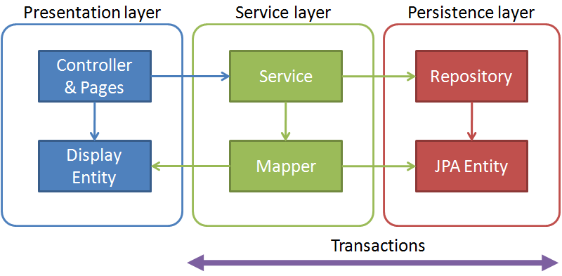

=======================
Pracownia Programowania
=======================

--------------------
Spring Boot
--------------------

.. class:: important 

    .. class:: important 

    Uwaga! cały kod znajduje się na gałęzi **SpringBootStart** w repozytorium https://github.com/WitMar/PRA2025 . Kod końcowy w gałęzi **SpringBootEnd**.
       
Jeżeli nie widzisz odpowiednich gałęzi na GitHubie wykonaj **Ctr+T**, a jak to nie pomoże to wybierz z menu **VCS->Git->Fetch**. 

Trójwarstwowy model aplikacji
---------------------------------

Aplikacje tworzone w SpringBoot w większości oparte są o model architektury trójwartswowej:

	| warstwa prezentacji : Controller, Pages, Display beans
	| warstwa serwisów : Services, Mapper between JPA entities and display beans    
	| warstwa persystencji : JPA DAOs Repositories, JPA entities - będzie tematem kolejnych zajęć
    
.. class:: center
	
	|a0|
	

Spring Boot
-------------

Spring Boot to lekki framework pozwalający na proste tworzenie aplikacji w oparciu o framework Spring. Spring Framework jest to platforma, której głównym celem jest uproszczenie procesu tworzenia oprogramowania w technologii Java/J2EE. Rdzeniem Springa jest kontener wstrzykiwania zależności, który zarządza komponentami i ich zależnościami. Obiekty zarządzane przez Springa nazywane są beanami.

O samym springu mówiliśmy na poprzednich zajęciach.

Startery (zależności definiowane w pliku pom.xml) są grupami zależności, które pozwalają na uruchamianie projektów Springowych minimalizując wysiłek ich konfiguracji.

W naszym przypadku głównym starterem będzie:

        | **spring-boot-starter-web** służy do budowania aplikacji opartych na REST API z wykorzystaniem Spring MVC oraz serwera aplikacji Tomcat.
        
Podany wyżej starter sprawia, że projekt jest konfigurowany do tego by korzystać z :

    | Wbudowanego Serwera Tomcat 
    | Hibernate for Object-Relational Mapping (ORM) - będzie tematem kolejnych zajęć
    | Apache Jackson for JSON binding
    | Spring MVC for the REST framework
    
Pełną listę starterów można znaleźć tutaj: 

    | https://docs.spring.io/spring-boot/docs/current/reference/htmlsingle/#using.build-systems.starters

Aplikacje przy użyciu Springa, buduje się modułowo. Idealnie wpasowuje się to w model MVC i pozwala na iteracyjny rozrost naszej aplikacji o kolejne moduły. 

Jeżeli pozwolisz (przy użyciu adnotacji **@EnableAutoConfiguration**) Spring Boot dokona w jak najszerszym sensie automatycznej konfiguracji projektu - wyszuka odpowiednie adnotacje i powoła obiekty do życia. 

Do generowania szkieletu aplikacji springowej możemy także posłużyć się stroną:

    | http://start.spring.io/
    
Który wyprodukuje szkielet aplikacji springowej wraz z zależnościami.    

Konfiguracja ustawień
-----------------------

Konfiguracja znajduje się w pliku application.yml

W tym momencie wykorzystujemy tylko ustawienie do zmiany domyślnego numeru portu na którym uruchamiany jest Spring.

.. code:: bash
  
  server:
    port : 8181

Konfiguracja zależności
--------------------------

W pliku POM definiujemy:

.. code:: bash

    <parent>
        <groupId>org.springframework.boot</groupId>
        <artifactId>spring-boot-starter-parent</artifactId>
        <version>3.3.10</version>
    </parent>

Jest to definicja wersji Spring Boota z jakiej korzystamy (**3.3.10**) ale także tzw. parent POM, dzięki czemu w naszym pliku POM możemy dziedziczyć wersje bibliotek z rodzica POM, tak by była między nimi pełna kompatybilność. 

Możemy więc w pliku POM zdefiniować:

.. code:: bash

        <dependency>
            <groupId>org.springframework.boot</groupId>
            <artifactId>spring-boot-starter-web</artifactId>
        </dependency>
        <dependency>
            <groupId>org.springframework.boot</groupId>
            <artifactId>spring-boot-starter-test</artifactId>
            <scope>test</scope>
        </dependency>
        <dependency>
            <groupId>org.springframework.boot</groupId>
            <artifactId>spring-boot-starter-data-jpa</artifactId>
        </dependency>

Bez określania wersji i parametr ten zostanie wydziedziczony z parent POM (o ile są tam zdefiniowane). Zobacz pakiety i ich wersje na stronie :

		| https://mvnrepository.com/artifact/org.springframework.boot/spring-boot-starter-parent/3.3.10

Do budowania aplikacji używamy następujących wtyczek, które budują JAR (a następnie z niego) plik WAR. Ta wersja powinna budowania powinna być kompatybilna ze wszystkimi wersjami Javy.

.. code:: bash

    <build>
        <plugins>
            <plugin>
                <groupId>org.apache.maven.plugins</groupId>
                <artifactId>maven-assembly-plugin</artifactId>
                <version>2.4.1</version>
                <dependencies>
                    <dependency>
                        <groupId>org.codehaus.plexus</groupId>
                        <artifactId>plexus-archiver</artifactId>
                        <version>2.4.4</version>
                    </dependency>
                </dependencies>
            </plugin>
            <plugin>
                <groupId>org.apache.maven.plugins</groupId>
                <artifactId>maven-jar-plugin</artifactId>
                <version>3.0.0</version>
                <dependencies>
                    <dependency>
                        <groupId>org.codehaus.plexus</groupId>
                        <artifactId>plexus-archiver</artifactId>
                        <version>2.4.4</version>
                    </dependency>
                </dependencies>
            </plugin>
            <plugin>
                <groupId>org.apache.maven.plugins</groupId>
                <artifactId>maven-war-plugin</artifactId>
                <version>3.2.0</version>
                <configuration>
                    <dependencies>
                        <dependency>
                            <groupId>org.codehaus.plexus</groupId>
                            <artifactId>plexus-archiver</artifactId>
                            <version>2.4.4</version>
                        </dependency>
                    </dependencies>
                </configuration>
            </plugin>
        </plugins>
    </build>
    

Uruchomienie
-------------

Główną klasą projektu jest klasa **SpringApp**. Znajduje się w niej funkcja main, inaczej mówiąc będzie to klasa, którą chcemy uruchamiać. 

Aby uruchomić aplikację Springową potrzebujemy klasę wejściową opatrzoną adnotacją **@SpringBootApplication**, oraz wywołanie metody statycznej run() na klasie SpringApplication.

Przed klasą znajdują się adnotacja

.. code:: java

    @SpringBootApplication(exclude = {HibernateJpaAutoConfiguration.class})

    
Jest ona tak naprawdę jest zbiorem kilku innych adnotacji (**@SpringBootConfiguration** (informacja, że obsługujemy żądania HTTP), **@EnableAutoConfiguration** (dzięki niej, aplikacja dokona samokonfiguracji według domyślnych wartości, załaduje potrzebne moduły itp.) oraz **@ComponentScan** (informacja, że ma przeskanować projekt w poszukiwaniu adnotacji odnośnie entity, repository, service i controller i je załadować)), informujemy tym samym, że dana klasa może być klasą rozruchową dla Springa, i zawiera w sobie podstawową konfigurację. 

Ta sama klasa zwierać będzie ustawienia Springa (analogicznie do poprzednich zajęć była to klasa w której definiowaliśmy samodzielnie beany). 

Aby uruchomić serwis wystarczy kliknąć prawym klawiszem na klasie **SpringApp.java** i wybrać **Run**. Spring Boot uruchamia wbudowany serwis aplikacji i nazwie Tomcata za nas i wgrywa tam aplikację, abyśmy sami mogli się skupić na tworzeniu kodu zamiast przejmowania się szczegółami technicznymi.

Tomcata uruchamia się domyślnie na porcie **8080**, jeżeli ten port jest zajęty na Twoim komputerze aplikacja się nie uruchomi. Korzystając z konfiguracji ustawień możesz zmienić port na inny.

Definicja API - Swagger
-------------------------

Uwaga! jeżeli uruchamiamy Springa poprzez główną klasę z Intellij nasz serwis będzie dostępny pod adresem **http://localhost:8181/**. Stąd jeżeli chciałbyś użyć postmana do komunikacji z serwisem korzystaj z tego adresu + ścieżki w ramach aplikacji.

.. class:: tag

    Zadanie 
    
Na poprzednich zajęciach widziałeś dokumentację API wygenerowaną przez bibliotekę Swagger. Nie jest ona standardowym elementem Spring Boota, aby dodać swaggera do projektu musisz wykonać następujące kroki. Dodaj do pom.xml (ten jeden krok jest już wykonany za Ciebie):

.. code:: xml

    <dependency>
      <groupId>org.springdoc</groupId>
      <artifactId>springdoc-openapi-starter-webmvc-ui</artifactId>
      <version>2.2.0</version>
    </dependency>
              
Możesz definiować elementy Swaggera dodając beana do Springa

.. code:: java

    @Bean
    public OpenAPI customOpenAPI() {
        return new OpenAPI()
                .info(new Info()
                        .title("My API")
                        .version("1.0")
                        .description("This is my awesome API."));
    }
    
Uruchom klasę **SpringApp** sprawdź w przeglądarce na **http://localhost:8181/swagger-ui/index.html#** czy swagger działa.   

.. class:: tag

    Zadanie 
    
Uruchom aplikację. Następnie wygeneruj obiekty metodą **generateModel** w indexController. 
    
Zobacz jak w obu przypadkach serializują się obiekty wywołując metody get na api/products oraz api/sellers.	

Serializer
------------	
  
.. class:: tag

    Zadanie
    
Zobacz, jak obiekt daty jest serializowany (wywołaj GET dla dowolnego obiektu). 

Podobnie jak na zajęciach z Jacksona, jeżeli chcielibyśmy zmienić format serializacji daty możemy tego dokonać ustawieniami na mapperze. Skąd jednak pobrać mapper używany przez Springa ? Najłatwiej jest zdefiniować własny mapper i przekazać go w konfiguracji Springa.

dodaj do POM:

.. code:: java

  <dependency>
      <groupId>com.fasterxml.jackson.datatype</groupId>
      <artifactId>jackson-datatype-joda</artifactId>
      <version>2.0.4</version>
  </dependency>
  
  
Zobacz czy serializacja sie zmieniła.  

Następnie dodaj do klasy **SpringApp** wsktrzykniecie własnego Mappera z własnymi ustawieniami:
        
.. code:: java

    @Bean
    public MappingJackson2HttpMessageConverter mappingJackson2HttpMessageConverter() {
        MappingJackson2HttpMessageConverter jsonConverter = new MappingJackson2HttpMessageConverter();
        ObjectMapper objectMapper = new ObjectMapper();
        objectMapper.registerModule(new JodaModule());
        objectMapper.disable(SerializationFeature.WRITE_DATES_AS_TIMESTAMPS);
        objectMapper.configure(DeserializationFeature.FAIL_ON_UNKNOWN_PROPERTIES, false);
        jsonConverter.setObjectMapper(objectMapper);
        return jsonConverter;
    }

zobacz, jak data jest teraz serializowana (zrestartuj aplikację i wywołaj GET na obiekcie). Co stanie się jak zmienię SerializationFeature.WRITE_DATES_AS_TIMESTAMPS z disable na enable? 

Lombok
------------

`Project Lombok <https://projectlombok.org/>`_ to biblioteka dla języka Java, która upraszcza kod poprzez automatyczne generowanie powtarzalnych elementów, takich jak gettery, settery, konstruktory czy metody ``toString()``. Dzięki adnotacjom Lomboka, kod staje się bardziej zwięzły i łatwiejszy w utrzymaniu.

Aby dodać Lomboka do projektu Maven:

.. code-block:: xml

    <dependency>
        <groupId>org.projectlombok</groupId>
        <artifactId>lombok</artifactId>
        <version>1.18.30</version>
        <scope>provided</scope>
    </dependency>

Adnotacje Lomboka
~~~~~~~~~~~~~~~~~~~

Poniżej przedstawiono najczęściej używane adnotacje:

- ``@Getter`` i ``@Setter`` – generują metody getter i setter.
- ``@ToString`` – generuje metodę ``toString()``.
- ``@EqualsAndHashCode`` – generuje metody ``equals()`` i ``hashCode()``.
- ``@NoArgsConstructor``, ``@AllArgsConstructor``, ``@RequiredArgsConstructor`` – generują różne konstruktory.
- ``@Data`` – skrót zawierający ``@Getter``, ``@Setter``, ``@ToString``, ``@EqualsAndHashCode`` i ``@RequiredArgsConstructor``.
- ``@Builder`` – umożliwia stosowanie wzorca buildera.
- ``@Slf4j`` – generuje logger oparty na bibliotece SLF4J.

Przykład
--------

.. code-block:: java

    import lombok.Data;

    @Data
    public class Osoba {
        private String imie;
        private String nazwisko;
    }

Powyższy kod generuje wszystkie potrzebne gettery, settery, ``toString()``, ``equals()``, ``hashCode()`` oraz konstruktor wymagany dla pól oznaczonych jako ``final``.

Współpraca z IDE
~~~~~~~~~~~~~~~~~~~

Lombok wymaga odpowiedniego wsparcia ze strony środowiska IDE:

- IntelliJ IDEA: należy zainstalować plugin Lombok oraz włączyć "Annotation Processing".
    
Controller
-----------

Kontroler to klasa odpowiedzialna za komunikację ze światem zewnętrznym (odpowiedź na zapytania z zewnątrz). W tym miejscu definiować będziemy endpointy REST API, czyli odpowiednie zachowania na zapytania HTTP.

Przed nazwą klasy kontrolera umieszczamy adnotację **@RestController**, by dać znać Springowi, że dana klasa jest kontrolerem. 

Dodatkowo możemy zdefiniować na klasie adnotację 

.. code:: java
    
    @RequestMapping("/api")
    
Która spowoduje, że do wszystkich ścieżek zdefiniowanych w klasie dodany zostanie przedrostek **"/api"**.    

Konkretne metody API definiujemy za pomocą adnotacji. Nazwa adnotacji wskazują na metodę HTTP.

.. code:: java
    
    @GetMapping(value = "/products", produces = MediaType.APPLICATION_JSON_VALUE)
    
oznacza zestaw mapowania funkcji metody GET. tj. jeśli adres główny naszej aplikacji to **http://localhost:8181/myApp**, to w celu pobrania naszych danych będziemy musieli podać adres: **http://localhost:8181/myApp/api/products**. Drugi parametr mówi o tym, że zwracane dane mają być serializowane do postaci JSON.

Spring używa **Jacksona** do serializacji i deserializacji danych.

Obsługa różnych metod HTTP
~~~~~~~~~~~~~~~~~~~~~~~~~~~~~~~~

Spring Boot pozwala na obsługę różnych metod HTTP za pomocą dedykowanych adnotacji:

- ``@GetMapping`` – obsługuje żądania GET.
- ``@PostMapping`` – obsługuje żądania POST.
- ``@PutMapping`` – obsługuje żądania PUT.
- ``@DeleteMapping`` – obsługuje żądania DELETE.
- ``@PatchMapping`` – obsługuje żądania PATCH.

Parametry
~~~~~~~~~~~~

Kontrolery mogą przyjmować dane z różnych źródeł:

- ``@PathVariable`` – zmienne z URL-a.
- ``@RequestParam`` – parametry zapytania.
- ``@RequestBody`` – dane przesyłane w ciele żądania (np. JSON).
- ``@RequestHeader`` – nagłówki HTTP.
    
Parametrami metody są parametry z nagłówka i ciało zapytania HTTP jak i ścieżka zapytania. Jeżeli chcemy odczytać dane ze ścieżki skorzystamy w definicji parametru z adnotacji **@PathVariable** i nazwy którą kojarzymy z nazwą z parametry value umieszczoną w klamrach.

.. code:: java
    
    @GetMapping(value = "/product/{id}", produces = MediaType.APPLICATION_JSON_VALUE)
    public Product getByPublicId(@PathVariable("id") Integer publicId)
    
W przypadku, gdy przekazujemy dane poprzez parametr zapytania HTTP (czyli ?param=value) stosujemy adnotację **@RequestParam** i nazwę paramteru taką jaka będzie w komunikacie HTTP.

.. code:: java

    @GetMapping(value = "/product", produces = MediaType.APPLICATION_JSON_VALUE)
    public Product getByParamPublicId(@RequestParam("id") Integer publicId) 
    
W przypadku, gdy chcemy odczytać ciało zapytania HTTP stosujemy adnotację **@RequestBody**.

.. code:: java

    @PostMapping(value = "/product")
    public ResponseEntity<Product> create(@RequestBody Product product) 
                                                                 
W przypadku zwracanych parametrów możemy także zwracać obiekty klas i przez parametr **produces** określać sposób ich deserializacji lub dodać adnotację **@ResponseBody** (mówi, że zwracany obiekt to JSON i zapisuje go do body komunikatu HTTP). 
Klasa ``ResponseEntity`` pozwala na pełną kontrolę nad odpowiedzią HTTP: kodem statusu, nagłówkami i ciałem odpowiedzi.
Możemy także w odpowiedzi przekierować zapytanie do innego endpointa poprzez zastosowanie **new RedirectView("/api/products", true);**. 
Bądź ostrożny, ponieważ RedirectView nie zmienia metody HTTP, tzn. przekierowanie z metody DELETE wysyła żądanie DELETE do przekierowanego adresu URL.

.. code:: java

    @DeleteMapping(value = "/product/{id}")
    public RedirectView delete(@PathVariable Integer id) {
        productService.deleteProduct(id);
        return new RedirectView("/api/productsList", true);
    }
    
.. class:: tag

    Zadanie 

Zobacz jak zachowuje się endpoint delete.
   
.. class:: tag

    Zadanie 
    
Dobrą praktyką w przypadku tworzenia obiektów w REST API jest zwracać ścieżkę do obiektu, lub cały obiekt w odpowiedzi (jako potwierdzenie / podanie użytkownikowi id stworzonego obiektu). Zamień sposób odpowiedzi na zapytanie POST na poniższą linijkę:

.. code:: java

    ResponseEntity.ok().body(product);
    
Wywołaj POST dla obiektu 

.. code:: json

	{
	  "bestBeforeDate": "2022-12-11T19:21:25.099Z",
	  "name": "kartofel",
	  "price": 10
	}    
    
Zobacz różnice w odpowiedzi pomiędzy POST a PUT.          

Service
---------

Jeżeli potrzebujemy opakować naszą interakcję z modelem danych przez logikę biznesową zastosujemy tzw. service - czyli warstwę pośrednią między danymi a widokiem.

W celu zdefiniowania serwisu przed nazwą klasy serwisu umieszczamy adnotację **@Service**. 

Spring wykorzystuje tzw. mechanizm wstrzykiwania zależności. To znaczy, że silnik springa jest odpowiedzialny za zarządzanie komponentami i przekazywanie ich do innych komponentów, tak by mogły być wykorzystywane razem. Kluczowa jest tu adnotacja 

.. code:: java
    
    @Autowired

Mówi ona springowi, że chcemy w tym miejscy pobrać obiekt komponentu zdefiniowany w systemie.

.. code:: java

    @Autowired
    private ProductService productService;
    
Adnotacja taka spowoduje, że w kontrolerze będziemy mogli wykorzystać serwis, Spring zainicjalizuje zmienną productService niejako "za nas" a my będziemy mogli z niej dalej korzystać.

Dokładniej to co definiujemy to interfejs, którym możemy posługiwać się w naszej klasie a Spring wstrzykuje do niego implementację tego interfejsu. Stąd, aby utworzyć serwis definiujemy interfejs: 

.. code:: java

    public interface ProductService 

z nagłówkami metod. Jeżeli będziemy chcieli skorzystać w innej klasie z tego interfejsu zdefiniujemy go jako 

.. code:: java

    @Autowired 
    private ProductService productService;

Natomiast zwyczajowo konwencja mówi by implementację metod zawrzeć w klasie o nazwie **ProductServiceImpl**. 

.. code:: java
    
    @Service
    public class ProductServiceImpl implements ProductService 
    
    
Inne typy danych     
~~~~~~~~~~~~~~~~~~
        
.. class:: tag

    Zadanie 
    
Zmień zapytanie **seller/{id}** tak by zwracało XML-a, a nie JSON-a. By to zrobić ustaw Media Type:

.. code:: java

    @GetMapping(value = "/seller/{id}", produces = MediaType.APPLICATION_XML_VALUE)
    @ResponseBody
    public ResponseEntity<Seller> getSellerByPublicId(@PathVariable("id") Integer publicId) {
        Optional<Seller> seller = sellerService.getSellerById(publicId);
        if(seller.isPresent()) {
            return ResponseEntity.ok(seller.get());
        } else
            return ResponseEntity.noContent().build();
    }      

Walidacja
--------------

Na koniec dodamy walidację do pola modelu i kontrolera.

W kontrolerze Produktu w metodzie create dodaj walidacje 

.. code:: java

	@PostMapping(value = "/product")
	public ResponseEntity<Product> create(@RequestBody @NotNull @Valid
                                                      Product product) 
                                                                                                           

W klasie Produktu dodaj walidacje, by cena nie mogła być większa niż 100

.. code:: java

    @Column
    @Max(value = 100)
    private BigDecimal price;
    
Przykłady adnotacji walidujących:

.. code:: java

    @Data
    @Builder
      
      public class UserRequestDTO {    
        @NotBlank(message = "Invalid Name: Empty name")
        @NotNull(message = "Invalid Name: Name is NULL")
        @Size(min = 3, max = 30, message = "Invalid Name: Must be of 3 - 30 characters")
        String name;    
        
        @Email(message = "Invalid email")      
        String email;    
        
        @NotBlank(message = "Invalid Phone number: Empty number")
        @NotNull(message = "Invalid Phone number: Number is NULL")
        @Pattern(regexp = "^\\d{10}$", message = "Invalid phone number")
        String mobile;    
        
        @Min(value = 1, message = "Invalid Age: Equals to zero or Less than zero")      
        @Max(value = 100, message = "Invalid Age: Exceeds 100 years")
        Integer age;
    }    
                                                      
Zobacz jaki jest zwracany komunikat w przypadku błędnego payloada. Aby przekazać użytkownikowi błąd możemy albo dodac wiadomość w adnotacji :

import jakarta.validation.constraints.NotBlank;

.. code:: java
    
    @Max(value = 100, message = "Price has to be at mst 100")
    private BigDecimal price;

albo przechwycić wyjątek za pomocą exception handlera. @RestControllerAdvice Jest to globalny handler wyjątków oraz miejsce do definiowania logiki współdzielonej przez wiele kontrolerów. Dodaj obsługę błędów.

.. code:: java

    @RestControllerAdvice
    public class GlobalExceptionHandler {

    @ExceptionHandler(HandlerMethodValidationException.class)
    public ResponseEntity<Map<String, String>> handleHandlerMethodValidationException(HandlerMethodValidationException ex) {
        Map<String, String> errors = new HashMap<>();

        ex.getAllErrors().forEach(error -> {
            String field = error.getDefaultMessage(); // object or method param
            String message = error.getDefaultMessage();
            errors.put(field, message);
        });

        return new ResponseEntity<>(errors, HttpStatus.BAD_REQUEST);
    }

}
                                                      
.. class:: tag

    Zadanie

Spróbuj dodać poprzez POST, JSON z obiektem, który nie jest poprawnym obiektem Product, porównaj wynik z odpowiedzią dla niewalidowanego endpointa PUT. 

.. code:: json

	{
		"id":1,
		"productId": "68e886e4-4d17-4b95-8408-3718fcb9f34c",
		"name": "Chleb",
		"price": 310.5,
		"bestBeforeDate": "2021-12-12T14:06:54.280Z"
	}	
	

Test
-----

W projekcie zdefiniowany jest pusty test z adnotacjami.

.. code:: java

    @RunWith(SpringRunner.class)
    @SpringBootTest

Powoduje on uruchomienie środowiska springowego (bez połączenia z bazą danych). Dzięki czemu możemy łatwo sprawdzić w momencie budowania, czy nie występują błedy w definicji ustawień i środowiska Springowego.  

.. [*] Wykorzystano materiały z:

http://silversableprog.blogspot.com/2015/11/javaspring-boot-jak-rozpoczac-pisanie-w.html

http://blog.mloza.pl/spring-boot-szybkie-tworzenie-aplikacji-web-w-javie/

http://blog.mloza.pl/spring-boot-interakcja-z-baza-danych-czyli-spring-data-jpa/#more-70

https://www.callicoder.com/spring-boot-rest-api-tutorial-with-mysql-jpa-hibernate/

https://spring.io/guides/tutorials/bookmarks/

https://fastfoodcoding.com/tutorials/1505105199524/crud-operations-using-spring-boot-jpa-hibernate-postgresql

https://shakeelosmani.wordpress.com/2017/02/13/step-by-step-spring-boot-hibernate-crud-web-application-tutorial/

https://github.com/Zianwar/springboot-crud-demo

https://kobietydokodu.pl/09-spring-mvc/

https://www.ibm.com/developerworks/library/j-spring-boot-basics-perry/index.html

https://sites.google.com/site/telosystutorial/springmvc-jpa-springdatajpa/presentation/architecture

https://salithachathuranga94.medium.com/validation-and-exception-handling-in-spring-boot-51597b580ffd
