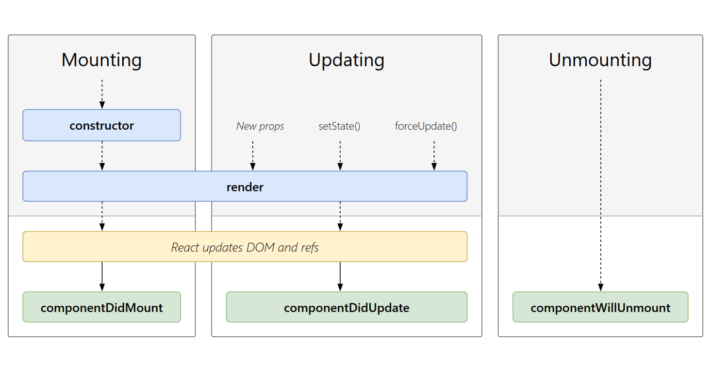
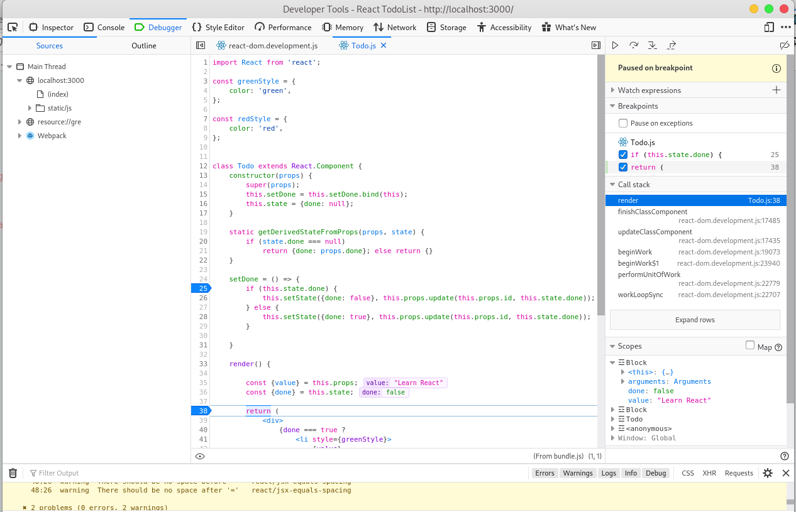

=======================
Programming Laboratory
=======================

--------------------
React
--------------------

.. class:: important

    Attention! The code for this class is on the branch **ReactStart** in the repository https://github.com/WitMar/PRA2020-PRA2021. The ending code in the branch **ReactEnd**.
    
If you do not see the right branches on GitHub, do **Ctr + T**, and if it does not help, choose **VCS-> Git-> Fetch** from the menu.

Node
-----

For this you will need **Node v8.0.0** and **npm v6.14.7** on your machine.

Node.js is a programming environment designed to create highly scalable web applications, especially web servers written in JavaScript. Node.js allows you to create event-driven applications that use an asynchronous I/O system.

On Linux systems, search if you have already installed nodejs and npm packages, eg. the installation for Ubuntu looks like this:

.. code:: bash

    sudo apt-get install nodejs npm

The work environment with javascript can be any text editor or a more advanced environment such as very similar to IntelliJ (it is very helpful in searching for syntax and syntax errors in the code).

    | https://www.jetbrains.com/webstorm/

    
Installation dependencies at home
------------------------------------

The application requires the installation of a node on the computer: https://nodejs.org/en/

To create a new app, you may choose the following method:

.. code:: bash

    npx create-react-app todoapp
    
You’ll need to have **Node >= 10** on your local development machine to run the command. You can use **nvm** (macOS/Linux) or **nvm-windows** to install and switch between Node versions in your computer. The above command will create a file structure of the new project.

If you are opening already download application, then, from the terminal level, in the project directory the following commands shall be invoked:

.. code:: bash
    
    npm start

Errors
--------

If I see the error:

.. code:: bash

    npm ERR! ENOTFOUND code
    npm ERR! errno ENOTFOUND
    npm ERR! network request to https://registry.npmjs.org/inline-process-browser/-/inline-process-browser-1.0.0.tgz failed, reason: getaddrinfo ENOTFOUND registry.npmjs.org registry.npmjs.org:443
    npm ERR! network This is a problem related to network connectivity.
    npm ERR! network In most cases you are behind or have bad network settings.
    npm ERR! network
    npm ERR! network If you are behind a proxy, please make sure that the
    npm ERR! network 'proxy' config is set properly. See: 'npm help config'

Try one of the following:

Temporary workaround: **add 104.16.20.35 registry.npmjs.org to /etc/hosts file**

or

.. code:: bash

    npm config set registry http://registry.npmjs.org
    
    
Installation - windows UAM computers
------------------------------------------

You need to install packages (preferably on polygon). 

.. code:: bash

    P:
    
    mkdir s[numer_indeksu]
    
    cd s[numer_indeksu]

Download the code from Git repository to created directory and run

.. code:: bash
    
    npm install
    
    npm start
    
You’ll need to have **Node v8.0.0** on your local development machine to run json-server, run in separate terminal

.. code:: bash

    json-server --watch db.json --port 8080
    
The application will be available under **localhost: 3000**, server under **localhost: 8080**.

The application is built live, during each change in source files. All you have to do is save the file and then changes are immediately applied.    

React
-------------

React is a declarative JavaScript library for building user interfaces. It lets you compose complex UIs from small and isolated pieces of code called “components”. React can be used as a base in the development of single-page or mobile applications. However, React is only concerned with state management and rendering that state to the DOM, so creating React applications usually requires the use of additional libraries for routing.

React use a virtual Document Object Model, or virtual DOM creating an in-memory data-structure cache, computing the resulting differences, and then updates the browser's displayed DOM efficiently. This allows the programmer to write code as if the entire page is rendered on each change, while the React libraries only render subcomponents that actually change. 

Project structure
-------------------

Dependencies of our project are stored in the **package.json** file.

package.json file play same role as played by pom.xml in Maven projects. 

Scripts section fefines a set of node scripts you can run. These scripts are command line applications. You can run them by calling npm run XXXX or yarn XXXX, where XXXX is the command name. Example: *npm run build*.

package.json follow the json syntax. The most important for us are again those under the tag **dependencies**. When you install a package using npm or yarn:

.. code:: bash

    npm install <PACKAGENAME>
    yarn add <PACKAGENAME>

that package is automatically inserted in the dependency list.

Package versions:

You have seen in the description above version numbers like these: **~3.0.0** or **^0.13.0**. What do they mean, and which other version specifiers can you use?

That symbol specifies which updates you package accepts, from that dependency. Given that using semver (semantic versioning) all versions have 3 digits, the first being the major release, the second the minor release and the third is the patch release, you have these rules:

    | ~: if you write ~0.13.0, you want to only update patch releases: 0.13.1 is ok, but 0.14.0 is not.
    | ^: if you write ^0.13.0, you want to update patch and minor releases: 0.13.1, 0.14.0 and so on.
    | \*: if you write \*, that means you accept all updates, including major version upgrades.
    | >: you accept any version higher than the one you specify
    | >=: you accept any version equal to or higher than the one you specify
    | <=: you accept any version equal or lower to the one you specify
    | <: you accept any version lower to the one you specify
    
there are other rules, too:

    | no symbol: you accept only that specific version you specify
    | latest: you want to use the latest version available
    
Downloaded dependencies are stored in the **node_modules** folder and should not be the element of the code repository.

The code is stored in the **src** folder.

In order to add new dependency run **npm install NAME_OF_LIBRARY** in the project forlder. the dependecy would automatically be added to the package.json file.
    
Javascript and Immutability
-----------------------------

There are generally two approaches to changing data. The first approach is to mutate the data by directly changing the data’s values. The second approach is to replace the data with a new copy which has the desired changes. React elements are immutable. Once you create an element, you can’t change its children or attributes.

Immutable data can easily determine if changes have been made, which helps to determine when a component requires re-rendering.

JSX
----

JSX, or JavaScript XML, is an extension to the JavaScript language syntax. Similar in appearance to HTML, JSX provides a way to structure component rendering using familiar HTML syntax.

JavaScript expressions (but not statements) can be used inside JSX with curly brackets **\{\}**:

.. code:: java

  <h1>{10+1}</h1>

The example above will render

.. code:: java

  <h1>11</h1>

If–else statements cannot be used inside JSX but conditional expressions can be used instead. 

.. code:: java

    

        <h1>{ i === 1 ? 'true' : 'false' }</h1>
        <h1>{ i === 1 && "I equals one" }</h1>
    

    
      
Index
------

Applications built with React usually have a single **root DOM node**. To render a React element into a root DOM node, pass component and root element to ReactDOM.render():

.. code:: java

    ReactDOM.render( <TodoList />, document.getElementById('root') );
    

React Components
-------------------

Components are independent and reusable bits of code.

**Class components** 

When creating a React component, the component's name must start with an upper case letter.

The component has to include the extends React.Component statement, this statement creates an inheritance to React.Component, and gives your component access to React.Component's functions. Component requires to have a render method that returns a hierarchy of views to display.

.. code:: java

    class TodoList extends React.Component {
        render() {
            return (
                

                    <h1>Todo List {this.props.name}</h1>
                    <ul>
                        <li>Learn React</li>
                        <li>Pass programming laboratory</li>
                        <li>Have a nice holiday</li>
                    </ul>
                

            );
        }
        
        export default TodoList;

    }
    
React is all about re-using code, and it can be smart to insert some of your components in separate files. Note that the file must start by importing React and it has to end with the statement *export default TodoList;*.    
    
Once we define a component, we can now render it in other component by writing *<TodoList />*. Each React component is encapsulated and can operate independently; this allows you to build complex UIs from simple components.    

**Function components**

In React, function components are a simpler way to write components that only contain a render method and don’t have their own state. We can write a function that takes props as input and returns what should be rendered.

.. code:: java

    function Todo() {
        return (
            <li className="todo" >
                Have a nice holidays
            </li>
        );
    }

    export default Todo;

.. class:: tag

    Exercise
    
Apply Todo component to the TodoList

Css styles
--------------

We can add CSS styles as :
    
    | separate files
    | inline css styles
 
.. code:: java

    const greenStyle = {
        color: 'green',
    };    
    
     <li style={greenStyle}>Learn React</li>

or 

    | styled html components

Create a variable by selecting a particular html element where we store our style keys 

.. code:: java

    const Div = styled.htmlElemnet`color: pink`
    
Then we use the name of our variable as a wrapper *

*, kind like we reuse the react component.
    
.. code:: java

    const undone = styled.p`
        color: red,
    `;

    <undone>Pass programming laboratory</undone>
    
Remember that styled components names need to start with **capital letter**.    
    
Passing Data Through Props 
---------------------------

A component takes in parameters, called **props** (short for “properties”). Properties of the constructor can be accessed by the variable **this.props**.

When defining a component to render we can pass the value in the component definition. The name of the parameters should match the name of the prop that we defined in the *TodoList* component. 

.. code:: java

    class Lists extends React.Component {
        render() {
            return <TodoList name="My List" />;  
            }
    }

    class TodoList extends React.Component {
        render() {
            return (
            

                <h1>Todo List {this.props.name}</h1>
                <ul>
                    <Todo/>
                    <Todo/>
                    <Todo/>
                </ul>
            

        );
        }
    }
    
Props are **read-only** and cannot be modified!    
 
.. class:: tag

    Exercise
    
Make List the most general (parent) component.
    
State
------

We want be able to add and remember todos. To “remember” things, components use state. React components can have state by setting this.state in their constructors. this.state should be considered as private to a React component that it’s defined in. 

State of the constructor can be accessed by the variable **this.state**. 

**Do Not Modify State Directly** changing the state directly will not re-render a component:

.. code:: java

    // Wrong
    this.state.nr = 0;
    this.state.todosList.push({ name : "List", elements = [ "learnReact"] });

Instead, use setState():

.. code:: java
    
    // Correct 
    newelement = { name : "List", elements = [ "learnReact"] };
    this.setState(prevState => ({
        number : 0;
        todosList : [...prevState.todosList, newelement]
    }))
    
State changes are executed asynchronously so you need to be aware of possible implications of this behaviour and do not assume that one setState will be executed before another one (and before next line in your code!!).    

setState only changes the value of provided variable leaving other state variables intact, so you do not need to set the whole state in every setState command.

The only place where you can directly assign **this.state** is the **constructor**.

State is not accessible to any component other than the one that owns and sets it. To collect data from multiple children, or to have two child components communicate with each other, you need to declare the shared state in their parent component instead. The parent component can pass the state back down to the children by using props; this keeps the child components in sync with each other and with the parent component. In order to pass the value from child to the parent we are using functions - then parent pass a function as a props to the child, when child execute the function it is executed on parent with access to it state.

Constructor
--------------

.. class:: important
    
    In JavaScript classes, you need to always call super when defining the constructor of a subclass. All React component classes that have a constructor should start with a super(props) call.

.. code:: java

    constructor(props) {    
        super(props);    
        this.state = { todosList: [] }; 
    }    
    
.. class:: tag

    Exercise
    
Add constructor and state to TodoList

.. code:: java

    class TodoList extends React.Component {
        constructor(props) {
            super(props);
            let t1 = { value : "Learn React", done : true };
            let t2 = { value : "Pass Programming Laboratory", done : false };
            let t3 = { value : "Have a nice holiday", done : false };
            this.state = { todosList: [t1, t2, t3] };
        }

        render() {

            const {todosList} = this.state;

            let todos = todosList.map( todo => {
                return (<ul>
                    <Todo value = {todo.value}
                            done = {todo.done}   />
                    </ul>);
            })

            return (
                

                    <h1>Todo List {this.props.name}</h1>
                    {todos}
            

            );  
        }   
    }
    
    export default TodoList;
    
Events
-----------

We can execute HTML events in React.

.. code:: java

    constructor(props) {
    // This binding is necessary to make `this` work in the callback    
    this.addTodo = this.addTodo.bind(this);  
    }
    
    addTodo = () => {
        let newelement = { value : "new", done : false };
        this.setState(prevState => ({
            todosList : [...prevState.todosList, newelement]
        }));
    };
    
    <button onClick={this.addTodo}>  
        AddTodo
    </button>

Where addTodo is a react function. Remebmer to bind the function when defined, it you forget to bind this.addTodo and pass it to onClick, this will be undefined when the function is actually called. Alternatively you can use an **arrow function** in the callback:

.. code:: java

    constructor(props) {
    
    }
    
    addTodo = () => {
        let newelement = { value : "new", done : false };
        this.setState(prevState => ({
            todosList : [...prevState.todosList, newelement]
        }));
    };
    
    <button onClick={() => this.addTodo()}>  
        AddTodo
    </button>
    
The problem with this syntax is that a different callback is created each time the component renders and it might force an extra re-rendering.

If you need to prevent default behaviour of a html event you need to execute preventDefault() method.

.. code:: java

    function ActionLink() {
        function handleClick(e) {    
            e.preventDefault();    
            console.log('The link was clicked.');  
        }
        
        return (
            <a href="#" onClick={handleClick}> Click me </a>
        );
    }
    
.. class:: tag

    Exercise
    
Add new Todo element on user click.

React List and Keys
---------------------

Lists are an important aspect within your app. Every application is bound to make use of lists in some form or the other. In React, when you use lists, each list item needs a unique key.
Keys are necessary to improve performance of your React app. Keys help React identify which items have changed (added/removed/re-ordered). To give a unique identity to every element inside the array, a key is required.

.. code:: java

    <ul key = {todo.id}>
        
.. class:: tag

    Exercise
    
Copy and analyze following code:

.. code:: java

    class TodoList extends React.Component {
        constructor(props) {
            super(props);
            let t1 = { id : 0, value : "Learn React", done : true };
            let t2 = { id : 1, value : "Pass Programming Laboratory", done : false };
            let t3 = { id : 2, value : "Have a nice holiday", done : false };
            this.state = { todosList: [t1, t2, t3] };
            this.addTodo = this.addTodo.bind(this);
            this.counter = 2;
        };

        addTodo = () => {
            this.counter++;
            let newelement = { id: this.counter, value : "new", done : false };
            this.setState(prevState => ({
                todosList : [...prevState.todosList, newelement]
            }));
        };

        handleRemove = id => {
            let arrAfterDel = this.state.todosList.filter(function(item) {
                return item.id !== id
            });
            this.setState({todosList : arrAfterDel});
        }

        render() {
    
            const {todosList} = this.state;
    
            let todos = todosList.map( todo => {
                return (<ul key = {todo.id}>
                            <Todo value = {todo.value}
                                done = {todo.done}   />
                            <button type="button" onClick={() => this.handleRemove(todo.id)}>
                                Remove
                            </button>
                    </ul>);
            })

            return (
                

                    <h1>Todo List {this.props.name}</h1>
                    {todos}
                    <button onClick={this.addTodo}>
                        AddTodo
                    </button>
                

            );
        }
    }

    export default TodoList;    

Notice that we have to use a global variable counter for adding unique id's to object. This value will live with the component. We could use the state to save counter, but remember that changes on state cause re-render and it is not needed in this case.

Component lifecycle
--------------------

.. class:: center
	
	|col|
	

Lifecycle methods use a form of hooking that allows the execution of code at set points during a component's lifetime.

    | **shouldComponentUpdate** allows the developer to prevent unnecessary re-rendering of a component by returning false if a render is not required.
    | **componentDidMount** is called once the component has "mounted" (the component has been created in the user interface, often by associating it with a DOM node). This is commonly used to trigger data loading from a remote source via an API.
    | **componentWillUnmount** is called immediately before the component is torn down or "unmounted". This is commonly used to clear resource-demanding dependencies to the component that will not simply be removed with the unmounting of the component (e.g., removing any setInterval() instances that are related to the component, or an "eventListener" set on the "document" because of the presence of the component)
    | **render** is the most important lifecycle method and the only required one in any component. It is usually called every time the component's state is updated, which should be reflected in the user interface.
    
A component’s lifecycle can be divided into 4 parts:

    | Mounting —  an instance of a component is being created and inserted into the DOM.
    | Updating — when the React component is born in the browser and grows by receiving new updates. 
    | Unmounting — the component is not needed and gets unmounted.
    | Error handling — called when there is an error during rendering, in a lifecycle method, or in the constructor of any child component.
    

Lifecycle methods
-------------------

React has four built-in methods that gets called, in this order, when mounting a component:

    | constructor()
    | getDerivedStateFromProps()
    | render()
    | componentDidMount()

The getDerivedStateFromProps() method is called right before rendering the element(s) in the DOM. This is the natural place to set the state object based on the initial props. Also at updates the getDerivedStateFromProps method is called. This is the first method that is called when a component gets updated.  

.. class:: tag

    Exercise
    
Make Todo a class component and add button that set Todo to done

.. code:: java

    import React from 'react';

    const greenStyle = {
        color: 'green',
    };

    const redStyle = {
        color: 'red',
    };

    class Todo extends React.Component {
        constructor(props) {
            super(props);
            this.setDone = this.setDone.bind(this);
            this.state = {done: null};
        }

        static getDerivedStateFromProps(props, state) {
            if (state.done === null)
                return {done: props.done}; else return {};
        }

        setDone = () => {
            if (this.state.done) {
                this.setState({done: false});
            } else {
                this.setState({done: true});
            }
        }

        render() {

            const {value} = this.props;
            const {done} = this.state;
    
            return (
                

                    {done === true ?
                        <li style={greenStyle}>
                            {value}
                        </li> :
                        <li style={redStyle}>
                            {value}
                        </li>}
                    <button onClick={this.setDone}>
                        Change status
                    </button>
                

            )

        };
    }

    export default Todo;

Of course now the downsize of this solution is that the parent component does not know about the change of state of the child component. 

Add a function to the props of child component that will update the data.

.. code:: java

    updateChild = (id, done) => {
        let arrAfterUpdate = this.state.todosList.map(function (item) {
            if(item.id === id) item.done = done;
            return item;
        });
        this.setState({todosList: arrAfterUpdate});
        console.log(arrAfterUpdate);
    };
    
in render add :    

.. code:: java

      <Todo value={todo.value}
                      done={todo.done}
                      id = {todo.id}
                      update={(id, done) => this.updateChild(id, done)}  />

Execute it in the Todo.js

.. code:: java

    setDone = () => {
        if (this.state.done) {
            this.setState({done: false}, this.props.update(this.props.id, this.state.done));
        } else {
            this.setState({done: true}, this.props.update(this.props.id, this.state.done));
        }

    }

Remember that setState is asynchronous therefore we can not do 

.. code:: java

        if (this.state.done) {
            this.setState({done: false});
        } else {
            this.setState({done: true});
        }
        this.props.update(this.props.id, this.state.done)

as likely state would be updated **after** the update function would be executed. Therefore we use callback function which is a second argument of setState functon and is executed once the setState has been finished. 
    
Debugging
-----------

You can debug and check for errors in your React application using Browser. In firefox click right button of the mouse and choose inspect element. 

In the console tab you can find errors returned by the javascript code.

In the debugger tab you can debug the application. Click on the Debugger tab, click **ctrl + p** to choose a Todo.js file. Set up a breakpoint and click on the website. Check the value of variables and how to debug.

.. class:: center
	
	|col1|
	

    
Input fields
-------------

You add a form with React like any other element. Data is handled by the components, all the data is stored in the component state. You can control changes by adding event handlers in the onChange attribute.

.. class:: tag

    Exercise
    
Allow user to add todo with the input field

Add to TodoList:

.. code:: java

    myChangeHandler = (event) => {
        this.setState({newTodo: event.target.value});
    }

    ...
    render() {
    ...
    return (
            

                <h1>Todo List {this.props.name}</h1>
                {todos}
                
 My new todo 

                <input
                    type='text'
                    onChange={this.myChangeHandler}
                />
                <button onClick={this.addTodo}>
                    AddTodo
                </button>
            

        );

HTTP requests
--------------------

Our ultimate goal is to make our application work together with the json-server that is running on port 8080.

For this we will use the library which is called axios. Axios is a lightweight HTTP client.

Add import to TodoList component:

.. code:: java

    import axios from 'axios';
    

Get all elements from the server and save them as the todos on componentMount:
    
.. code:: java

    componentDidMount() {
        axios.get(`http://localhost:8080/todos`)
            .then(res => {
                const todosList = res.data;
                this.setState({ todosList });
            })
    }
    
In order to update element on the server we use the PUT method:

.. code:: java

    updateChild = (id, done) => {
        let arrAfterUpdate = this.state.todosList.map(function (item) {
            if(item.id === id) item.done = done;
            return item;
        });

        let object = arrAfterUpdate.find(function (item) {
            if(item.id === id) return item;
        });

        this.setState({todosList: arrAfterUpdate});

        axios.put(`http://localhost:8080/todos/${object.id}`, object);

        console.log(arrAfterUpdate);
    };

POST on add:

.. code:: java

    addTodo = () => {
        this.counter++;
        let newelement = {id: this.counter, value: this.state.newTodo, done: false};
        this.setState(prevState => ({
            todosList: [...prevState.todosList, newelement]
        }));
        axios.post(`http://localhost:8080/todos/`, newelement);
    };
    
DELETE on deletion:

.. code:: java

    handleRemove = id => {
        let object = this.state.todosList.find(function (item) {
            if(item.id === id) return item;
        });
        let arrAfterDel = this.state.todosList.filter(function (item) {
            return item.id !== id
        });
        this.setState({todosList: arrAfterDel});

        axios.delete(`http://localhost:8080/todos/${object.id}`, object);
    }

Styling
--------------

We would like to add a Bootstrap table to our project.

Render expect to have a wrapper root tag in the return object. But sometimes you don't want to have it in your code. In such case you can use a React.Frament element.

Install bootstrap:

.. code:: bash

    npm install bootstrap

Add this to Todo.js class:

.. code:: bash

    import 'bootstrap/dist/css/bootstrap.min.css';
 
.. code:: java

            <React.Fragment>
                {done === true ?
                    <th style={greenStyle}>
                        {value}
                    </th> :
                    <th style={redStyle}>
                        {value}
                    </th>}
                <th>
                    <button onClick={this.setDone}>
                        Change status
                    </button>
                </th>
            </React.Fragment>

Add bootstrap table elements to the main class:

.. code:: java
    
    render() {

        const {todosList} = this.state;

        let todos = todosList.map(todo => {
            return (<tr key={todo.id}>
                <Todo value={todo.value}
                      done={todo.done}
                      id = {todo.id}
                      update={(id, done) => this.updateChild(id, done)}  />
                <th>
                    <button type="button" onClick={() => this.handleRemove(todo.id)}>
                    Remove
                    </button>
                </th>
            </tr>);
        })

        return (
            

                <h1>Todo List {this.props.name}</h1>
                <table className="table table-striped">
                    <thead className="thead-dark">
                    <th scope="col">Todo</th>
                    <th scope="col">Status</th>
                    <th scope="col"></th>
                    </thead>
                    <tbody>
                        {todos}
                    </tbody>
                </table>
                
 My new todo 

                <input
                    type='text'
                    onChange={this.myChangeHandler}
                />
                <button onClick={this.addTodo}>
                    AddTodo
                </button>
            

        );
    }

See the results.

.. class:: tag

    Exercise
    
Make the elements in the todo description a textarea and allow user to edit the values

.. code:: java

    <React.Fragment>
                {done === true ?
                    <th style={greenStyle}>
                       <textarea rows="4" cols="100"
                               value={value}
                        />
                    </th> :
                    <th style={redStyle}>
                        <textarea rows="4" cols="100"
                               value={value}
                        />
                    </th>}
                <th>
                    <button onClick={this.setDone}>
                        Change status
                    </button>
                </th>
    </React.Fragment>
    
Tests
-------

In order to run the test in TodoList.test.js we need create a new run configuration in WebStorm.

Choode plus and choose **Jest**, in the window that is open in the *Jest options* put **--env=jsdom**.

You can read more about the tests at

    | https://jestjs.io/docs/en/tutorial-react
   
.. [*] Used materials from :

https://projects.wojtekmaj.pl/react-lifecycle-methods-diagram/

https://reactjs.org/tutorial/tutorial.html

https://codeburst.io/4-four-ways-to-style-react-components-ac6f323da822

https://en.wikipedia.org/wiki/React_(web_framework)

https://reactjs.org/docs/getting-started.html

https://medium.com/@krishankantsinghal/package-json-understanding-it-for-your-nodejs-reactjs-angularjs-or-any-javascript-app-which-use-5a18de90d33

https://adhithiravi.medium.com/why-do-i-need-keys-in-react-lists-dbb522188bbb

https://www.w3schools.com/react/react_lifecycle.asp

https://www.netguru.com/codestories/react-native-lifecycle
