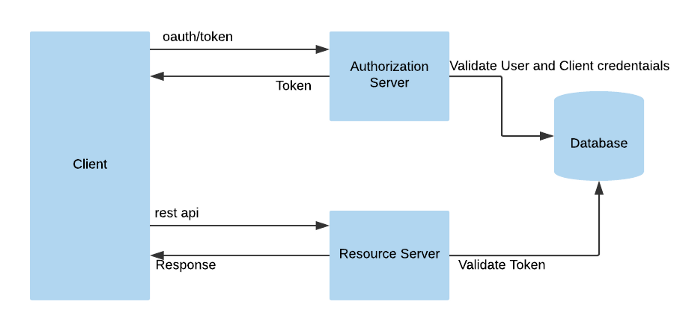
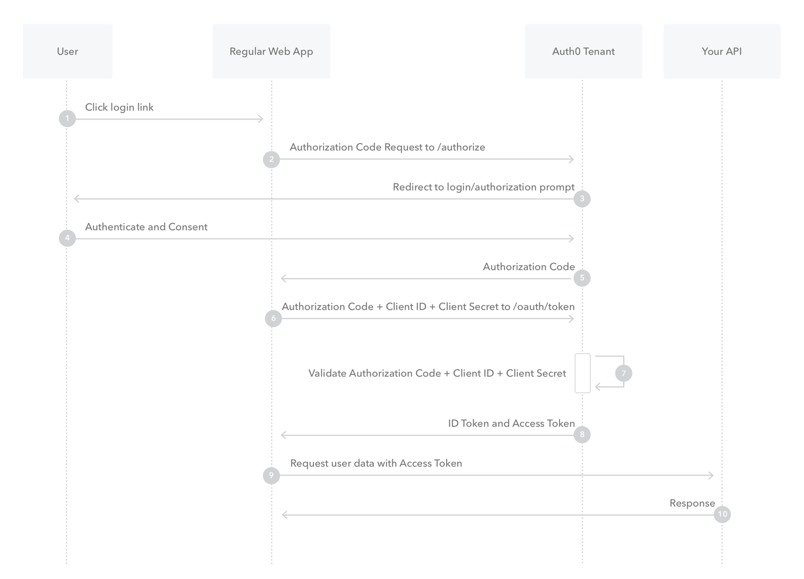
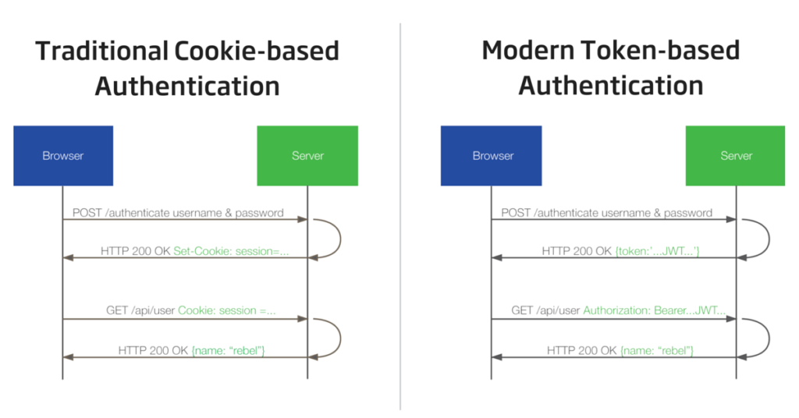

=======================
Programming Laboratory
=======================

--------------------
Spring Security
--------------------

.. class:: important

    Attention! The code for this class is on the branch **SpringSecurityStart / SpringSecurityReactStart** in the repository https://github.com/WitMar/PRA2020-PRA2021. The ending code in the branch **SpringSecurityEnd / SpringSecurityReactEnd**. The code is based on solution made by Rajeev Singh "callicoder" (see references).
    
If you do not see the right branches on GitHub, do **Ctr + T**, and if it does not help, choose **VCS-> Git-> Fetch** from the menu.

OAuth
-------------

The OAuth 2.0 authorization framework is a protocol that allows a user to grant a third-party web site or application access to the user's protected resources, without necessarily revealing their long-term credentials or even their identity.

Instead of using the resource owner's credentials to access protected resources, the client obtains an access token--a string denoting a specific scope, lifetime, and other access attributes. Access tokens are issued to third-party clients by an authorization server with the approval of the resource owner. Then the client uses the access token to access the protected resources hosted by the resource server.

Auth0 generates access tokens for API authorization scenarios, in JSON web token (JWT) format. The permissions represented by the access token, in OAuth terms, are known as scopes. When an application authenticates with Auth0, it specifies the scopes it wants. If those scopes are authorized by the user, then the access token will represent these authorized scopes.

.. class:: center
	
	|a0|
	

	
    
.. class:: center
	
	|a1|
	

Token
------

Authentication is the process by which an application confirms user identity. Applications have traditionally persisted identity through session cookies, relying on session IDs stored server-side. This forces developers to create session storage that is either unique to each server, or implemented as a totally separate session storage layer.

Token authentication is a more modern approach and is designed solve problems session IDs stored server-side can’t. Using tokens in place of session IDs can lower your server load, streamline permission management, and provide better tools for supporting a distributed or cloud-based infrastructure.

.. class:: center
	
	|a3|
	

As you can see in the diagram above, once the user’s credentials are exchanged for a token on the server, the client can use the token to validate each subsequent request. Once generated, the token is attached to the user via a browser cookie or saved in local/session storage.

All of the user metadata is encoded right into the token itself, so any machine on your network can validate any user. The server and client can pass the token back and forth forever and never store any user or session data. This is “statelessness,” and it’s the key to your application’s scalability.

JWT token
-----------

A JWT is a compact, URL-safe, encryptable JSON object that is rapidly becoming the standard for token implementation across the web.

A well-formed JWT consists of three concatenated Base64url-encoded strings, separated by dots (.):

    | **JOSE Header**: contains metadata about the type of token and the cryptographic algorithms used to secure its contents.

    | **JWS payload** (set of claims): contains verifiable security statements, such as the identity of the user and the permissions they are allowed.

    | **JWS signature**: used to validate that the token is trustworthy and has not been tampered with. When you use a JWT, you must check its signature before storing and using it.
    
Tokens are signed to protect against manipulation, they are not encrypted. What this means is that a token can be easily decoded and its contents revealed. There are many websites that are able to read the header and payload – but without the correct secret, the token is useless

You can encode or decode JWT token for example using

    | https://www.jsonwebtoken.io/

In a real world scenario, a client would make a request to the server and pass the token with the request. The server would attempt to verify the token and, if successful, would continue processing the request. If the server could not verify the token, the server would send a 401 Unauthorized and a message saying that the request could not be processed as authorization could not be verified.    
    
Google API
------------

All applications follow a basic pattern when accessing a Google API using OAuth 2.0. At a high level, you follow five steps:

Obtain OAuth 2.0 credentials from the Google API Console.
Visit the Google API Console to obtain OAuth 2.0 credentials such as a client ID and client secret that are known to both Google and your application. The set of values varies based on what type of application you are building. For example, a JavaScript application does not require a secret, but a web server application does.

Spring Security
-----------------

Spring Security is a powerful and highly customizable authentication and access-control framework.

@ConfigurationProperties
============================

@ConfigurationProperties bind external configurations to a strongly typed bean in your application code. You can inject and use this bean throughout your application code just like any other spring bean.

Spring Boot application loads configuration properties from application.properties file located in the classpath by default. can bind the properties defined in the application.properties file to a POJO class using @ConfigurationProperties. The @ConfigurationProperties annotation takes a prefix parameter, and binds all the properties with the specified prefix to the POJO class.

Properties set in pojo class:

.. code:: java

    app:
      auth:
        tokenSecret: PRACOWNIAPROGRAMOWANIA
        tokenExpirationMsec: 864000000
      oauth2:
        # After successfully authenticating with the OAuth2 Provider,
        # we'll be generating an auth token for the user and sending the token to the
        # redirectUri mentioned by the client in the /oauth2/authorize request.
      authorizedRedirectUris:
        - http://localhost:3000/oauth2/redirect
        
An app requesting an access token has to know the token secret in order to gain the token. This prevents malicious apps that have not been authorized from using the tokens from ever obtaining a valid access token. It is not connected to authenticating a user, but it's instead for authorizing an app to request access tokens.      

Spring Security Configuration
===============================

.. code:: java

    @EnableGlobalMethodSecurity(
            jsr250Enabled = true,
            prePostEnabled = true
    )

It enables more complex expression based access control syntax with @PreAuthorize and @PostAuthorize annotations. It enables the @RolesAllowed annotation.

.. code:: java

    @PreAuthorize decides whether a method can actually be invoked or not. 

    @PreAuthorize("hasRole('USER')")
    public void create(Contact contact);

means that access will only be allowed for users with the role "ROLE_USER". 

TokenAuthenticationFilter
===========================

When client obtained valid token and wants to call some REST endpoint other than /authenticate? It needs to provide X-Auth-Token header. If this token is present, AuthenticationFilter creates proper input Authentication object and AuthenticationManager calls TokenAuthenticationProvider to authenticate. Implementation of this provider is very simple. What we actually want is to validate if token is present and not empty and then ask our TokenService if it contains such token. The presence of this token just means that we have a request from someone who has already authenticated, so we can return the authenticated Authentication.

.. code:: java

    package com.example.springsocial.security;

    public class TokenAuthenticationFilter extends OncePerRequestFilter {

    @Autowired
    private TokenProvider tokenProvider;

    @Autowired
    private CustomUserDetailsService customUserDetailsService;

    private static final Logger logger = LoggerFactory.getLogger(TokenAuthenticationFilter.class);

    @Override
    protected void doFilterInternal(HttpServletRequest request, HttpServletResponse response, FilterChain filterChain) throws ServletException, IOException {
        try {
            String jwt = getJwtFromRequest(request);

            if (StringUtils.hasText(jwt) && tokenProvider.validateToken(jwt)) {
                Long userId = tokenProvider.getUserIdFromToken(jwt);

                UserDetails userDetails = customUserDetailsService.loadUserById(userId);
                UsernamePasswordAuthenticationToken authentication = new UsernamePasswordAuthenticationToken(userDetails, null, userDetails.getAuthorities());
                authentication.setDetails(new WebAuthenticationDetailsSource().buildDetails(request));

                SecurityContextHolder.getContext().setAuthentication(authentication);
            }
        } catch (Exception ex) {
            logger.error("Could not set user authentication in security context", ex);
        }

        filterChain.doFilter(request, response);
    }

    private String getJwtFromRequest(HttpServletRequest request) {
        String bearerToken = request.getHeader("Authorization");
        if (StringUtils.hasText(bearerToken) && bearerToken.startsWith("Bearer ")) {
            return bearerToken.substring(7, bearerToken.length());
        }
        return null;
    }
    }

**AuthenticationEntryPoint** - This class is used to return a 401 unauthorized error to clients that try to access a protected resource without proper authentication. It implements Spring Security’s AuthenticationEntryPoint interface.

Http security 
===============

The HttpSecurity configurations are used to configure security functionalities like csrf, sessionManagement, and add rules to protect resources based on various conditions. I.e. permitting access to static resources and few other public APIs to everyone and restricting access to other APIs to authenticated users only.

.. code:: java
    
    .authorizeRequests()
                    .antMatchers("/",
                        "/error",
                        "/favicon.ico",
                        "/**/*.png",
                        "/**/*.gif",
                        "/**/*.svg",
                        "/**/*.jpg",
                        "/**/*.html",
                        "/**/*.css",
                        "/**/*.js")
                        .permitAll()
                    .antMatchers("/auth/**", "/oauth2/**")
                        .permitAll()
                    .anyRequest()
                        .authenticated()
                        
We allow everyone to access /auth and /oauth2/ and to download files, but restrict acess on all other endpoints.                         
    
OAuth communication flow
==========================

.. code:: java

                .oauth2Login()
                    .authorizationEndpoint()
                        .baseUri("/oauth2/authorize")
                        .authorizationRequestRepository(cookieAuthorizationRequestRepository())
                        .and()
                    .redirectionEndpoint()
                        .baseUri("/oauth2/callback/*")
                        .and()
                    .userInfoEndpoint()
                        .userService(customOAuth2UserService)
                        .and()
                    .successHandler(oAuth2AuthenticationSuccessHandler)
                    .failureHandler(oAuth2AuthenticationFailureHandler);

                    // Add our custom Token based authentication filter
                    http.addFilterBefore(tokenAuthenticationFilter(), UsernamePasswordAuthenticationFilter.class);

The first step is the frontend call to the endpoint 

    | http://localhost:8080/oauth2/authorize/google?redirect_uri=http://localhost:3000/oauth2/redirect

The **redirect_uri** is the URI to which the user will be redirected once the authentication with the OAuth2 provider is successful. 

On receiving the authorization request, Spring Security’s OAuth2 client will redirect the user to the **AuthorizationUrl** of the supplied provider.
All the state related to the authorization request is saved using the **authorizationRequestRepository** specified in the **SecurityConfig**.

If the user allows permission to the app, the provider will redirect the user to the callback url http://localhost:8080/oauth2/callback/google with an authorization code.

If the **OAuth2** callback is successful and it contains the authorization code, Spring Security will exchange the **authorization_code** for an **access_token** and invoke the **customOAuth2UserService** specified in the above **SecurityConfig**.

The **customOAuth2UserService** retrieves the details of the authenticated user and creates a new entry in the database or updates the existing entry with the same email.

Finally, the **oAuth2AuthenticationSuccessHandler** is invoked. It creates a JWT authentication token for the user and sends the user to the redirect_uri along with the JWT token in a query string

CustomOAuth2UserService
==========================

The CustomOAuth2UserService extends Spring Security’s DefaultOAuth2UserService and implements its loadUser() method. This method is called after an access token is obtained from the OAuth2 provider.

In this method, we first fetch the user’s details from the OAuth2 provider. If a user with the same email already exists in our database then we update his details, otherwise, we register a new user.

RestAuthenticationEntryPoint
=================================

This class is invoked when a user tries to access a protected resource without authentication. In this case, we simply return a 401 Unauthorized response.

UserPrincipal
================
The UserPrincipal class represents an authenticated Spring Security principal. It contains the details of the authenticated user.

**CurrentUser** meta annotation

This is a meta-annotation that can be used to inject the currently authenticated user principal in the controllers.

CORS
=======

For security reasons, browsers prohibit AJAX calls to resources residing outside the current origin. For example, as you’re checking your bank account in one tab, you could have the evil.com website in another tab. The scripts from evil.com shouldn’t be able to make AJAX requests to your bank API (withdrawing money from your account!) using your credentials.

Cross-origin resource sharing (CORS) is a W3C specification implemented by most browsers that allows you to specify in a flexible way what kind of cross domain requests are authorized, instead of using some less secured and less powerful hacks like IFrame or JSONP.

You can add to your @RequestMapping annotated handler method a **@CrossOrigin** annotation in order to enable CORS on it (by default @CrossOrigin allows all origins and the HTTP methods specified in the @RequestMapping annotation):

.. code:: java

        @CrossOrigin
        @GetMapping("/{id}")
        public Account retrieve(@PathVariable Long id) {
            // ...
        }

Enabling CORS for the whole application if you are using Spring Boot, it is recommended to just declare a WebMvcConfigurer bean as following:

.. code:: java

    @Configuration
    public class MyConfiguration {

        @Bean
        public WebMvcConfigurer corsConfigurer() {
            return new WebMvcConfigurerAdapter() {
                @Override
                public void addCorsMappings(CorsRegistry registry) {
                    registry.addMapping("/**");
                }
            };
        }
    }        

In our cases we need cors to allow auth server to communicate with us. You can use it in your projects too!
    
React 
-------------

Local storage
==============

The localStorage is en element of the browser. It allows access to the local Storage object. LocalStorage is similar in concept to sessionStorage. The difference between them is that the data stored in localStorage do not have an expiry date, and the data stored in sessionStorage are deleted after the session ends - i.e. when the browser is closed.

The usage of the local storage is fairly straight forward. In your JavaScript code, running in the browser, you should have access to the localStorage instance which has setter and getter to store and retrieve data from the local storage. There are also methods on the local storage to remove items and to clear all items:

.. code:: javascript

    // setter
    localStorage.setItem('myData', data);
 
    // getter
    localStorage.getItem('myData');
    
    // remove
    localStorage.removeItem('myData');
    
    // remove all
    localStorage.clear();
    
OAuth
======

**OAuth2RedirectHandler** is an path executed after succesful authentication of the user. We use local storage to safe the ACCESS_TOKEN. Then it has to be used whenever we made a call to the backend.

.. code:: javascript

    request = (options) => {
        const headers = new Headers({});

        axios.get(options.url, {
            headers: {
                'Content-Type': 'application/json',
                'Authorization': 'Bearer ' + localStorage.getItem(ACCESS_TOKEN)
            }
        }).then(response =>
                this.setState({data: response.data})
            ).catch((error) => {
            this.setState({data: JSON.stringify(error.response)});
        });
    };

React-router-domain
=====================

The <Route> component is the most important component in React Router. It renders some UI if the current location matches the route’s path. Ideally, a <Route> component should have a prop named path, and if the path name matches the current location, it gets rendered.

The <Link> component, on the other hand, is used to navigate between pages. It’s comparable to the HTML anchor element. However, using anchor links would result in a full page refresh, which we don’t want. So instead, we can use <Link> to navigate to a particular URL and have the view re-rendered without a refresh.

<NavLink> is special version of the <Link> that will add styling attributes to the rendered element when it matches the current URL.
    
.. [*] Wykorzystano materiały z:

https://github.com/callicoder/spring-boot-react-oauth2-social-login-demo

https://auth0.com/docs/protocols/protocol-oauth2

https://dassum.medium.com/securing-spring-boot-rest-api-with-json-web-token-and-jdbc-token-store-67558a7d6c29

https://stormpath.com/blog/token-authentication-scalable-user-mgmt

https://auth0.com/learn/token-based-authentication-made-easy/

https://spring.io/projects/spring-security

https://www.callicoder.com/spring-boot-spring-security-jwt-mysql-react-app-part-2/

https://www.callicoder.com/spring-boot-security-oauth2-social-login-part-2/

https://spring.io/blog/2015/06/08/cors-support-in-spring-framework
