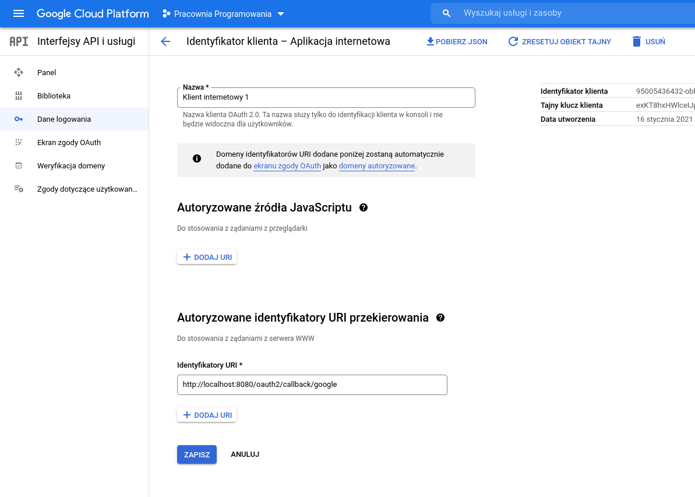

=======================
Programming Laboratory
=======================

--------------------
Spring Security
--------------------

.. class:: important 

    .. class:: important 

    Uwaga! cały kod znajduje się na gałęziach (backend/frontend) **SpringSecurityStart / SpringSecurityReactStart** w repozytorium https://github.com/WitMar/PRA2025 .
       
Jeżeli nie widzisz odpowiednich gałęzi na GitHubie wykonaj **Ctr+T**, a jak to nie pomoże to wybierz z menu **VCS->Git->Fetch**. 

Uwaga! Kod należy uruchamiać przy pomocy JAVA wersji **17**.

Autoryzacja OAuth
------------------

OAuth 2.0 to protokół autoryzacji, który pozwala użytkownikowi przyznać stronie internetowej lub aplikacji dostęp do chronionych zasobów użytkownika bez konieczności ujawniania jego haseł, a nawet tożsamości.

Zamiast używać poświadczeń właściciela zasobu w celu uzyskania dostępu do chronionych zasobów, klient uzyskuje token dostępu — ciąg znaków oznaczający określony zakres, okres istnienia i inne atrybuty dostępu. Tokeny dostępu są wydawane klientom zewnętrznym przez serwer autoryzacji za zgodą właściciela zasobu. Następnie klient używa tokenu dostępu, aby uzyskać dostęp do chronionych zasobów hostowanych przez serwer zasobów.

OAuth generuje tokeny dostępu dla scenariuszy autoryzacji API w formacie JSON web token (JWT). Uprawnienia reprezentowane przez token dostępu w warunkach OAuth są znane jako zakresy (an. scopes). Gdy aplikacja uwierzytelnia się za pomocą OAuth, określa żądane zakresy. Jeśli te zakresy są autoryzowane przez użytkownika, token dostępu będzie reprezentował te autoryzowane zakresy.

W naszym przypadku nasz serwer jest zarówno klientem (względem zewnętrznego API) jak i dostarczycielem tokenów (dla aplikacji frontendowej).

Przepływ danych w przypadku autoryzacji przez zewnętrzny serwis autoryzujący:

	| 1. Aplikacja chce uzyskać dane użytkownika, pobierając je z bazy dostawcy tożsamości, w tym celu wykonywane jest przekierowanie do serwera autoryzującego.
	| 2. Serwer autoryzujący przedstawia formularz z informacją o tym, że aplikacja chce uzyskać dostęp do określonych elementów profilu (np. pobrać podstawowe dane personalne oraz adres e-mail).
	| 3. Użytkownik w zależności od tego, czy akceptuje wymagania aplikacji, wydaje jej autoryzację lub nie.
	| 4. W przypadku udzielenia autoryzacji serwer wykonuje przekierowanie z powrotem do aplikacji, a ta otrzymuje specjalny token, za pomocą którego może pobrać wybrane dane z profilu użytkownika.

.. class:: center
	
	|a0|
	
.. |a0| image:: auth00.png  
	
Przepływ danych przy autoryzacji zewnętrznym serwerem Auth0 :
    
.. class:: center
	
	|a1|
	
.. |a1| image:: auth.png      

Token
------

Uwierzytelnianie (authentication) to proces, w którym aplikacja potwierdza tożsamość użytkownika. Aplikacje tradycyjnie utrwalają tożsamość za pomocą plików cookie sesji, opierając się na identyfikatorach sesji przechowywanych po stronie serwera. Zmusza to programistów do tworzenia pamięci sesji, która jest unikalna dla każdego serwera lub zaimplementowana jako całkowicie oddzielna warstwa pamięci sesji.

Uwierzytelnianie tokenem jest bardziej nowoczesnym podejściem i ma na celu rozwiązanie problemów istniejących przy wykorzystywaniu identyfikatory sesji. Używanie tokenów zamiast identyfikatorów sesji może zmniejszyć obciążenie serwera, usprawnić zarządzanie uprawnieniami i zapewnić lepsze narzędzia do obsługi infrastruktury rozproszonej lub opartej na chmurze.

.. class:: center
	
	|a3|
	
.. |a3| image:: token.png  

Jak widać na powyższym diagramie, po wymianie danych uwierzytelniających użytkownika na token na serwerze, klient może użyć tokena do walidacji każdego kolejnego żądania. 

Wszystkie metadane użytkownika są zakodowane bezpośrednio w samym tokenie, więc każdy komputer w Twojej sieci może zweryfikować dowolnego użytkownika. Serwer i klient mogą przekazywać token w nieskończoność i nigdy nie przechowywać żadnych danych użytkownika ani sesji. To jest „bezstanowość” i jest kluczem do skalowalności aplikacji.

JWT token
-----------

JWT to kompaktowy, bezpieczny dla adresów URL, szyfrowany obiekt JSON, który szybko staje się standardem implementacji tokenów w Internecie.

Prawidłowo uformowany token JWT składa się z trzech połączonych ciągów zakodowanych w Base64url i oddzielonych kropkami (.):

     | **JOSE Header**: zawiera metadane dotyczące typu tokena i algorytmów kryptograficznych użytych do zabezpieczenia jego zawartości.

     | **Payloda JWS** (zestaw oświadczeń): zawiera weryfikowalne oświadczenia dotyczące bezpieczeństwa, takie jak tożsamość użytkownika i przyznane mu uprawnienia.

     | **Signature JWS**: służy do sprawdzania, czy token jest godny zaufania i nie został naruszony. Gdy używasz tokena JWT, musisz sprawdzić jego podpis przed jego zapisaniem i użyciem.
    
Tokeny są podpisywane w celu ochrony przed manipulacją, same dane główne nie są za to szyfrowane. Oznacza to, że token można łatwo zdekodować, a jego zawartość ujawnić. Istnieje wiele stron internetowych, które potrafią odczytać nagłówek i ładunek – ale bez prawidłowego sekretu / podpisu token jest bezużyteczny.

Możesz zakodować lub odszyfrować token JWT na przykład za pomocą

    | https://www.jsonwebtoken.io/

W rzeczywistym scenariuszu klient wysyła żądanie do serwera i przekazuje token wraz z żądaniem. Serwer próbuje zweryfikować token i jeśli się powiedzie, będzie kontynuował przetwarzanie żądania. Jeśli serwer nie mógł zweryfikować tokenu, wysłałby 401 Unauthorized i komunikat informujący, że żądanie nie może zostać przetworzone, ponieważ nie można zweryfikować autoryzacji.
    
Google API
------------

Uzyskaj dane logowania OAuth 2.0 z konsoli Google API. Odwiedź konsolę interfejsu API Google, aby uzyskać dane uwierzytelniające OAuth 2.0, takie jak identyfikator klienta i klucz klienta, które są znane zarówno firmie Google, jak i Twojej aplikacji. Zestaw wartości różni się w zależności od typu tworzonej aplikacji. Na przykład aplikacja JavaScript nie wymaga klucza tajnego, ale aplikacja serwera WWW tak.

.. class:: center
	
	|a34|
	

Nasza aplikacja
--------------------

W naszym przykładzie aplikacja backendowa wykorzystywana jest w komunikacji z serwerem google. Frontent wysyła zapytanie o logowanie do serwera google, po podaniu credentialu google odpowiada na podany endpoint redirect do backendu z informacją o sukcesie logowania i danymi użytkownika. Dane te są 
zapisywane w bazie danych w backendzie i tworzony jest token z id użytkownika i sekretnym podpisem. Token ten jest następnie wysyłany na frontend i każde kolejne zapytanie frontendu korzysta z tego tokenu do autoryzacji zapytań.

Jest to inne podejście niż wyżej na diagramie, gdzie to frontend komunikował się z serwerem googla i otrzymywał od niego token (wtedy backend też musi pytać serwer googla za każdym razem o to czy token jest poprawny). W naszym przypadku latwiej jest zarządzać użytkownikami gdyż każdy nowy użytkownik trafia do bazy danych
w przypadku gdy bakcend nie znałby użytkownika byłoby to trochę trudniejsze do przeprowadzenia.

Spring Security
-----------------

Spring Security to potężna i wysoce konfigurowalna platforma uwierzytelniania i kontroli dostępu.

@ConfigurationProperties
============================

@ConfigurationProperties wiąże dane z application.yml z komponentem, klasą w kodzie aplikacji. Możesz wstrzykiwać i używać tej klasy w całym kodzie aplikacji, tak jak każdy inny bean springowy.

Aplikacja Spring Boot domyślnie ładuje właściwości konfiguracyjne z pliku application.yml znajdującego się w ścieżce klas. może powiązać właściwości zdefiniowane w pliku application.properties z klasą POJO przy użyciu @ConfigurationProperties. Adnotacja @ConfigurationProperties przyjmuje parametr prefiksu i wiąże wszystkie właściwości z określonym prefiksem z klasą POJO.

Własności z pliku konfiguracyjnego

.. code:: java

    app:
      auth:
        tokenSecret: PRACOWNIAPROGRAMOWANIA
        tokenExpirationMsec: 864000000
      oauth2:
        # After successfully authenticating with the OAuth2 Provider,
        # we'll be generating an auth token for the user and sending the token to the
        # redirectUri mentioned by the client in the /oauth2/authorize request.
      authorizedRedirectUris:
        - http://localhost:3000/oauth2/redirect
        
Aplikacja żądająca tokenu dostępu musi znać klucz tajny, aby odczytać podpis tokenu. Uniemożliwia to złośliwym aplikacjom, które nie zostały autoryzowane za pomocą z tokenów przed uzyskaniem dostępu. 

Podajemy też tutaj własny adres aplikacji frontendowej (liste adresów w powyższym przykładzie) na którym czekać będzie ona na przesłanie przez nas tokenu.    

Controller
============

W naszej aplikacji będziemy posiadać dwa endpointy, jeden pobierający aktualnie zautoryzowanego użytkownika i drugi do pobrania danych. Oba endpointy będą dostępne tylko dla użytkowników o roli USER (czyli zautoryzowanych).

.. code:: java

	@GetMapping("/user/me")
    @PreAuthorize("hasRole('USER')")
    public User getCurrentUser(Authentication authentication) {
        UserPrincipal userDetails = (UserPrincipal) authentication.getPrincipal();
        return userRepository.findById(userDetails.getId())
                .orElseThrow(() -> new ResourceNotFoundException("User", "id", userDetails.getId()));
    }

    @GetMapping(value = "/data", produces = "application/json")
    @PreAuthorize("hasRole('USER')")
    public String getUserSecretData(Authentication authentication) {
        return "Now server can reveal user's secret data";
    }
    
Zauważmy, że elementem requestu jest klasa Authentication zawierająca dane autoryzacji i z niej pobieramy obiekt przechowujący informację o użytkowniku wywołującym zapytanie, jego credentiale itp.

Spring Security Configuration
---------------------------------

.. code:: java

    @EnableGlobalMethodSecurity(
            jsr250Enabled = true,
            prePostEnabled = true
    )

Umożliwia bardziej złożoną składnię kontroli dostępu opartą na wyrażeniach z adnotacjami @PreAuthorize i @PostAuthorize. Włącza adnotację @RolesAllowed. 

.. code:: java

    @PreAuthorize decides whether a method can actually be invoked or not. 

    @PreAuthorize("hasRole('USER')")
    public void create(Contact contact);

oznacza, że dostęp będą mieli tylko użytkownicy z rolą „ROLE_USER”.

Http security 
===============

Konfiguracje HttpSecurity służą do konfigurowania dostępu do zasobów, takich jak csrf (rodzaj ataku), sessionManagement i dodawania reguł w celu ochrony zasobów w oparciu o różne warunki. Tj. zezwalanie na dostęp do zasobów statycznych i kilku innych publicznych interfejsów API dla wszystkich oraz ograniczanie dostępu do innych interfejsów API tylko do uwierzytelnionych użytkowników.

.. code:: java
    
    .authorizeRequests()
                    .antMatchers("/",
                        "/error",
                        "/favicon.ico",
                        "/**/*.png",
                        "/**/*.gif",
                        "/**/*.svg",
                        "/**/*.jpg",
                        "/**/*.html",
                        "/**/*.css",
                        "/**/*.js")
                        .permitAll()
                    .antMatchers("/auth/**", "/oauth2/**")
                        .permitAll()
                    .anyRequest()
                        .authenticated()
                        
Umożliwiamy każdemu dostęp do /auth i /oauth2/ oraz pobieranie plików, ale ograniczamy dostęp do wszystkich innych punktów końcowych tylko dla zautoryzowanych użytkowników - jest to autoryzacja niezależna do ustawianej na kontrolerze.   

RestAuthenticationEntryPoint
===============================

Ta klasa jest wywoływana, gdy użytkownik próbuje uzyskać dostęp do chronionego zasobu bez uwierzytelniania. W takim przypadku po prostu zwracamy odpowiedź 401 Unauthorized.

OAuth communication flow
==========================

.. code:: java

				.oauth2Login()
                    // set up in Google console as URI
                    .redirectionEndpoint()
                    .baseUri("/oauth2/callback/google")
                .and()
                    .successHandler(oAuth2AuthenticationSuccessHandler);

                    // Add our custom Token based authentication filter
                    http.addFilterBefore(tokenAuthenticationFilter(), UsernamePasswordAuthenticationFilter.class);

Wszystkie aplikacje korzystające z podstawowego wzorca podczas uzyskiwania dostępu do interfejsu API Google przy użyciu protokołu OAuth 2.0 muszą wykonać pięć kroków:

Pierwszym krokiem jest wywołanie przez fronend

    | http://localhost:8080/oauth2/authorization/google

Po otrzymaniu żądania autoryzacji klient Spring Security OAuth2 przekieruje użytkownika do **AuthorizationUrl** podanego dostawcy (providera) autoryzacji. Cały stan związany z żądaniem autoryzacji jest zapisywany za pomocą **authorizationRequestRepository** w sesji HTTP (ważne jeżeli chcemy wykonywać więcej zapytać do serwera Google, ale w naszym wypadku robimy to tylko raz).

Jeśli użytkownik zezwoli na dostęp do aplikacji, dostawca przekieruje użytkownika do adresu URL wywołania zwrotnego http://localhost:8080/oauth2/callback/google z kodem autoryzacyjnym. Adres ten jest ustawiany w GUI consoli googla i musi być uzgodniony między providerem API i naszym serwerem.

Jeśli wywołanie zwrotne **OAuth2** powiedzie się i zawiera kod autoryzacji, Spring Security wymieni **authorization_code** na **access_token** i prześle nam dane o które prosiliśmy.

Na koniec wywoływany jest **oAuth2AuthenticationSuccessHandler**. Tworzy on token uwierzytelniania JWT dla użytkownika i wysyła go użytkownikowi przez redirect_uri wraz z tokenem JWT w zapytaniu. W tym miejscu też tworzymy token oraz użytkowników na podstawie danych otrzymanych od providera - zobacz metodę **tokenProvider.createToken()**.

Tworzenie użytkowników :

.. code:: java

	User user = new User();
	user.setEmail((String)userAuth.getAttributes().get("email"));
	user.setImageUrl((String)userAuth.getAttributes().get("picture"));
	user.setName((String)userAuth.getAttributes().get("name"));
	User userSaved = userRepository.save(user);
	userPrincipal = UserPrincipal.create(userSaved);       

Tworzenie tokenu, jak widać w tokenie zapiszemy jedynie id użytkownika.

.. code:: java
	
	Jwts.builder()
                .setSubject(Long.toString(userPrincipal.getId()))
                .setIssuedAt(new Date())
                .setExpiration(expiryDate)
                .signWith(SignatureAlgorithm.HS512, appProperties.getAuth().getTokenSecret())
                .compact();

CustomUserDetailService
========================

Klasa ta służy nam do tego by zamieniać nasze obiekty typu User na obiekty UserPrincipal implementujące interfers UserDetails i mogące być tym samym elementem Authentication.

TokenAuthenticationFilter
===========================

Autoryzacja zapytań naszej aplikacji frontendowej odbywa się poprzez filtr TokenAuthenticationFilter.

Kiedy klient uzyskał prawidłowy token i chce wywołać REST-owy endpoint na naszy serwerze inny niż /authenticate? musi dostarczyć nagłówek X-Auth-Token. Jeśli ten token jest obecny, AuthenticationFilter tworzy właściwy obiekt uwierzytelniania danych wejściowych, a AuthenticationManager wywołuje TokenAuthenticationProvider w celu uwierzytelnienia. Implementacja tego providera jest bardzo prosta. W rzeczywistości chcemy sprawdzić podpis Tokeny względem ustawionego przez nas sekretu. W przypadku sukcesu korzystamy z przesłanego ID do zapisania odpowiedniego użytkownika jako element klasy Authentication.

.. code:: java

    package com.example.springsocial.security;

    public class TokenAuthenticationFilter extends OncePerRequestFilter {

    @Autowired
    private TokenProvider tokenProvider;

    @Autowired
    private CustomUserDetailsService customUserDetailsService;

    private static final Logger logger = LoggerFactory.getLogger(TokenAuthenticationFilter.class);

    @Override
    protected void doFilterInternal(HttpServletRequest request, HttpServletResponse response, FilterChain filterChain) throws ServletException, IOException {
        try {
            String jwt = getJwtFromRequest(request);

            if (StringUtils.hasText(jwt) && tokenProvider.validateToken(jwt)) {
                Long userId = tokenProvider.getUserIdFromToken(jwt);

                UserDetails userDetails = customUserDetailsService.loadUserById(userId);
                UsernamePasswordAuthenticationToken authentication = new UsernamePasswordAuthenticationToken(userDetails, null, userDetails.getAuthorities());
                authentication.setDetails(new WebAuthenticationDetailsSource().buildDetails(request));

                SecurityContextHolder.getContext().setAuthentication(authentication);
            }
        } catch (Exception ex) {
            logger.error("Could not set user authentication in security context", ex);
        }

        filterChain.doFilter(request, response);
    }

    private String getJwtFromRequest(HttpServletRequest request) {
        String bearerToken = request.getHeader("Authorization");
        if (StringUtils.hasText(bearerToken) && bearerToken.startsWith("Bearer ")) {
            return bearerToken.substring(7, bearerToken.length());
        }
        return null;
    }
    }

                   
UserPrincipal
================
Klasa UserPrincipal implementuje interfejs UserDetails i reprezentuje uwierzytelniony podmiot Spring Security. Zawiera dane uwierzytelnionego użytkownika. Możemy dostać się do niej poprzez obiekt klasy Authentication. W ogólności nie musimy definiować własnego modelu użytkownika w aplikacji, ale jest to dla nas pomocne, gdyż możemy dodać do interfejsu dodatkowe pola z danymi o użytkowniku.

CORS
=======

Ze względów bezpieczeństwa przeglądarki zabraniają wywołań AJAX do zasobów znajdujących się poza bieżącym źródłem (serwerem, domeną). Na przykład, gdy sprawdzasz swoje konto bankowe w jednej zakładce, możesz mieć otwartą witrynę evil.com w innej. Skrypty z evil.com nie powinny być w stanie wysyłać żądań AJAX do Twojego bankowego API (wypłacania pieniędzy z Twojego konta!) przy użyciu Twoich danych uwierzytelniających.

Udostępnianie zasobów między źródłami (CORS) to specyfikacja W3C zaimplementowana przez większość przeglądarek, która pozwala w elastyczny sposób określić, jakiego rodzaju żądania między domenami są autoryzowane, zamiast używać mniej bezpiecznych i mniej wydajnych hacków, takich jak IFrame lub JSONP.

Możesz dodać do swojej metody obsługi z adnotacjami @RequestMapping adnotację **@CrossOrigin**, aby włączyć w niej mechanizm CORS (domyślnie @CrossOrigin zezwala na wszystkie źródła i metody HTTP określone w adnotacji @RequestMapping):

.. code:: java

        @CrossOrigin
        @GetMapping("/{id}")
        public Account retrieve(@PathVariable Long id) {
            // ...
        }

Jeśli używasz Spring Boot to włączenie mechanizmu CORS dla całej aplikacji zaleca się wykonać po prostu przez deklarację komponentu bean WebMvcConfigurer w następujący sposób:

.. code:: java

    @Configuration
    public class MyConfiguration {

        @Bean
        public WebMvcConfigurer corsConfigurer() {
            return new WebMvcConfigurerAdapter() {
                @Override
                public void addCorsMappings(CorsRegistry registry) {
                    registry.addMapping("/**");
                }
            };
        }
    }        

W naszych przypadkach potrzebujemy cors, aby umożliwić komunikację z serwerem auth. Możesz go również wykorzystać w swoim projekcie jeżeli miałbyś problem z CORS.
    
React 
-------------

Local storage
==============

LocalStorage jest elementem przeglądarki. Umożliwia dostęp do lokalnego obiektu Storage. LocalStorage jest podobny w koncepcji do sessionStorage. Różnica między nimi polega na tym, że dane przechowywane w localStorage nie mają daty ważności, a dane przechowywane w sessionStorage są usuwane po zakończeniu sesji – czyli po zamknięciu przeglądarki.

Użycie pamięci lokalnej jest dość proste. W swoim kodzie JavaScript, uruchomionym w przeglądarce, powinieneś mieć dostęp do instancji localStorage, która ma setter i getter do przechowywania i pobierania danych z lokalnego magazynu. Istnieją również metody w magazynie lokalnym, aby usunąć elementy i wyczyścić wszystkie elementy:

.. code:: javascript

    // setter
    localStorage.setItem('myData', data);
 
    // getter
    localStorage.getItem('myData');
    
    // remove
    localStorage.removeItem('myData');
    
    // remove all
    localStorage.clear();
    
OAuth
======

**OAuth2RedirectHandler** to ścieżka wykonywana po pomyślnym uwierzytelnieniu użytkownika. Używamy lokalnej pamięci, aby zabezpieczyć ACCESS_TOKEN. Następnie musi być używany za każdym razem, gdy nawiązujemy połączenie z backendem.

.. code:: javascript

    request = (options) => {
        const headers = new Headers({});

        axios.get(options.url, {
            headers: {
                'Content-Type': 'application/json',
                'Authorization': 'Bearer ' + localStorage.getItem(ACCESS_TOKEN)
            }
        }).then(response =>
                this.setState({data: response.data})
            ).catch((error) => {
            this.setState({data: JSON.stringify(error.response)});
        });
    };

React-router-domain
=====================

Komponent <Route> jest najważniejszym komponentem w React Router. Renderuje zadany komponent, jeśli bieżąca lokalizacja URL pasuje do podanej ścieżki. W idealnym przypadku składnik <Route> powinien mieć właściwość o nazwie path, a jeśli nazwa ścieżki pasuje do wpisanej w URL to zostanie zrenderowana.

W przypadku niezalogowanego użytkownika w PrivateRoute przekierowujemy użytkownika na stronę logowania.

Z drugiej strony komponent <Link> służy do poruszania się między stronami. Możemy użyć <Link>, aby przejść do konkretnego adresu URL i ponownie renderować widok bez odświeżania.

<NavLink> to specjalna wersja <Link>, która dodaje atrybuty stylizacji do renderowanego elementu, gdy pasuje on do bieżącego adresu URL.

AppHeader
===========

Zawiera nagłówek / menu, które w zależności od tego czy jesteśmy zalogowani czy też nie pojawia się użytkownikowi w różnej formie.

App
====

Główna klasa zwiera menu aplikacji, oraz metody zapytań, które wykonują komponenty (przesyłamy je wstrzykując do komponentów). Dba o zarządzanie stanem zalogowania, lub nie i propaguje ten stan do wszystkich komponentów poniżej.

Constants
==========

Zawierają stałe potrzebne w aplikacji, adres serwera, adres serwera autoryzacji oraz adres na który serwer przesyła nam token.

BackendRequest
===============

Ustawiamy token z local storage i robimy zapytanie na endpoint serwera.

Profile
=========

Strona z profile (styl i postać strony ściągnięta z internetu). Tu także występuje zabezpieczenie (redirect) w przypadku, gdy niezalogowany użytkownik chce wejść na stronę profilu.

Login
========

Przekierowanie na link do autoryzacji przez API google.

OAuth2RedirectHandler
======================

Pobiera token z linka przesyłanego przez nasz serwer i zapisuje w local storage.
    
.. [*] Wykorzystano materiały z:

https://github.com/callicoder/spring-boot-react-oauth2-social-login-demo

https://auth0.com/docs/protocols/protocol-oauth2

https://dassum.medium.com/securing-spring-boot-rest-api-with-json-web-token-and-jdbc-token-store-67558a7d6c29

https://stormpath.com/blog/token-authentication-scalable-user-mgmt

https://auth0.com/learn/token-based-authentication-made-easy/

https://spring.io/projects/spring-security

https://www.callicoder.com/spring-boot-spring-security-jwt-mysql-react-app-part-2/

https://www.callicoder.com/spring-boot-security-oauth2-social-login-part-2/

https://spring.io/blog/2015/06/08/cors-support-in-spring-framework
