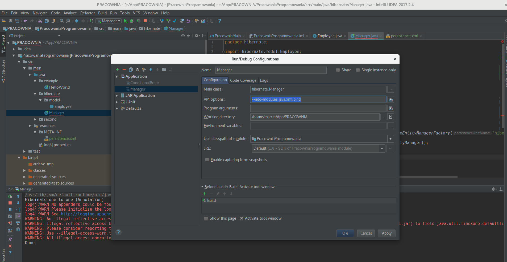

========================
Pracowania Programowania
========================

--------------
FAQ 
--------------

.. class:: important

    Klasy nie są nie niebieskie (zielone) nie można ich uruchomić.
    
Projekt nie jest zdefiniowany jako project Mavenowy. Otwórz okno projektu Mavena **View->Tool Windows->Maven Project**. Kliknij na plusik, odnajdź swój projekt i wybierz w nim plik o rozszerzeniu **.pom**.    

.. class:: important

    Nie widzę wszystkich gałęzi z repozytorium.
    
Wykonaj **Ctrl + T**. Jeżeli nie pomoże wykonaj **VCS->Git->Pull**.   
    
.. class:: important

    Ctrl+T powoduje błędy repozytorium (nie mogę nadpisać pliku, jestem niezsynchronizowany).
    
Spróbuj zamiast tego wykonać **VCS->Git->Pull**. Jeżeli masz w opisie błędów napisane conflicts wybierz **VCS->Git->Megre Changes** i wzkaż gałąź z której chcesz ściągnąć kod.    

.. class:: important

    Klasy z bibliotek (logera, hibernate, jsona) świecą się na czerwono.
    
Najpewniej nie ściągnięte są zależności Mavenowe. Kliknij na dwie strzałeczki w kółeczku z okienka Mavena poczekaj aż się skończą ładować.

.. class:: important

    Klasy Javy jak String świecą się na czerwono.
    
Nie jest zdefiniowane JDK, wejdź w **File->Project Structure->Project** i zobacz czy dobrze wybrane jest JDK oraz czy poziom Javy ustawiony jest na **8**.    

.. class:: important

    Inne rzeczy świecą się na czerwono.
    
Najedź na nie kursorem kliknij i wybierz **Alt+Enter** zobacz czy środowisko umie pomóc Ci rozwiązać problem.

.. class:: important

    Nie mogę uruchomić Hibernate. Nie znajduje **hibernate-dynamic**.
    
Sprawdź czy katalog resources jest oznaczony przez małą ikonkę listy, jeżeli nie wybierz prawym przyciskiem myszki na katalogu Resources i dalej **Mark Directory As -> Resource Root**.    

.. class:: important

    Nie mogę uruchomić Hibernate. Błąd bazy.
    
Jeżeli zmieniłeś model bazy danych zmień linijkę 

    | **<property name="hibernate.hbm2ddl.auto" value="validate"/>** 
    | na 
    | **<property name="hibernate.hbm2ddl.auto" value="create"/>**.

Sprawdź link połączenia z bazą danych **<property name="javax.persistence.jdbc.url" value=...>** jeżeli w tej linijce pojawia się **localhost** znaczy, że próbujesz połączyć się z bazą na własnym komputerze. Czy zainstaloweś bazę danych? Jeżeli łączysz się z bazą na wydziale sprawdź

    | <property name="javax.persistence.jdbc.url" value="jdbc:postgresql://psql.wmi.amu.edu.pl:5432/**NAZWA_TWOJEJ_BAZY**?ssl=true&amp;sslfactory=org.postgresql.ssl.NonValidatingFactory"/>
    | <property name="javax.persistence.jdbc.user" value="**TWOJ_LOGIN**"/>
    | <property name="javax.persistence.jdbc.password" value="**TWOJE_HASŁO**"/>

.. class:: important

    Uruchamia się inna klasa niż bym chciał.
    
Sprawdź czy uruchamiasz odpowiednią klasę (test). Nazwa aktualnie uruchamianej klasy znajduje się obok zielonego trójkącika na górze na pasku. Środowisko **NIE** uruchamia klasy aktualnie edytowaj, tylko najczęściej ostatnio uruchamianą. Dla pewności uruchamiaj poprzez wybór prawym klawiszem myszy na nazwie klasy i **run**.    

.. class:: important

    Nie mogę uruchomić klasy.
    
Uruchamiać można tylko klasy zawierające metodę main.

.. class:: important

    Nie mogę zapisać zmian na repo.
    
Wybierz **Ctrl+k** by zapisać zmiany na dysku. Wybierz **Ctrl+Shift+k** by przesłać zmiany do repo.

.. class:: important

    Nie mogę uruchomić Hibernate. Dziwny błąd przy uruchomieniu.
    
Jeżeli błąd ma w opisie **JAXbind wykonaj**. Żeby persistence.xml zadziałał trzeba (w celu dobrego odczytu pliku) w ustawieniach uruchamiania programu dodać przełącznik **--add-modules java.xml.bind**.
    
Wybierz **Run->Edit Configurations** dodaj do konfiguracji uruchomienia klasy Manager **--add-modules java.xml.bind**. (patrz screen)

.. class:: center
	
	|a10|
	

