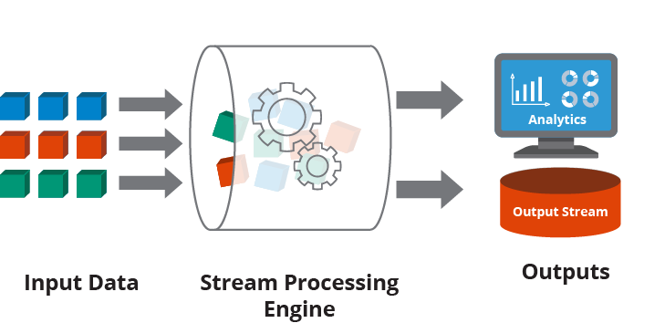
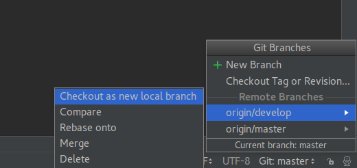
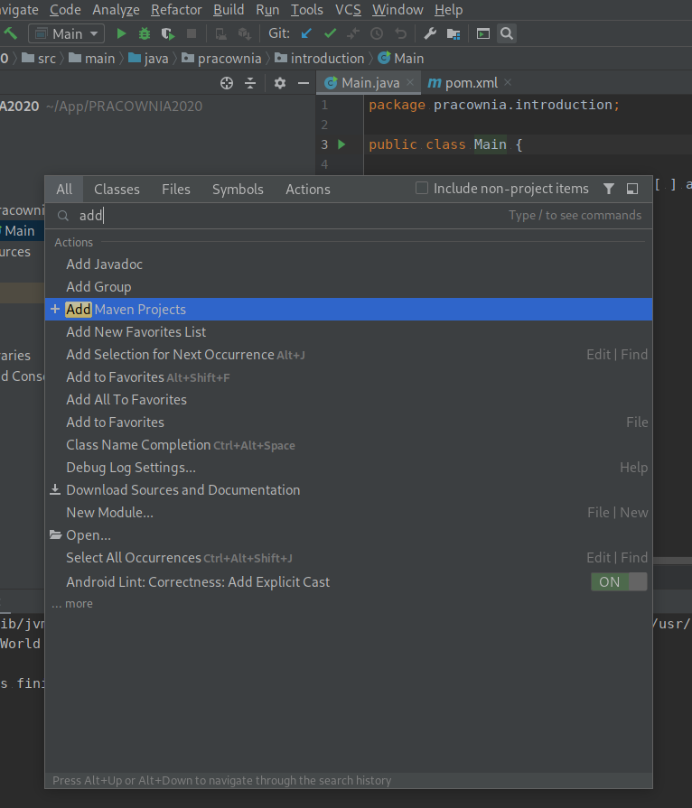
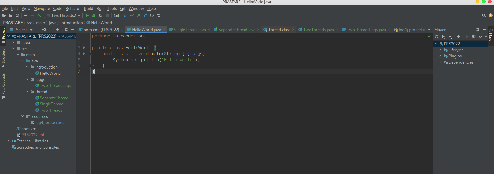
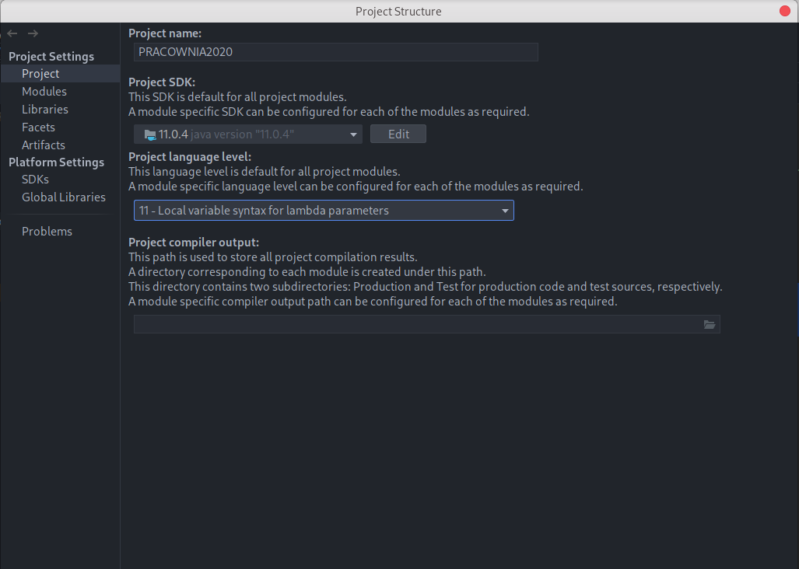
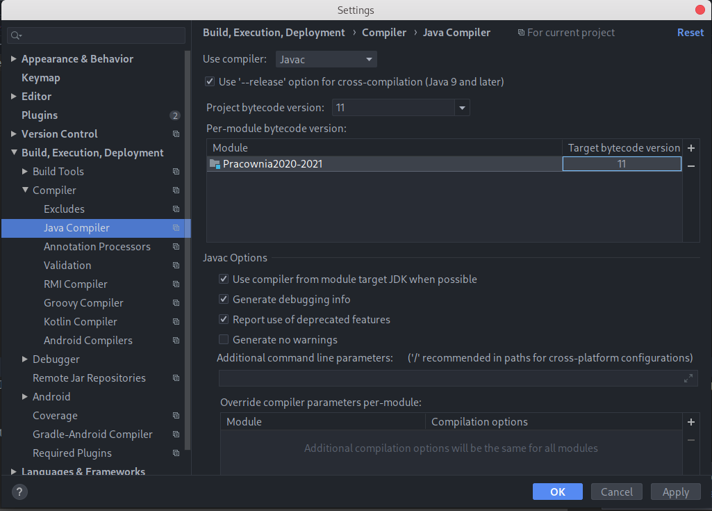

.. role:: todo

.. role:: raw-latex(raw)
            :format: latex html

==========================================
Przetwarzanie równoległe i strumieniowe
==========================================

.. class:: important 

    Uwaga! Kod z którego będziemy korzystać na zajęciach jest dostępny na branchu **IntroductionClassesStart** w repozytorium https://github.com/WitMar/PRS2020 . Kod końcowy można znaleźć na branchu **IntroductionClassesEnd**.

--------------------------
Przetwarzanie równoległe
--------------------------

Procesy to zasadniczo programy, które są wykonywane na procesorze. Proces może tworzyć inne procesy, które są znane jako procesy potomne (child processes). Procesy są odizolowane, co oznacza, że ​​nie współdzielą pamięci z żadnym innym procesem.

Wątek to indywidualny segment procesu, co oznacza, że ​​proces może mieć wiele wątków. Wątek ma trzy stany: uruchomiony, gotowy i zablokowany. Wątki współdzielą zasoby (procesor, pamięć, kod) w ramach jednego procesu.

Wątek jest również znany jako lekki proces. Kiedy wiele wątków jest wykonywanych w procesie w tym samym czasie, otrzymujemy termin „wielowątkowość". Na przykład w przeglądarce wiele kart może być różnymi wątkami. MS Word wykorzystuje wiele wątków: jeden wątek do formatowania tekstu, inny wątek do przetwarzania danych wejściowych itp. 

Wielowątkowość to model wykonywania programu, który pozwala na tworzenie wielu wykonywanych niezależnie wątków w ramach jednego procesu, które jednocześnie współdzielą zasoby procesu. W zależności od sprzętu wątki mogą działać w pełni równolegle, jeśli są dystrybuowane do osobnych rdzeni procesora lub wirtualnie równolegle gdy to system operacyjny steruje przydziałem zasobów do wątków.

Pomimo wielu zalet przetwarzania wielowątkoweo (równoległego) związane jest z nimi zarówno zwiększenie złożoności przetwarzania jak i pare trudnych do rozwiązania błędów. Istnieje kilka typowych scenariuszy, które możesz napotkać w aplikacjach wielowątkowych. Obejmują one:

    | Problemy z dostępem do danych, w których dwa wątki odczytują i modyfikują te same dane. Bez odpowiedniego wykorzystania mechanizmów blokujących może dojść do niespójności danych.
    |
    | Problemy z brakiem wątków i rywalizacją o zasoby pojawiają się, gdy wiele wątków próbuje uzyskać dostęp do pojedynczego chronionego zasobu.
    |
    | Problemy rożnych ścieżek wywołań w zależności od przydziału zasobów procesora.
	
Elementy te będą tematem pierwszej części zajęć.

----------------------------
Przetwarzanie strumieniowe
----------------------------
	
W przeszłości dane były zazwyczaj przetwarzane w partiach na podstawie harmonogramu lub określonego wcześniej progu (np. co noc o 1 w nocy, co sto wierszy lub za każdym razem, gdy wolumen osiąga dwa megabajty). Jednak wraz ze wzrostem liczby danych do przetworzenia okazało się, że przetwarzanie wsadowe (ang. batch processing) nie jest w stanie wydajnie przetwarzać danych.

Przetwarzanie strumieniowe stało się koniecznością w nowoczesnych aplikacjach. Przedsiębiorstwa zwróciły się w stronę technologii, które reagują na dane w czasie ich tworzenia. Przetwarzanie strumieniowe umożliwia aplikacjom reagowanie na nowe zdarzenia w danych (np. przekroczenie zakresu alarmowego) w momencie ich wystąpienia. Zamiast grupować dane i zbierać je w określonych odstępach czasu, aplikacje przetwarzania strumieniowego gromadzą i przetwarzają dane natychmiast po ich wygenerowaniu.
	
Działania, które przetwarzanie strumieniowe wykonuje na danych, obejmują agregacje (np. obliczenia, takie jak suma, średnia, odchylenie standardowe), analizy (np. przewidywanie przyszłego zdarzenia na podstawie wzorców danych), przekształcenia (np. zmiana liczby na format daty ), wzbogacanie (np. łączenie punktu danych z innymi źródłami danych w celu stworzenia większego kontekstu i znaczenia) oraz przetwarzanie (np. wstawianie danych do bazy danych).	
	
.. class:: center
	
	|ss|
	

	
	
Przetwarzanie strumieni jest najczęściej stosowane do danych generowanych jako seria zdarzeń, takich jak dane z sensorów, systemów przetwarzania płatności oraz logów aplikacji. Typową architekturą wykorzystywaną w tym podejściu jest strategia publisher/subscriber (powszechnie określanego jako pub/sub) lub sink/source. Dane i zdarzenia są generowane przez publishera lub źródło (sink) i dostarczane do aplikacji przetwarzającej strumień będącej subscriberem. Od strony technicznej typowym publisherem jest np. Apache Kafka® a bibliotekami przetwarzającymi dane Apache Spark, Hadoop czy też Apache Flink.	

Elementy te będą tematem drugiej części zajęć.

------------------------------------
Projekty
------------------------------------

Sprawdzane "wspólnie" na zajęciach lub indywidualnie ze studentami.

Projekt I - implementacja prostego przetwarzania równoległego (sumowanie liczb, zerowanie, sprawdzanie wyniku) przychodzących danych na podstawie implementacji od prowadzącego, 20% oceny końcowej.

Projekt II - implementacja złożonego przetwarzania równoległego na bazie projektu I (synchronizacja źródeł, zamykanie i otwieranie kolejek), 40% oceny końcowej. 

Projekt III - implementacja przetwarzania zadań w Apache Flink, 40% oceny końcowej.
	
------------------------------------
Środowisko develperskie - Java
------------------------------------

Edytor
=======

Implementując programy w języku Java, rekomendowanym (i aktualnie jednym z najpopularniejszych) IDE jest IntelliJ IDEA dostępny za darmo w wersji Community (link poniżej) (jako studenci możecie Państwo prosić o darmowy dostęp do wersji Ultimate - https://www.jetbrains.com/community/education/#students):

    | https://www.jetbrains.com/idea/download/

GIT
=======

GIT to system kontroli wersji oprogramowania.

Git posiada trzy stany, w których mogą znajdować się pliki: commited, modified i staged. 

Podstawowy sposób pracy z Git wygląda mniej więcej tak:

	| * Dokonujesz modyfikacji plików w katalogu roboczym (zmiana stanu na zmodyfikowany).
	|
	| * Dokonujesz zatwierdzenia (commit), podczas którego zawartość plików zapisywana jest w stan staged i przygotowana do przesłania na serwer.
	|
	| * Dokonujesz przesłania commita (push) i dane zapisywane są do repozytorium.
	
Z praktycznego punktu widzenia oznacza to, że musimy wykonać dwa kroki zanim zmiany w kodzie zostaną z sukcesem przesłane na serwer.	

.. class:: tag 

	Zadanie 1

Załóż konto na GitHub
	
	| https://github.com/
	
Otwórz repozytorium

	| https://github.com/WitMar/PRS2020
	
Wybierz **Fork** by ściągnąć repozytorium na własne konto (W ten sposób na koniec zajęć będziesz mógł przesłać kod do własnego repozytorium).

Otwórz Idea intellij na komputerze.

W przypadku, gdy uruchamiasz edytor poraz pierwszy zobaczysz wyskakujące okno i wybierz z niego **Project from version control**, w przypadku, gdy nie jest to Twoje pierwsze uruchomienie wejdź na **File-> New -> Project From Version Control -> Git**.

Skopiuj w pokazującym się nowym oknie adres dostępny po wybraniu na stronie GitHub opcji **CloneOrDownload** (uwaga wybierz adres z opcja HTTPS, adres w opcji SSH nie zadziała!!).

.. class:: center
	
	|1|
	
.. |1| image:: clone.png

Domyślnie po uruchomieniu znajdujesz się na branchu **Master**, który u nas jest pusty.
Wybierz w prawym dolnym rogu aplikacji nazwę brancha i przenieś się na branch **IntroductionClassesStart**.

.. class:: center
	
	|a2|
	

Powinieneś uzyskać następujący efekt - z dokładnością do nazwy klasy. Uwaga jeśli kod nie jest pokolorowany tak jak oczekujesz znaczy to, że środowisko nie rozpoznało automatycznie twojego pliku Mavena:

Wybierz ikonkę lupki i wpisz maven, wybierz opcję **Add Maven Project**.

.. class:: center
	
	|aMV|
	

Następnie znajdź katalog do którego ściągnąłeś kod i wybierz plik **pom.xml**. Powinieneś otrzymać poniższy wynik (spójrz na ikonki przy plikach!). 

.. class:: center
	
	|a3|
	

Jeżeli nadal kod nie jest dobrze pokolorowany wejdź w opcje **File -> Project Structure**, ustaw wersje Javy na 11 w zakładce **Project** oraz składni w zakładce **Module** też na java 11.

.. class:: center
	
	|a33|
	

Sprawdź wersje kompilatora używanego przez IDE **File -> settings -> compiler**, też wybierz wersję Java 11.

.. class:: center
	
	|a113|
	

   
Maven
=======

Maven to system budowania aplikacji, który pomaga nam zautomatyzować proces kompilacji i generowania plików uruchomieniowych **jar-ów, war-ów** itp. Narzuca on specyficzną strukturę projektu.

    | * **pom.xml** – główny plik konfiguracji Maven
    
    | 
    
    | * **/src/main** – katalog, gdzie znajdziemy pliki naszego programu, są tam dwa podkatalogi: java – tutaj trafiają wszystkie klasy (cały kod naszego modułu)
    
    |   
    
    | * **resources** – tutaj będą wszystkie pliki, które nie są kodem, np. grafiki, pliki XML, konfiguracje w przypadku projektów webowych będziemy mieli także katalog webapp, który jest używany do umieszczania wszystkich treści webowych

    |

    | * **/src/test** - ma podobną strukturę jak katalog *main* z tą różnicą, że jest on wykorzystywany tylko w trakcie automatycznych testów
    
    |
    
    | * **/target** – tutaj trafia skompilowany projekt (czyli np. w postaci wykonywalnego pliku JAR lub aplikacji webowej WAR)

Po rozwinięciu powinniśmy widzieć listę instrukcji (jeżeli nie wybieramy odśwież - dwie zielone strzałki, jak nie pomoże klikamy plusik i wskazujemy na plik **pom.xml** w naszym projekcie i ok).

Po tym etapie plik Main.java powinien mieć obok nazwy klasy zielone kółeczko z "c" w środku, jeżeli tak nie jest najlepiej powtórz wszystkie operacje od początku.

Więcej o Mavenie można znaleźć np tutaj:

    | https://kobietydokodu.pl/7-maven-i-tajemnice-pliku-pom-xml/

    | http://tutorials.jenkov.com/maven/maven-tutorial.html

Maven dokumentacja:

    | https://maven.apache.org/guides/getting-started/index.html 
    

Thread
=======

W języku Java klasy posiadające statyczną metodę main() mogą być uruchamiane. Domyślnie uruchomienie metody main tworzy wątek, który uruchamia kod się w niej znajdujący.

Wejdź do klasy **SingleThread** i uruchom ją. Wywołanie wątku możemy zastopować stosując metodę sleep i podając w nawiasie liczbę milisekund na którą chcemy zatrzymać wątek. 

.. code:: XML
	
	Thread.sleep(500);
	
W momencie zastopowania wątek może przekazać swoje zasoby, takie jak procesor do innego wątku. 

W przypadku, gdy wątek jest w stanie nie pozwalającym mu na wykonanie metody sleep może zwrócić wyjątek (exception). Stąd kompilator wymusza na nas otoczenie tej operacji poprzez operacje **try catch** obsługujące pojawiające się wyjątki.

W przypadku gdy chcemy uruchomić więcej niż jeden wątek w kodzie Javy najprosciej jest wyłączyć implementację wątku do osobnej klasy. Dokonaliśmy tego w klasie **SeparateThread** poprzez dodanie podklasy, która dziedziczy z klasy Thread. Klasa Thread posiada wiele metod do zarządzania wątkami o których powiemy sobie później. Teraz interesuje nas metoda run() w której umieszczamy kod do wywołania przez wątek. W celu wykonania własnego kodu nadpiszemy tę metodę nadklasy w naszej klasie poprzez definicję metody o tej samej nazwie i wskazując adnotacją **@Override**, że jest to nadpisanie metody.

.. code:: XML
	
    class Concurrency extends Thread { 

        @Override // override method from superclass
        public void run() {}
    }
    
Możemy teraz w głównej metodzie utworzyć obiekt klasy Concurrency, każdy taki obiekt jest wątkiem, który możemy uruchomić poprzez wykonanie metody **start()**.

.. class:: tag 

    Zadanie 2

Uruchom klasę **SeparateThread.java**, zaobserwuj jak działają dwa wątki, główny i wywołany przez nasz program. Dodaj operacje wypisania czegoś na ekran do głównego wątku, kiedy się ona wywoła?

Przypadek, gdy chcielibyśmy utworzyć więcej wątków z klasy Concurrency pokazany jest w klasie **TwoThreads**.

.. class:: tag 

    Zadanie 3

Uruchom klasę **TwoThreads.java**, zaobserwuj jak działają dwa wątki operujące na osobnych danych. Zobacz jak będzie to wyglądało w przypadku usunięcia thread.sleep w kodzie wątku.

Logger
===========

Metoda System.out.printl jest **synchronizowana** to znaczy, że dostęp do niej ma tylko jeden wątek na raz. W przypadku dużego obciążenia systemu i dużej liczby wywołań może to bardzo spowalniać i obciążać aplikację. Jednocześnie wiemy jak ważnym i pomocnym elementem projektu informatycznego jest logowanie komunikatów / śledzenie wywołań. Z pomocą przychodzą nam specjalne biblioteki zwane logerami. Szczególnie użyteczne właściwości logerów to: dzielenia logów na poziomy, zapisywanie automatyczne do pliku, a także asynchroniczne wywołanie. 

Przykładem biblioteki do logowania jest **log4j**.

Aby używać w naszym projekcie biblioteki **log4j** dodaliśmy do naszego projektu (do pliku mavena **pom.xml**) zależność do biblioteki logowania log4j wklejając tam:

.. class:: highlight

.. code:: XML

    <dependencies>
        <dependency>
            <groupId>log4j</groupId>
            <artifactId>log4j</artifactId>
            <version>1.2.17</version>
        </dependency>
    </dependencies>

W ogólności jeżeli chcemy dodać bibliotekę log4j do projektu, aby znaleźć odpowiedni wpis wystarczy w google wpisać *maven log4j*. Pierwszy link powinien zaprowadzić nas na stronę:

    | https://mvnrepository.com/artifact/log4j/log4j 
    
Po wyborze wersji zobaczymy wpis:    

    | https://mvnrepository.com/artifact/log4j/log4j/1.2.17

.. class:: important 

	Uwaga! Na każdych zajęciach potrzebne zależności będą już dodane do ustawień mavena.

Dodaliśmy do klasy TwoThreads.java wywołanie loggera poprzez dodanie zmiennej globalnej:

.. code:: XML

    public static Logger log = Logger.getLogger(TwoThreads.class);
    
Uwaga! Dodając nowy obiekt zwróć uwagę, że korzystać z biblioteki **log4j**, gdyż w Javie jest wiele bibliotek o nazwie Logger, i wykorzystanie innej nie zadziała tak jak chcemy. Innymi słowy spójrz czy w powstałym imporcie w nazwie klasy jest **log4j**.

Zwróć uwage na zmianę wywołań System.out.printl na log o poziomie info (poziomy logów w log4j to *debug, info, warn, error*, którym odpowiadają metody o takich samych nazwach) :

.. code:: XML

    log.info("Loop " + this.loopNum + ", Read: " + i);

Więcej informacji o log4j można doczytać tutaj:

    | https://www.mkyong.com/logging/log4j-hello-world-example/
    
.. class:: tag 

    Zadanie 4

Uruchom klasę **TwoThreadsLogs.java**, powinieneś zobaczyć na ekranie logi. W katalogu projektu powinnien też zostać stworzony plik o nazwie **log.log**. Zwróć uwagę na to jak zbudowany jest pojedynczy log.

Współdzielenie zasobów
========================

W klasie **TwoThreadsLogs.java** mamy też przykład programu, w którym dwa wątki współdzielą zasób jakim jest zmienna **i**. Zobacz jakie anomalie możesz zaobserwować w działaniu takiego programu.

Jeżeli chcielibyśmy połączyć dwie operacje np. inkrementację wartości zmiennej **i** oraz wypisanie drugiego logu możemy to wykonać poprzed dodanie synchronizowanego bloku kodu.

Dodaj do klasy zmienną globalną

.. class:: highlight

.. code:: XML

	public static Long synchronizer = 0L;
	
oraz synchronizowany blok

.. class:: highlight

.. code:: XML
                
    synchronized (synchronizer) {
        i = i + 1;
        log.info("Loop " + this.loopNum + ", Write: " + i);
    }	

    
.. class:: tag 

    Zadanie 5

Uruchom ponownie klasę **TwoThreadsLogs.java**. Jakie różnice w działaniu zaobserowałeś/łaś.

Commit
---------

.. class:: tag 
    
    Zadanie 6

Zakommituj swój kod do repozytorium pod nowy branch o nazwie IntroductionClassesWithLogger.
    
Commit w IntelliJ
------------------

    :todo:`Ctrl + k` służy do commitowania kodu lokalnie do repozytorium

    :todo:`Ctrl + Shift + k` służy do commitowania kodu do zewnętrznego repozytorium, aby wybrać nową nazwę brancha kliknij na nazwę brancha w okienku komitowania.

    :todo:`Ctrl + t` służy do odświeżania projektu - ściągania zmian z serwera

Przy pierwszym połączeniu powinniśmy być zapytani o użytkownika i hasło. Można też połączyć "na stałe" intellij z kontem na github przez ustawienia **Settings->Version Control->GitHub**.    
    
Finalny kod
------------

W przypadku problemów (zgubiłeś się lub byłeś nieobecny) finalny kod powstały na zajęciach możesz znaleźć na gałęzi **IntroductionClassesEnd**.

.. [*] Wykorzystano materiały z:

https://www.koderhq.com/tutorial/java/concurrency/

https://www.geeksforgeeks.org/introduction-of-process-management/?ref=lbp

https://totalview.io/blog/multithreading-multithreaded-applications

https://hazelcast.com/glossary/stream-processing/
	
