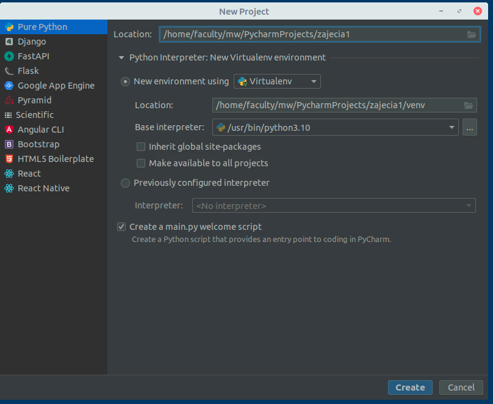
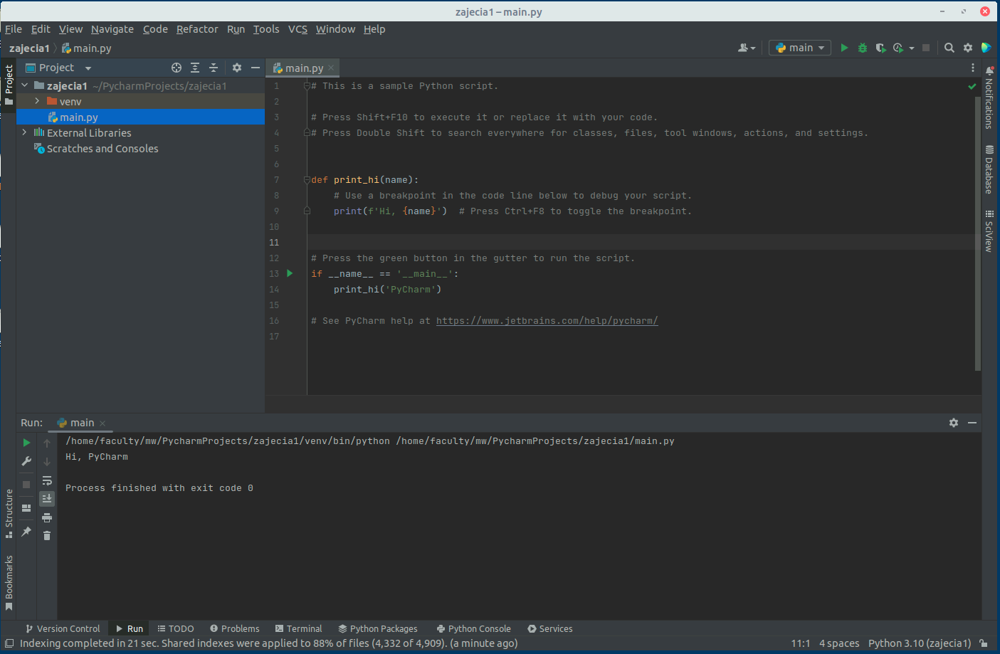
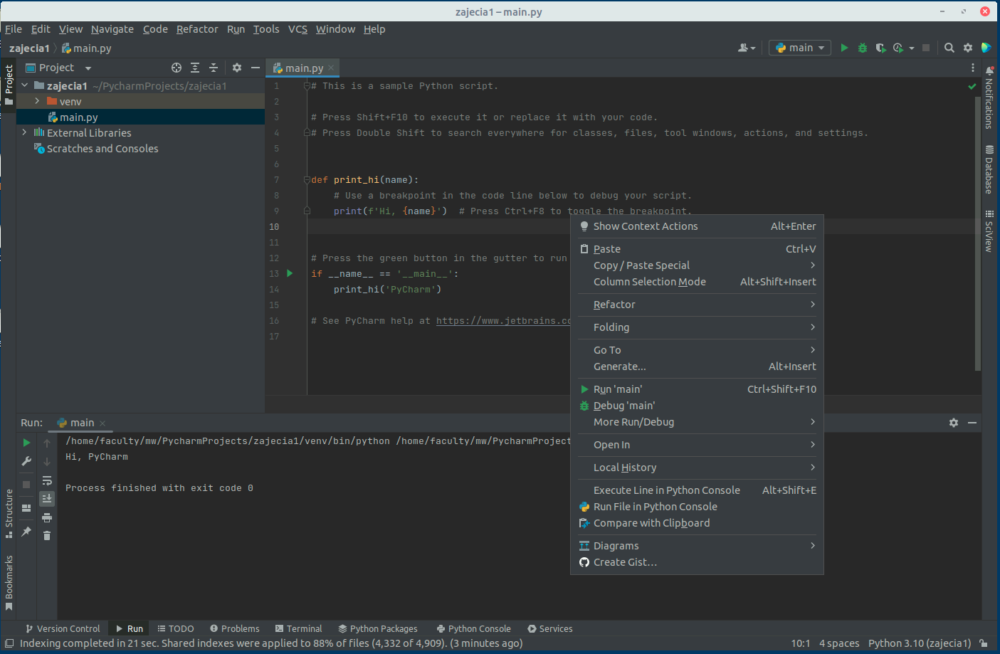
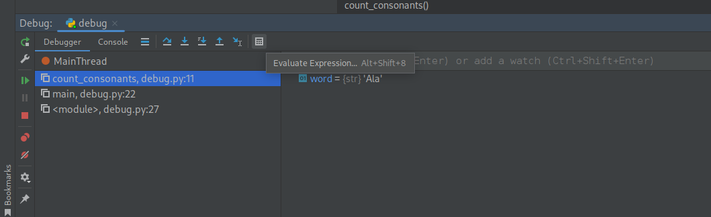
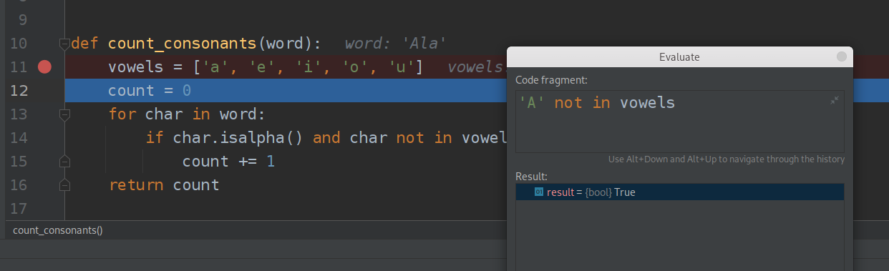
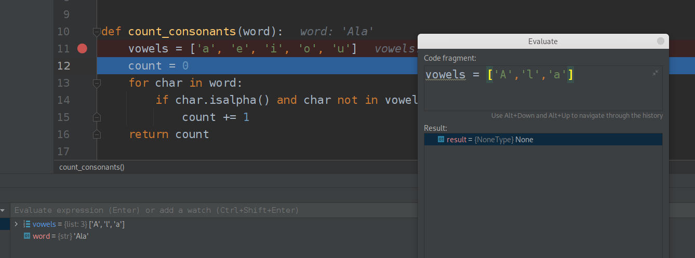
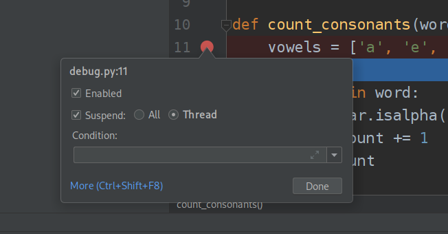

Laboratorium 2 - Debuggowanie programów w Python, mapowanie danych, przetwarzanie danych
========================================================================================

Debuggowanie w PyCharm
======================

Kod numer 1, wklej kod do nowego pliku w Pycharm i uruchom. Vowel to
samogłoski a consonants to spółgłoski.

.. class:: highlight

.. code:: python

    def count_vowels(word):
        vowels = ['a', 'e', 'i', 'o', 'u']
        count = 0
        for char in word:
            if char in vowels:
                count += 1
        return count
    
    
    def count_consonants(word):
        vowels = ['a', 'e', 'i', 'o', 'u']
        count = 0
        for char in word:
            if char.isalpha() and char not in vowels:
                count += 1
        return count
    
    
    def main():
        word = input("Enter a word: ")
        vowels = count_vowels(word)
        consonants = count_consonants(word)
        print("The word", word, "contains", vowels, "vowels and", consonants, "consonants.")
    
    
    # User needs to debug the error below
    main()

.. parsed-literal::

    Enter a word:  Ala

.. parsed-literal::

    The word Ala contains 1 vowels and 2 consonants.

Uruchom kod dla słowa “Ala”. Zwrócona odpowiedź nie jest poprawna.
Znajdź błąd. Aby znaleźć błąd w programie można posłużyć się procesem
debuggowania, czyli uruchamiania programu krok po kroku w celu
sprawdzenia jego działania w kolejnych iteracjach.

W celu uruchomienia programu w trybie debuggowania w Pycharm należy
wybrać zamiast zielonej strzałki, ikonkę zielonego robaczka, lub też
kliknąć na pliku prawym przyciskiem myszy i wybrać opcję **Debug**
(powinna być zaraz pod Run).

.. class:: center
	
	|b|
	

Z debuggowaniem związane jest pojęcie breakpointa, czyli punktu
zatrzymania wykonania. Aby dodać breakpoint w PyCharm należy nacisnąć
obok numeru linii programu tak by pojawiła się czerwona kropka, ona
symbolizuje właśnie breakpoint.

.. class:: center
	
	|a|
	

Gdy program osiągnie breakpoint zatrzyma swoje wykonanie i w edytorze
kodu zobaczymy podświetloną linię - znaczy to, że program wykonał
wszystkie operacje do tej linii (**ale nie wliczając jej**).

.. class:: center
	
	|c|
	

Dodatkowo w menu podręcznym na dole ekranu pojawić powinno się okno z
podglądem wartości zmiennych w danym punkcie wykonania.

.. class:: center
	
	|d|
	

Od tego momentu możemy wykonać trzy operacje

   **F9** - wznawia uruchomienie programu do osiągnięcia następnego
   breakpointa

..

   **F8** - uruchamia kolejną linijkę programu na poziomie na którym się
   znajdujemy (czyli obecnie zaznaczoną)

   **F7** - wykonuje kolejną linię programu (czyli w przypadku wykonania
   funkcji wejdzie do środka metody i wykona pierwszą linijkę tej metody
   a w przypadku prostej operacji wykona poświetloną właśnie linijkę.

Przetestuj działanie dodając breakpoint w 21 linijce programu i
wybierając raz **F7** raz **F8** raz **F9**.

Następnie ustaw breakpoint w 11 linijce programu i przejdź przez pętle
linijka po linijce, czy widzisz gdzie jest błąd w zliczaniu spółgłosek?

Czasem w sprawdzaniu co się dzieje pomaga nam opcja Evaluate expression
gdzie możemy wpisać dowolny kod i zobaczyć jego wynik.

.. class:: center
	
	|e|
	

Uwaga! Dostępna jest ona oczywiście tylko w trybie debuggowania! Wybierz
evaluate expression i wpisz w środek

   ‘A’.isalpha()

..

   ‘A’ not in vowels

Zauważ, że aby evaluator wiedział co oznacza lista vowels muszę
wykonaniem programu dojśc do miejsca gdzie lista ta była zadeklarowana!

.. class:: center
	
	|f|
	

Zauważ też że ewaluator może wpływać na zmienne w działającym programie,
może wiec zmieniać jego wykonanie i stan (nawet po wyjściu z jego
okienka), używaj go więc rozważnie!

.. class:: center
	
	|g|
	

Jak widać błędem było nieuwględnienie wielkich liter w przetwarzaniu.
Popraw bład i uruchom program raz jeszcze.

Gdy klikniemy prawym przyciskiem na breakpoint pojawi się nam okno opcji
dla breakpointa. Możemy ustawić w nim warunek - wtedy program zatrzyma
się w tym miejscu tylko gdy warunek będzie spełniony. Druga istotna dla
nas później opcja to możliwość zatrzymania tylko wątku który dotarł do
tego miejsca lub wszystkich wątków programu (będzie to wykorzystane na
kolejnych zajęciach).

.. class:: center
	
	|h|
	

Kod 2: Ten kod używa zmodyfikowanego algorytmu szybkiego wyboru, aby
znaleźć medianę bez sortowania listy. Funkcja find_median() wielokrotnie
dzieli listę na elementy, które są mniejsze, równe lub większe niż
losowo wybrany element przestawny, aż znajdzie element, który pojawia
się na środku listy.

Przetwarzanie i generowanie danych
==================================

Iteratory
---------

Poniżej znajdziemy przyklady implementacji iteratorów w Python. Sprawdź
co stanie się w sytuacji, gdy dojdziemy do końca iteratora.

.. class:: highlight

.. code:: python

    L = [1, 2, 3]
    it = iter(L)
    it  
    
    print(it.__next__())
    print(next(it))
    print(it.__next__())
    print(next(it))

.. parsed-literal::

    1
    2
    3

::

    ---------------------------------------------------------------------------

    StopIteration                             Traceback (most recent call last)

    Cell In [2], line 8
          6 print(next(it))
          7 print(it.__next__())
    ----> 8 print(next(it))

    StopIteration: 

Gdy wywołasz iter() na słowniku, otrzymasz iterator, który przegląda
klucze słownika:

.. class:: highlight

.. code:: python

    slownik = {'Jan': 'Sty', 'Feb': 'Lut', 'Mar': 'Mar', 'Apr': 'Kwi', 'May': 'Maj', 'Jun': 'Cze', 
         'Jul': 'Lip', 'Aug': 'Sie', 'Sep': 'Wrz', 'Oct': 'Paz', 'Nov': 'Lis', 'Dec': 'Gru'}
    
    it = iter(slownik)
    
    a = next(it)
    print(a, slownik[a])
    a = next(it)
    print(a, slownik[a])
    a = next(it)
    print(a, slownik[a])
    a = next(it)
    print(a, slownik[a])
    a = next(it)
    print(a, slownik[a])

.. parsed-literal::

    Jan Sty
    Feb Lut
    Mar Mar
    Apr Kwi
    May Maj

Słowniki posiadają metody, które zwracają inne iteratory. Aby iterować
po wartościach lub parach klucz/wartość, po prostu użyj metod values()
lub items() w celu uzyskania odpowiedniego iteratora.

.. class:: highlight

.. code:: python

    slownik = {'Jan': 'Sty', 'Feb': 'Lut', 'Mar': 'Mar', 'Apr': 'Kwi', 'May': 'Maj', 'Jun': 'Cze', 
         'Jul': 'Lip', 'Aug': 'Sie', 'Sep': 'Wrz', 'Oct': 'Paz', 'Nov': 'Lis', 'Dec': 'Gru'}
    
    it = slownik.values()  
    print(it)
    it = slownik.items()  
    print(it)

.. parsed-literal::

    dict_values(['Sty', 'Lut', 'Mar', 'Kwi', 'Maj', 'Cze', 'Lip', 'Sie', 'Wrz', 'Paz', 'Lis', 'Gru'])
    dict_items([('Jan', 'Sty'), ('Feb', 'Lut'), ('Mar', 'Mar'), ('Apr', 'Kwi'), ('May', 'Maj'), ('Jun', 'Cze'), ('Jul', 'Lip'), ('Aug', 'Sie'), ('Sep', 'Wrz'), ('Oct', 'Paz'), ('Nov', 'Lis'), ('Dec', 'Gru')])

Iterator na listę
~~~~~~~~~~~~~~~~~

Możemy zamienić obiekt iteratora na listę lub kolekcję korzystając z
metod list() oraz tuple().

.. class:: highlight

.. code:: python

    L = [1, 2, 3]
    iterator = iter(L)
    t = list(iterator)
    print(t)
    iterator = iter(L)
    t = tuple(iterator)
    print(t)

.. parsed-literal::

    [1, 2, 3]
    (1, 2, 3)

Własny iterator
~~~~~~~~~~~~~~~

Możemy definiować własne klasy iteratorów. Przykładowa implementacja
obiektu odliczającego (będącego zarazem nieskończonym iteratorem)
znajduje się poniżej:

.. class:: highlight

.. code:: python

    from collections.abc import Iterator
    
    class count(Iterator):
        def __init__(self, start=0, step=1):
            self.c, self.step = start-step, step
    
        def __next__(self):
            self.c += self.step
            return self.c
        
    count = count(0,1)
    print(next(count))
    print(next(count))

.. parsed-literal::

    0
    1

Generatory
==========

Funkcja zawierająca słowo kluczowe **yield** jest funkcją generatora.
Kompilator kodu bajtowego Pythona identyfikuje go, co w rezultacie
powoduje inną kompilację funkcji. Co więcej, wywołanie funkcji
generatora zwróci generator obsługujący protokół iteratora, a nie
pojedynczą wartość.

.. class:: highlight

.. code:: python

    seq1 = 'ABC'
    seq2 = (1, 2, 3)
    [(x, y) for x in seq1 for y in seq2] 

.. parsed-literal::

    [('A', 1),
     ('A', 2),
     ('A', 3),
     ('B', 1),
     ('B', 2),
     ('B', 3),
     ('C', 1),
     ('C', 2),
     ('C', 3)]

.. class:: highlight

.. code:: python

    def generate_pairs(A,B):
       for x in A:
           for y in B:
               yield (x, y)
                
    seq1 = 'ABC'
    seq2 = (1, 2, 3)
    
    gen = generate_pairs(seq1,seq2)
    print(gen)
    print(next(gen))
    print(next(gen))
    print(next(gen))
    print(next(gen))
    print(next(gen))
    print(next(gen))

.. parsed-literal::

    <generator object generate_pairs at 0x7f6874793c80>
    ('A', 1)
    ('A', 2)
    ('A', 3)
    ('B', 1)
    ('B', 2)
    ('B', 3)

Lambda
======

W Pythonie funkcja Lambda jest funkcją anonimową, co oznacza, że jest
**funkcją bez nazwy**. Może mieć dowolną liczbę argumentów, ale tylko
jedno wyrażenie, które jest obliczane i zwracane. **Musi mieć wartość
zwracaną**. Najprostsza lambda to funkcja identycznościowa.

.. class:: highlight

.. code:: python

    ident = lambda x : x 
     
    print(ident(6))

.. parsed-literal::

    6

Ponieważ funkcja lambda musi mieć wartość zwracaną dla każdego
prawidłowego wejścia, nie możemy jej zdefiniować za pomocą **if**, ale
**bez else**, ponieważ nie określamy, co zwrócimy, jeśli warunek if
będzie fałszywy, tj. jego część else. Zrozummy to na prostym przykładzie
funkcji lambda, która zwraca liczbę tylko gdy jest ona dodatnia:

.. class:: highlight

.. code:: python

    abs = lambda x : x if(x > 0)
     
    print(abs(6))
    print(abs(-6))

::

      Cell In [10], line 1
        abs = lambda x : x if(x > 0)
                                    ^
    SyntaxError: invalid syntax

Funkcja lambda musi zwracać wartość, a ta funkcja zwraca x, jeśli <
code>x > 0 i nie określa, co zostanie zwrócone, jeśli wartość x jest
mniejsza lub równa 0.

Aby to poprawić, musimy określić, co zostanie zwrócone, jeśli warunek if
będzie fałszywy, tj. musimy określić jego część else.

.. class:: highlight

.. code:: python

    abs = lambda x : x if(x > 0) else -x
     
    print(abs(6))
    print(abs(-6))

.. parsed-literal::

    6
    6

.. class:: highlight

.. code:: python

    max = lambda a, b : a if(a > b) else b
     
    print(max(1, 2))
    print(max(10, 2))

.. parsed-literal::

    2
    10

Połączenie lambdy z list comprehension. W każdej iteracji wewnątrz list
comprehension tworzymy nową funkcję lambda z domyślnym argumentem x
(gdzie x jest bieżącym elementem iteracji). Później, wewnątrz pętli for,
wywołujemy ten sam obiekt funkcji z domyślnym argumentem za pomocą
item() i uzyskujemy pożądaną wartość. Zatem is_even_list przechowuje
listę obiektów funkcji lambda.

.. class:: highlight

.. code:: python

    is_even_list = [lambda arg = x: arg%5 for x in range(1, 11)]
    
    for item in is_even_list:
    	print(item())

.. parsed-literal::

    1
    2
    3
    4
    0
    1
    2
    3
    4
    0

Wywołanie lambdy przez inną lambdę

.. class:: highlight

.. code:: python

    List = [[2,3,4],[1, 4, 16, 64],[3, 6, 9, 12]]
     
    # Sort each sublist
    sortList = lambda x: (sorted(i) for i in x)
    
    for i in sortList(List):
        print(i)
        
    multiplyByTwo = lambda x, f : [y for y in f(x)] 
    
    print(multiplyByTwo(List,sortList))

.. parsed-literal::

    [2, 3, 4]
    [1, 4, 16, 64]
    [3, 6, 9, 12]
    [[2, 3, 4], [1, 4, 16, 64], [3, 6, 9, 12]]

List comprehension
==================

List comprehension to elegancki sposób definiowania i tworzenia list na
podstawie istniejących list. Składnia [expression for item in list]. Moc
list comprehension to to że może zidentyfikować, kiedy otrzyma stringa
lub tuple i pracować na nich jak na liście.

Operacje w list comprehension możesz zrobić za pomocą pętli. Jednak nie
każdą pętlę można przepisać jako list comprehension. Są one jednak
bardziej eleganckim i zwięzłym zapisem wielu akcji.

.. class:: highlight

.. code:: python

    word_letter = [ letter for letter in 'word' ]
    print( word_letter)

.. parsed-literal::

    ['w', 'o', 'r', 'd']

.. class:: highlight

.. code:: python

    number_list = [ x for x in range(20) if x % 2 == 0]
    print(number_list)

.. parsed-literal::

    [0, 2, 4, 6, 8, 10, 12, 14, 16, 18]

Podwójny warunek logiczny (nested if)

.. class:: highlight

.. code:: python

    num_list = [y for y in range(100) if y % 2 == 0 if y % 5 == 0]
    print(num_list)

.. parsed-literal::

    [0, 10, 20, 30, 40, 50, 60, 70, 80, 90]

Tutaj sprawdź rozumienie listy:

::

   Czy y jest podzielne przez 2, czy nie?
   Czy y jest podzielne przez 5, czy nie?

Jeśli y spełnia oba warunki, y jest dołączane do num_list. Zwróć uwagę
na różnicę między filtrowaniem po pętli a zmianą elementu - przed **for
in** oraz to w jakiej kolejności są wykonywane.

.. class:: highlight

.. code:: python

    num_list = ['A' if y % 20 == 0 else 'B' for y in range(100) if y % 2 == 0 if y % 5 == 0]
    print(num_list)
    
    num_list = [rr for rr in [10 if y % 25 == 0 else 7 for y in range(100)] if rr % 2 == 0 if rr % 5 == 0]
    print(num_list)

.. parsed-literal::

    ['A', 'B', 'A', 'B', 'A', 'B', 'A', 'B', 'A', 'B']
    [10, 10, 10, 10]

Zanieżdzone pętle:

.. class:: highlight

.. code:: python

    matrix = [[1, 2], [3,4], [5,6], [7,8]]
    transpose = [[row[i] for row in matrix] for i in range(2)]
    print (transpose)

.. parsed-literal::

    [[1, 3, 5, 7], [2, 4, 6, 8]]

Zip
===

Połączenie dwóch list argumentów w jedną listę krotek może być trudne.
Na szczęście python udostępnia funkcję zip. Spowoduje to automatyczne
spakowanie **N** list w jedną listę krotek (każda krotka zawiera N
elementów).

.. class:: highlight

.. code:: python

    a = [1, 2, 3, 4, 5]
    b = [6, 7, 8, 9, 10]
    c = [11, 12, 13, 14, 15]
    
    args = zip(a, b, c)
    print(list(args))

.. parsed-literal::

    [(1, 6, 11), (2, 7, 12), (3, 8, 13), (4, 9, 14), (5, 10, 15)]

Filter
======

Filter() zatrzymuje tylko te elementy, w których generuje wartość
**True**, a usuwa wszystkie dane wejściowe, które wygenerowały wartość
**False**.

Filter przyjmuje dwa argumenty funkcję i iterowalny obiekt.

.. class:: highlight

.. code:: python

    li = [5, -5, 2, -2, 0, 62, -77, 23, 73, -61]
     
    final_list = list(filter(lambda x: (x > 0), li))
    print(final_list)

.. parsed-literal::

    [5, 2, 62, 23, 73]

Map
===

Funkcja map() w Pythonie przyjmuje jako argument funkcję i listę
argumetów. Działa podobnie do list comprehension. Funkcja jest
wywoływana za pomocą funkcji lambda i zwracana jest nowa lista wartości,
która zawiera wszystkie zmodyfikowane elementy wejściowe zwrócone przez
tę funkcję. Przykłady:

.. class:: highlight

.. code:: python

    li = [5, -5, 2, -2, 0, 62, -77, 23, 73, -61]
     
    final_list = list(map(lambda x: x*2, li))
    print(final_list)

.. parsed-literal::

    [10, -10, 4, -4, 0, 124, -154, 46, 146, -122]

.. class:: highlight

.. code:: python

    countries = ['poland', 'france', 'spain']
     
    uppered_countries = list(map(lambda countries: countries.upper(), countries))
     
    print(uppered_countries)

.. parsed-literal::

    ['POLAND', 'FRANCE', 'SPAIN']

Przypadek większej liczby argumentów oraz wykorzystania funkcji nazwanej
zamiast lambdy:

.. class:: highlight

.. code:: python

    def add(x, y):
        """Return the sum of the two arguments"""
        return x + y
    
    a = [1, 2, 3, 4, 5]
    b = [6, 7, 8, 9, 10]
    
    result = map(add, a, b)
    print(list(result))

.. parsed-literal::

    [7, 9, 11, 13, 15]

Reduce
======

Funkcja reduce() w Pythonie przyjmuje jako argument funkcję i listę.
Funkcja jest wywoływana za pomocą funkcji **lambda**, a zwracany jest
nowy zredukowany wynik. Funkcja reduce() należy do modułu functools.

.. class:: highlight

.. code:: python

    from functools import reduce
    li = [1, 2, 3, 4, 5, 6]
    sum = reduce((lambda x, y: x + y), li)
    print(sum)

.. parsed-literal::

    21

W tym wypadku wynik poprzedniego przetwarzania jest dodawany do
kolejnego itd (((((1+2)+3)+4)+5)+6). Lambda w reduce powinna przyjmować
dwa argumenty.

Podsumowanie
============

+------+--------------------+--------------------+-------------------+---+
|      | Map                | Filter             | Reduce            |   |
+======+====================+====================+===================+===+
| I    | N do N             | N do M, gdzie N>=M | N do 1            |   |
| nput |                    |                    |                   |   |
| vs   |                    |                    |                   |   |
| ou   |                    |                    |                   |   |
| tput |                    |                    |                   |   |
+------+--------------------+--------------------+-------------------+---+
| W    | Transformacja i    | Filtrowanie danych | Redukcja do       |   |
| ykor | wzbogacenie danych |                    | pojedynczej       |   |
| zyst |                    |                    | wartości          |   |
| anie |                    |                    |                   |   |
+------+--------------------+--------------------+-------------------+---+
| A    | Każda dana         | Odrzucane dane dla | Parami redukcja   |   |
| plik | wejściowa          | których warunek    | wejścia do jednej |   |
| acja | przechodzi przez   | jest false         | wartości          |   |
|      | funkcję            |                    |                   |   |
+------+--------------------+--------------------+-------------------+---+
