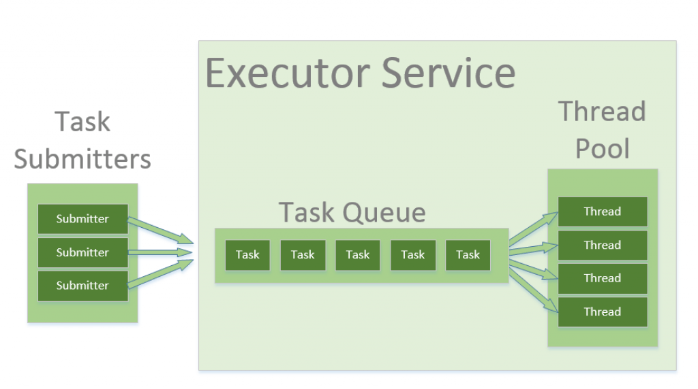

.. role:: todo

.. role:: raw-latex(raw)
            :format: latex html

==========================================
Przetwarzanie równoległe i strumieniowe
==========================================

.. class:: important 

    Uwaga! Kod z którego będziemy korzystać na zajęciach jest dostępny na branchu **ExecutorsClassesStart** w repozytorium https://github.com/WitMar/PRS2020 . Kod końcowy można znaleźć na branchu **ExecutorsClassesEnd**.

Jeżeli nie widzisz odpowiednich gałęzi na GitHubie wykonaj **Ctr+T**, a jak to nie pomoże to wybierz z menu **Git->Fetch**.    

Thread Pool
=====================================

Wątki wykonujące te same zadania możemy łączyć w grupy. Tak, że traktujemy je jako pojedynczy obiekt i mamy możliwość wspólnego nimi zarządzania. Grupa wątków może zawierać podgrupy.

W Javie każda grupa wątków jest podgrupą grupy system:

.. class:: highlight

.. code:: java

    logger.info(Runtime.getRuntime().availableProcessors());

    logger.info(Thread.currentThread().getThreadGroup().getName());
    logger.info(Thread.currentThread().getThreadGroup().getParent().getName());
    
W ramach grupy main uruchomione są takie wątki maszyny wirtualnej Javy jak np, GarbageCollector. Musimy więc być świadomi, że maszyna wirtualna Javy uruchamia także dodatkowe wątki poza głównym wątkiem programu.

Tworzenie grup wątków:

.. class:: highlight

.. code:: java

	ThreadGroup group = new ThreadGroup("moja grupa");
	
Zobacz przykład w klasie **Groups.java** 

Programy serwerowe, takie jak serwery baz danych i serwery WWW, wielokrotnie wykonują żądania od wielu klientów i są zorientowane na przetwarzanie dużej liczby krótkich zadań. Podejście do budowania aplikacji serwera polegałoby na utworzeniu nowego wątku za każdym razem, gdy nadejdzie żądanie i obsłużeniu tego nowego żądania w nowo utworzonym wątku. Chociaż takie podejście wydaje się proste do wdrożenia, ma poważne wady. Serwer, który tworzy nowy wątek dla każdego żądania, spędzałby więcej czasu i zużywał więcej zasobów systemowych na tworzenie i niszczenie wątków niż przetwarzanie rzeczywistych żądań.

Obiekty wątków używają znacznej ilości pamięci, a w przypadku aplikacji tworzenie i nieszczenie wielu obiektów wątków powoduje znaczne obciążenie związane z zarządzaniem pamięcią. Innym problemem jest także obsługa zadań w przypadku, gdy ich liczba przekracza dostępną liczbę wątków. Rozwiązaniem w tym wypadku jest stosowanie tzw. puli wątków.

Thread pool - pula wątków dostępna do działania, które sa wykorzystywane a następnie zwracane do puli do ponownego użytku. Pozwala to na stałe obciążenie systemu bez konieczności tworzenia i usuwania wątków za każdym razem gdy zadanie zostanie zakończone.

Jednym z popularnych typów puli wątków jest stała pula wątków (fixed thread pool). Pula tego typu zawsze ma określoną liczbę uruchomionych wątków; jeśli wątek zostanie w jakiś sposób zakończony, gdy jest nadal używany, zostanie automatycznie zastąpiony nowym wątkiem. Zadania są przesyłane do puli za pośrednictwem wewnętrznej kolejki, która przechowuje dodatkowe zadania, gdy jest więcej aktywnych zadań niż wątków.

Executory
=====================================

Java udostępnia strukturę Executor, która jest skoncentrowana wokół interfejsu Executor, jego podinterfejsu – ExecutorService i klasy ThreadPoolExecutor, która implementuje oba te interfejsy. Używając executora, tworzymy pule wątków do której możemy przesyłać zadania do wykonania.

.. class:: center
	
	|col|
	

Tworzenie Executora w javie :

.. class:: highlight

.. code:: java
        
    ExecutorService service = Executors.newFixedThreadPool(5);
    
Następnie możemy dodawać zadania do wykonania przez tę pulę wątków, np:

.. class:: highlight

.. code:: java
        
    service.submit(() -> {
      logger.info("Working " + Thread.currentThread().getName());
    });    

Zalety stosowania Executorów (thread pool):

	| biblioteka za nas obsługuje przychodzące zadania
	| możliwość reużywania wątków, nie musimy tworzyć i niszczyć wątków, co kosztuje czas i zasoby
	| możemy wygodnie ograniczyć liczbę wątków do tylu ile nasz komputer jest w stanie swobodnie obsłużyć.
	
Rodzaje Executorów:

	| SingleThreadExecutor - wywołuje programy synchroniczne, każdy nowy process jest uruchamiany przez nowy wątek.
	| FixedThreadPool(n) - uruchamia n wątków, gdzie n to zwykle liczba procesorów w komputerze
	| CachedThreadPool - nie ogranicza liczby wątków, które są uruchamiane. W przypadku gdy wszystkie wątki są zajęte i przychodzi nowe zadanie, tworzony jest nowy wątek. Jeżeli wątek nie pracuje przez 60 sekund wtedy jest usuwany. Tego executora użyjemy, gdy mamy dużo małych zadań do wykonania.
	| ScheduledExecutor - wykonanie operacji w wybranych momentach czasu
	
Zobacz przykład w odpowiednich klasach o nazwie **xxxExecutor.java** .

Executor musi zostać wyłączony, gdy skończysz z niego korzystać. Jeśli nie, maszyna JVM będzie działać, nawet jeśli wszystkie inne wątki zostaną zamknięte. 

.. class:: tag 

	Zadanie 1

Sprawdź co stanie się jak nie wyłączysz puli wątków przez wywołanie shutdown();
	
Executor.shutdown()	inicjalizuje zakonczeńczenie działania i blokuje możliwość dodawania nowych zadań do wykonania dla Executora. 

    | shutdown() informuje usługę executora, że nie może zaakceptować nowych zadań, ale już przesłane zadania nadal zadziałają
    | shutdownNow() zrobi to samo oraz spróbuje anulować już przesłane zadania, przerywając odpowiednie wątki. Zauważ, że jeśli twoje zadania ignorują przerwanie (interrupt), shutdownNow będzie zachowywać się dokładnie tak samo, jak shutdown.
    
Zagrożenia związane z używaniem pul wątków:

    | Zakleszczenie : podczas gdy zakleszczenie może wystąpić w dowolnym programie wielowątkowym, pule wątków wprowadzają inny przypadek zakleszczenia, w którym wszystkie wykonujące wątki czekają na wyniki z zablokowanych wątków oczekujących w kolejce z powodu niedostępności wątków do wykonania.
    | Przeciek wątku (leakage): Przeciek wątku występuje, gdy wątek zostanie usunięty z puli w celu wykonania zadania, ale nie zostanie do niego zwrócony po zakończeniu zadania. Na przykład, jeśli wątek zgłosi wyjątek, a klasa puli nie przechwyci tego wyjątku, wątek po prostu zakończy działanie, zmniejszając rozmiar puli wątków o jeden. Jeśli powtórzy się to wiele razy, pula w końcu stanie się pusta i żadne wątki nie będą dostępne do wykonania innych żądań.
    | Przerzucanie zasobów : Jeśli rozmiar puli wątków jest bardzo duży, czas marnuje się na przełączanie kontekstu między wątkami. Posiadanie większej liczby wątków niż optymalna liczba może spowodować problem z głodem, prowadzący do marnowania zasobów.  
    
Optymalny rozmiar puli wątków zależy od liczby dostępnych procesorów i charakteru zadań. W systemie z procesorem N dla kolejki procesów tylko typu obliczeniowego maksymalny rozmiar puli wątków N lub N+1 osiągnie maksymalną wydajność. Jednak zadania mogą czekać na I/O i w takim przypadku bierzemy pod uwagę stosunek czasu oczekiwania (W) i czasu obsługi (S) na żądanie; co skutkuje maksymalnym rozmiarem puli N*(1+ W/S) dla maksymalnej wydajności.

Synchronizowane kolekcje
=====================================

--------------------------
Synchronized collections
--------------------------

Wszystkie kolekcje w Javie możemy synchronizować opakowując ich definicję w metodę Collections.synchronizedXXX().

Jak sama nazwa wskazuje, synchronizedMap() zwraca zsynchronizowaną mapę na podstawie podanej w nawiasie implementacji. Aby zapewnić bezpieczeństwo wątków, synchronizedMap() chroni dostępy do mapy bazowej za pośrednictwem blokady (lock).

.. class:: highlight

.. code:: java

    Map<String, Integer> map = Collections.synchronizedMap(new HashMap<String, Integer>());

Synchronizowane kolekcje nie są wydajne gdyż stosują zamek (lock) na całym obiekcie i każdej jego metodzie, stąd nawet metody, które mogą być wykonywane niezależnie blokują się nawzajem. Odpowiedzią są kolekcje Concurrent.

---------------------
ConcurrentHashMap
---------------------

Mapa obsługująca pełną współbieżność pobierania i wysoką oczekiwaną współbieżność aktualizacji. Ta klasa podlega tej samej specyfikacji funkcjonalnej co HashMapa i zawiera wersje metod odpowiadające każdej metodzie HashMapy. Wszystkie operacje są bezpieczne wielowątkowo, operacje pobierania nie pociągają za sobą blokowania i nie ma obsługi blokowania całej tabeli w sposób uniemożliwiający wszelki dostęp. Mapa concurrent nie blokuje operacji odczytu a w przypadku zapisu blokuje tylko segment hash mapy (blok kluczy), co pozwala osiągnać lepszą wydajność.    

Tabela jest dynamicznie rozszerzana, gdy występuje zbyt wiele kolizji (tj. klucze, które mają różne kody skrótu, ale mieszczą się w tym samym bloku), z oczekiwanym średnim efektem utrzymania około dwóch pojemników na mapowanie. Zmiana rozmiaru tej lub dowolnego innego rodzaju tablicy mieszającej może być stosunkowo powolną operacją. Jeśli to możliwe, dobrym pomysłem jest podanie oszacowania rozmiaru jako opcjonalnego argumentu konstruktora InitialCapacity.

.. class:: highlight

.. code:: java

    ConcurrentHashMap<Integer,String> map = new ConcurrentHashMap<Integer,String>();
    
    map.put(1,"value");
    map.remove(1,"valueNew");
    logger.info(map.size());
    map.remove(1,"value");
    
Zwróć uwagę na dodatkowe metody niedostępne w HashMapie takie jak usuwanie specyficznej wartośći dla klucza.
    
Zobacz działanie concurrent map na przykładzie w klasie **ConcurrentMaps.java** oraz porównanie szybkości działania synchronizowanych i concurrent map w klasie **Maps.java**.

Dodatkowe narzędzia synchronizacji
=====================================

------------------------
Count down latch
------------------------

Pomoc w synchronizacji, która umożliwia jednemu lub większej liczbie wątków oczekiwanie na zakończenie zestawu operacji wykonywanych w innych wątkach.

CountDownLatch jest inicjowany z podaną liczbą. Blokowanie następuje poprzez wykonanie metody await do momentu, gdy bieżąca liczba licznika osiągnie zero z powodu wywołań metody countDown() przez inne wątki, po czym wszystkie oczekujące wątki są zwalniane, a wszystkie kolejne wywołania await nie blokują już wywołania. Jest to jednorazowy obiekt — licznika nie można zresetować. 

CountDownLatch to wszechstronne narzędzie do synchronizacji, które może być używane do wielu celów. CountDownLatch zainicjowany z liczbą jeden służy jako prosty zatrzask włączania/wyłączania lub brama: wszystkie wątki wywołujące czekają w bramie, aż zostaną otwarte przez wątek wywołujący countDown(). CountDownLatch zainicjowany do N może służyć do tego, aby jeden wątek czekał, aż N wątków zakończy jakąś akcję lub jakaś akcja zostanie zakończona N razy.

Przydatną właściwością CountDownLatch jest to, że nie wymaga, aby wątki wywołujące CountDown czekały, aż licznik osiągnie zero przed kontynuowaniem, po prostu zapobiega przejściu wybranych wątków poza await, aż wszystkie wątki będą mogły przejść.

.. class:: highlight

.. code:: java

	CountDownLatch latch = new CountDownLatch(3);
	
Blokowanie (metoda await()) będzie polegało na tym, iż praca nie zostanie odpalona, dopóki wartość licznika CountDownLatch nie będzie równa zero.

.. class:: highlight

.. code:: java

    latch.await();

Natomiast wątek serwis po wykonaniu swojej pracy ma za zadanie zmniejszyć ten licznik (metoda countDown()):

.. class:: highlight

.. code:: java

    latch.countDown();	

Zobacz przykłady w klasach **CountDown.java** i **CountDownAllWaits.java**.

.. class:: tag 

	Zadanie 2
	
Napisz program, który czeka na zakończenie wątków a później wyłącza Executora w klasie **CountDownZadanie.java**.

Klasycznym przykładem użycia CountDownLatch w Javie jest aplikacja Java po stronie serwera, która wykorzystuje architekturę mikroservisów, w której wiele usług jest dostarczanych przez wiele serwisów, a aplikacja nie może rozpocząć przetwarzania, dopóki wszystkie usługi nie zostaną pomyślnie uruchomione.	
	
------------------------
Cyclic barrier
------------------------

CyclicBarrier jest przydatny w scenariuszach, w których zestaw wątków ma czekać na siebie nawzajem w celu osiągnięcia wspólnego punktu bariery. Kiedy wątek osiąga barierę wywołuje metodę await() na obiekcie CyclicBarrier. Powoduje to zawieszenie wątku, dopóki inne wątki nie wywołają również metody await() na tym samym obiekcie CyclicBarrier. Gdy wszystkie określone wątki wywołają metodę await(), bariera jest zwalniana i wszystkie wątki będą mogły wznowić działanie.

Bariera nazywana jest cykliczną, ponieważ może być ponownie użyta po zwolnieniu oczekujących wątków.

Bariera działa podobnie jak licznik countDownLatch, z tą różnicą że blokuje więcej niż jeden wątek na barierze. Dodatkowo w przeciwieństwie do zatrzasku bariera może być reużywana wiele razy.

.. class:: highlight

.. code:: java

    CyclicBarrier barrier = new CyclicBarrier(4);
    barrier.await();

Bariery Cykliczne są używane w programach, w których mamy ustaloną liczbę wątków, które muszą czekać, aż osiągną wspólny punkt przed kontynuowaniem wykonywania.

Zobacz przykłady w klasach **Barrier.java** i **BarrierRunOnBarrierReached.java**.

.. class:: tag 

	Zadanie 3
	
Napisz program, który wstrzyma wszystkie wątki w przypadku wystąpienia zadania synchronizacji (klasa **BarrierZadanie.java**).

Zobacz na rozwiązanie prowadzącego, w jakim scenariuszu ono nie zadziała?

------------------------
BlockingQueue
------------------------

Kolejka blokująca to kolejka, która blokuje się, gdy próbujesz usunąć z niej element, a kolejka jest pusta, lub jeśli próbujesz dodać do niej elementy, a kolejka jest już pełna. Wątek, który próbuje usunąć element z pustej kolejki, jest blokowany, dopóki inny wątek nie wstawi elementu do kolejki. Wątek próbujący umieścić element w pełnej kolejce jest blokowany, dopóki jakiś inny wątek nie zrobi miejsca w kolejce, usuwając jeden lub więcej elementów lub całkowicie usuwając kolejkę.

BlockingQueue udostępnia metodę put() do przechowywania elementu oraz metodę take() do pobierania elementu. Obie są metodami blokującymi, co oznacza, że metoda put() zablokuje się, jeśli kolejka osiągnie swoją pojemność i nie ma miejsca na dodanie nowego elementu. Podobnie metoda take() będzie blokować, jeśli kolejka blokująca jest pusta.

Implementacje BlockingQueue są bezpieczne wielowątkowo. Wszystkie metody kolejkowania osiągają swoje efekty atomowo przy użyciu wewnętrznych blokad lub innych form kontroli współbieżności. Jednak operacje zbierania zbiorczego addAll, IncludesAll, keepAll i removeAll niekoniecznie są wykonywane niepodzielnie, chyba że określono inaczej w implementacji. Tak więc możliwe jest, że np. addAll(c) nie powiedzie się (zgłosi wyjątek) po dodaniu tylko niektórych elementów w c.

.. class:: highlight

.. code:: java

    BlockingQueue<Integer> sharedQ = new LinkedBlockingQueue<Integer>();
    queue.put(produce());
    consume(queue.take());
    
Zobacz przykład w klasie **BlockingQueue.java**.   

.. class:: tag 

	Zadanie 4 
	
Zmień przykłąd w klasie **BlockingQueue.java** tak by za pomocą bariery kończyć przetwarzanie consumera jak wszyscy consumenci skończą przetwarzanie. 	

------------------------
Exchangers
------------------------

Klasa Exchanger w Javie może służyć do współdzielenia obiektów między dwoma wątkami. Klasa udostępnia tylko jedną przeciążoną metodę exchange(T t). Po wywołaniu wymiana czeka, aż drugi wątek w parze również ją wywoła. W tym momencie drugi wątek odnajduje, że pierwszy wątek czeka ze swoim obiektem. Wątek wymienia przedmioty, które trzyma i sygnalizuje wymianę.

.. class:: highlight

.. code:: java

    Exchanger<String> exchanger = new Exchanger<>();
    exchanger.exchange("from");
    exchanger.exchange("to");
    
Zobacz przykład w klasie **Exchangers.java**.    

------------------------
Phaser
------------------------

Phaser pozwala nam budować logikę, w której wątki muszą czekać na barierę przed przejściem do następnej fazy wykonania. Możemy koordynować wiele faz wykonania, ponownie wykorzystując instancję Phasera dla każdej fazy programu. Każda faza może mieć inną liczbę wątków oczekujących na przejście do kolejnej fazy. 

Aby uczestniczyć w koordynacji, wątek musi sam zarejestrować() w instancji Phaser. Wątek sygnalizuje, że dotarł do bariery, wywołując *arriveAndAwaitAdvance(*), która jest metodą blokującą. Gdy liczba przybyłych wątków będzie równa liczbie zarejestrowanych wątków, realizacja programu będzie kontynuowana, a numer fazy wzrośnie. Aktualny numer fazy możemy uzyskać, wywołując metodę getPhase().

Gdy wątek zakończy swoje zadanie, powinniśmy wywołać metodę arriveAndDeregister(), aby zasygnalizować, że bieżący wątek nie powinien już być uwzględniany w tej konkretnej fazie.

.. class:: highlight

.. code:: java
    
    ph.arriveAndAwaitAdvance();
    try {
      Thread.sleep(20);
    } catch (InterruptedException e) {
      e.printStackTrace();
    }
    ph.arriveAndDeregister();
    
Zabacz przykład w klasie **PhaserExample.java**.

.. class:: tag 

	Zadanie 5
	
Zamień przykład na taki, który zrealizuje wyścig wątków na zasadzie, że najwolniejszy wątek danej fazy odpada (np ostatni który doda się do listy) i tylko jeden kończy przetwarzanie. 

.. [*] Wykorzystano materiały z:
	
	| https://www.baeldung.com/java-phaser
	| https://www.geeksforgeeks.org/thread-pools-java/
	| https://www.baeldung.com/java-synchronizedmap-vs-concurrenthashmap
	| https://docs.oracle.com/javase/7/docs/api/java/util/concurrent/CountDownLatch.html
	| https://jenkov.com/tutorials/java-concurrency/blocking-queues.html
