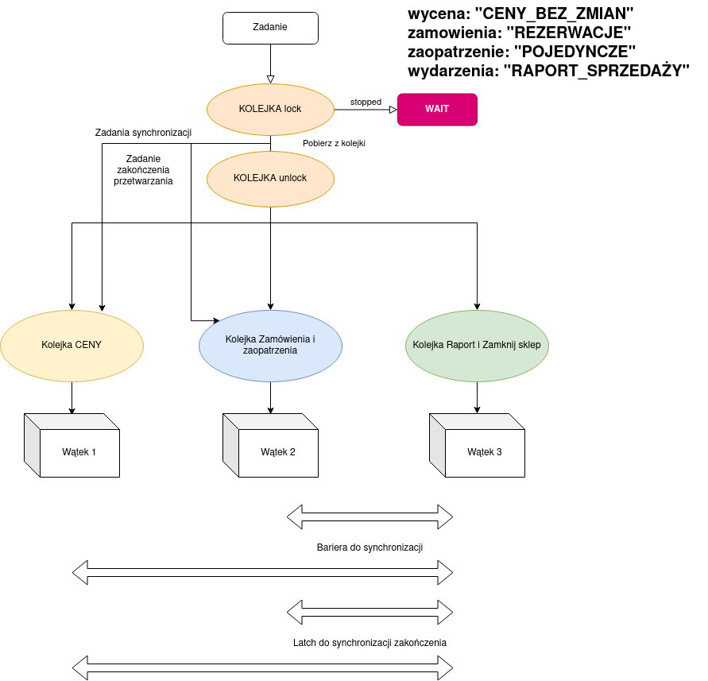
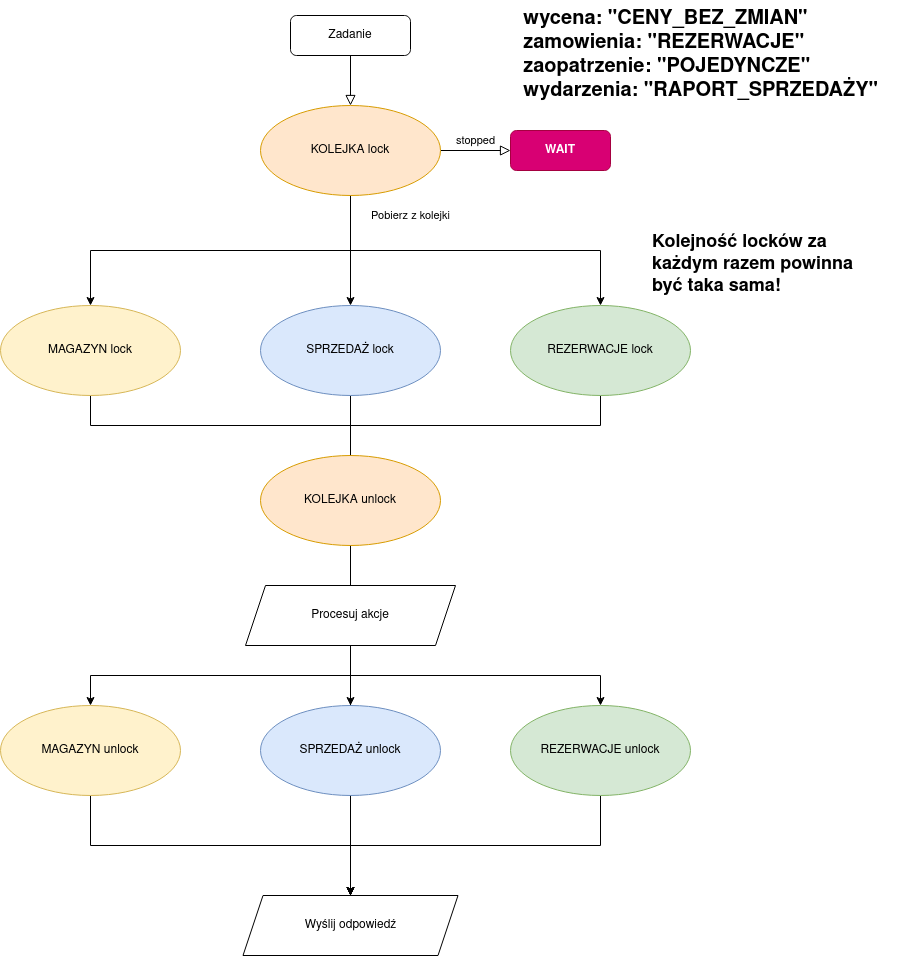
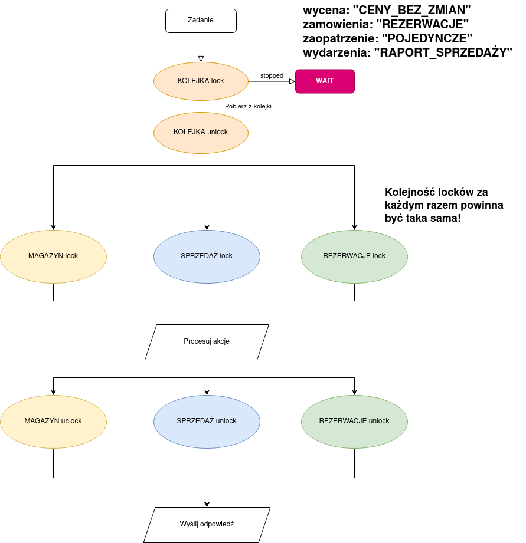
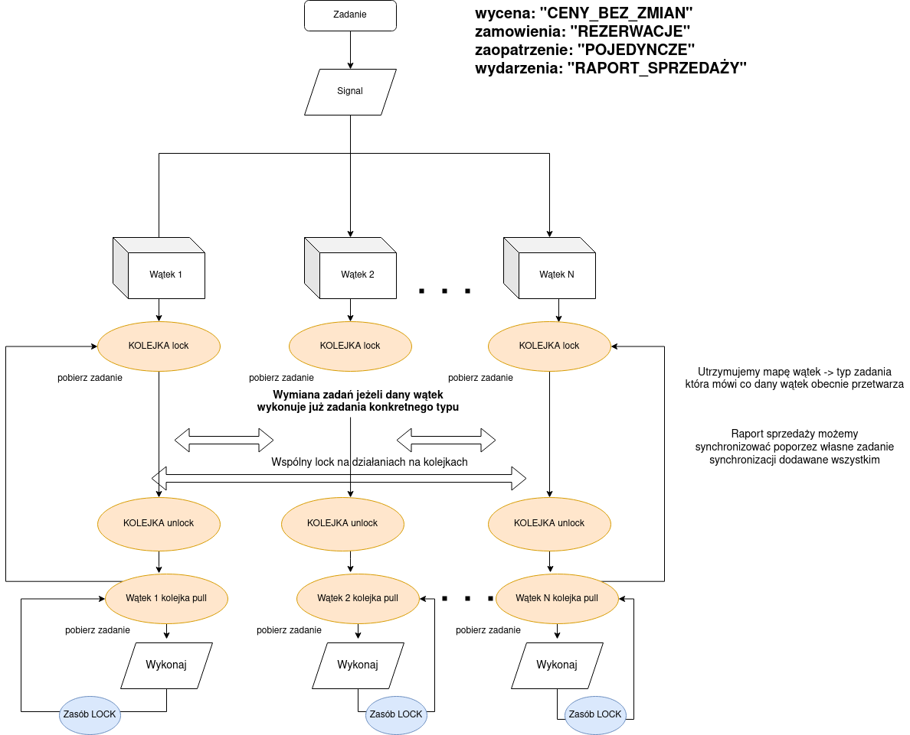
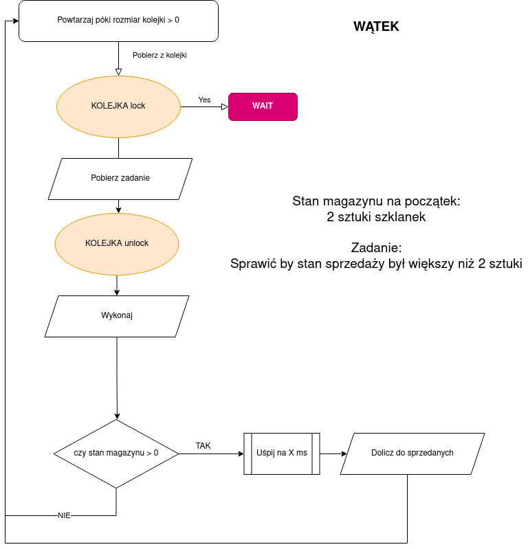

.. role:: todo

.. role:: raw-latex(raw)
            :format: latex html

==========================================
Przetwarzanie równoległe i strumieniowe
==========================================

Zasoby
==============

	| **Zamek** - Lock, umożliwiający zamykanie lock i otwieranie unclock, wątki czekają na zasób i są wznawiane w nieznanej nam kolejności
	
	| **Zamek** - Lock, z metodą tryLock która przepuszcza działanie dalej jeżeli w danym momencie zasób jest dla nas niedostępny 
	
	| **Zamek ReadWrite** - ReadWriteLock, umożliwiający zamykanie lock i otwieranie unclock, oraz podział operacji na odczyty i zapisy, wątki czekają na zasób i są wznawiane w nieznanej nam kolejności
	
	| **Condition** - związane z zamkiem umożliwiające czekanie na metodzie await() oraz wznawianie przez metodę signal() lub signalAll()
	
	| **Semafor** - blokada umożliwiająca przejście więcej niż jednemu wątkowi, Lock jest przykładem semafora binarnego
	
	| **Zmienne atomowe** - synchronizowane zmienne, których wartość może sterować przetwarzaniem
	
	| **Synchronizowane kolekcje** - listy, mapy, zbiory, na których operacje wielowątkowe sa bezpieczne.
	
	| **BlockingQueue** - kolejka która blokuje wątek gdy nie ma elementów do pobrania
	
	| **Licznik** - Latch, umożliwiający zliczanie wątków przez countDown() oraz czekanie na przyjście X wątków na metodzie await(), nie można użyć o wielokrotnie.
	
	| **Bariera** - cykliczny licznik zatrzymujący wątki poprzez wykonanie await() i przepuszczający po przyjściu X wątków, następnie restartujący się od początku.

Synchronizacja rozwiązanie oparte na analizie zasobów
========================================================

Podejście oparte na tworzeniu niezależnych kolejek dla zadań, które na siebie nie wpływają, oraz tworzenia specjalnych zadań dla synchronizacji:

.. class:: center
	
	|col0|
	

Zalety:

	| Bardzo proste w implementacji.

	| Uzyskanie sekwencyjnego wykonania przez podział sekwencyjnego wywołania w miarę możliwości na podgrupy.
	
Wady:

	| Ograniczona liczba wątków, jeden na kolejkę. Co zrobić jak kolejek jest więcej niż wątków?
	
	| Nie przenosi się na działanie niesekwencyjne.

Podejście oparte na blokowaniu zasobów w sposób taki, żeby wątki na raz nie zmieniały wartości, z których korzystają inne wątki

.. class:: center
	
	|col1|
	

Zalety:

	| Raport sprzedaży i zaopatrzenie mogą się wykonać jednocześnie.

	| Uzyskanie sekwencyjnego wykonania przez dodanie zamku na kolejce - kolejne zadanie nie dopuszcza nikogo do wykonywania operacji na zasobach dopóki same nie dostanie odpowiednich zasobów.
	
Wady:

	| W przypadku dwóch zadań o sprzedaży i wielu o podanie ceny, zadania o sprzedaży blokują zadania z cenami, choć nie powinny.
	
	| Co zrobić żeby móc działać niesekwencyjnie a rozwiązanie cały czas było poprawne?
	
	
Pytanie :

	| Co stanie się, gdy będziemy blokować zasoby poza kolejką?

.. class:: center
	
	|col2|
	

Co może pójśc nie tak? 

Jak zapewnić by zadania o sprzedaży nie blokowały zadań innych? Czy opcja pierwsza może nam pomóc w rozwiązaniu problemu?

W podejściu niesekwencyjnym. Zakładamy, że chcemy **zamówienia rozpatrywać w kolejności**, ale **zaopatrzenia możemy rozpatrywać jak chcemy**. **Raporty i inwentaryzacje nadal chcemy wykonywać synchronizując stan na dany moment czasu**. Możemy też pokusić się o synchronizację danych typów towarów a nie całego magazynu w przypadku zamówień.

Propozycja: przydział kolejek zadań do wątków, tak by one wzajemnie przyznawały zadania w zależnośći od sytuacji. Daje to nam możliwość skalowalności liczby wątków na dowolną liczbę i zmieniające się warunki jak chodzi o nowe typy zadan i zaleźnośći. 

.. class:: center
	
	|col3|
	

Zaliczenie I
=============

	Jedna godzina **15.30** w poniedziałek **09.05.2022**, podział na dwie grupy, zaliczenie po 45 min.

	| a) **Test** - pytanie testowe z "teorii", przypadki - jaki będzie wynik działania kodu lub wykazanie przypadków kiedy zadane rozwiązanie nie działa, podanie w których przypadkach  przedstawione w  pseudokodzie rozwiązanie zadziała, a kiedy nie
	
Przykład:

Wskaż prawdziwe zdania:

		| * Latch jako blokada może być wykorzystywany wielokrotnie
		| * Bariera jako blokada może być wykorzystywana wielokrotnie
		| * Bariera umożliwia synchronizację wielu wątków
		| * Latch umożliwia synchronizację wielu wątków
	
	| b) **Implementacja zadania w języku Java** :
	
Zmodyfikowana wersja poprzedniego zadania nr 1 bez ograniczenia o synchroniczności, z nowymi elementami, więcej produktów, zakupy i zaopatrzenie wielu produktów na raz.

	| c) **Podanie kontrprzykładów** (na zajęciach) albo odpowiedź, że zadana implementacja zawsze zadziała.
	
Zadanie(TYP, wartość_parametru (opcjonalnie), czas_uśpienia (w milisek));
	
Np przykład:	
		
.. class:: highlight

.. code:: java

    new Zadanie(TYP, 5, 1000);
	
	lub
	
    Zadanie.builder().item(Items.SZKLANKA)
					 .parameter(5)
					 .sleep(1000)
					 .build()

Pusta lista na odpowiedź że działa. 5 scenariuszy po 5 prób, 4% za każdą próbę.
	
Przykład:
	
Kod:

.. class:: highlight

.. code:: java

    ConcurrentHashMap<Items, Integer> warehouse = new ConcurrentHashMap();
    AtomicLong sold = new AtomicLong(0L);
    BlockingQueue<Zadanie> kolejka;

    public ShopZadanie(BlockingQueue<Zadanie> kolejka) {
        this.kolejka = kolejka;
        warehouse.put(Items.SZKLANKA, 2);
    }

    public void wykonaj(Zadanie zadanie) {
        if(warehouse.get(zadanie.item) > 0) {
            try {
                Thread.sleep(zadanie.sleep);
            } catch (InterruptedException e) {
                e.printStackTrace();
            }
            sold.incrementAndGet();
        }
    }

    public void uruchom() {
        Lock zamek = new ReentrantLock();

        // Wszystkie wątki działają w taki sam sposób
        Thread thread1 = new Thread(() -> {
            zamek.lock();
            while(kolejka.size() > 0) {
              Zadanie zadanie = kolejka.poll();
              zamek.unlock();
              wykonaj(zadanie);
              zamek.lock();
            }
            zamek.unlock();
        });

        Thread thread2 = new Thread(() -> {
            zamek.lock();
            while(kolejka.size() > 0) {
                Zadanie zadanie = kolejka.poll();
                zamek.unlock();
                wykonaj(zadanie);
                zamek.lock();
            }
            zamek.unlock();
        });

        Thread thread3 = new Thread(() -> {
            zamek.lock();
            while(kolejka.size() > 0) {
                Zadanie zadanie = kolejka.poll();
                zamek.unlock();
                wykonaj(zadanie);
                zamek.lock();
            }
            zamek.unlock();
        });

        thread1.start();
        thread2.start();
        thread3.start();

        try {
            thread1.join();
            thread2.join();
            thread3.join();
            // Sprawdzamy czy nie sprzedano więcej niż 2 sztuk
            assertThat(sold.get()).isLessThanOrEqualTo(2);
        } catch (InterruptedException e) {
            e.printStackTrace();
        }
    }

Diagram:

.. class:: center
	
	|col5|
	

Przykładowa odpowiedź :

.. class:: highlight

.. code:: java

        kolejka.add(Zadanie.builder()
                .item(Items.SZKLANKA)
                .sleep(3000)
                .build());
        kolejka.add(Zadanie.builder()
                .item(Items.SZKLANKA)
                .sleep(2000)
                .build());
        kolejka.add(Zadanie.builder()
                .item(Items.SZKLANKA)
                .sleep(1000)
                .build());

Lub

.. class:: highlight

.. code:: java
		
	IntStream.rangeClosed(1,3).forEach(it -> {
                   kolejka.add(Zadanie.builder()
                            .item(Items.SZKLANKA)
                            .sleep(1000)
                            .build());
                });
	
Głosowanie:

	| https://app.rankedvote.co/elections/19116/Zaliczenie/19415/vote	
	
Podaj numer indkesu jako ID, imię dowolne.

Uszereguj opcje od najbardziej preferowanej do najmniej preferowanej.	
	
.. [*] Wykorzystano materiały z:

	| https://www.rankedvote.co/guides/understanding-ranked-choice-voting/how-does-ranked-choice-voting-work

