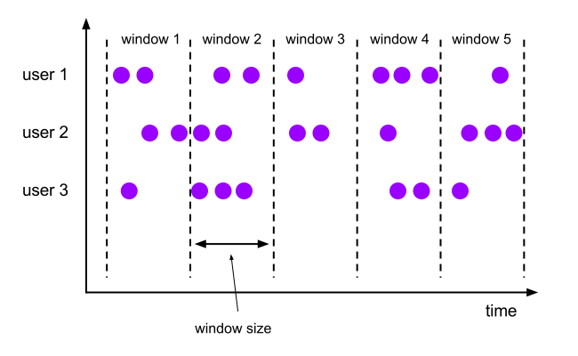
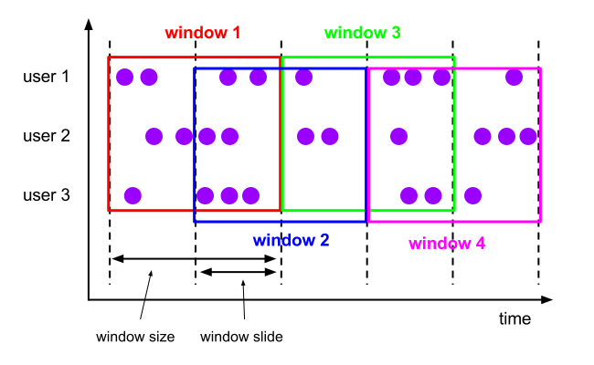
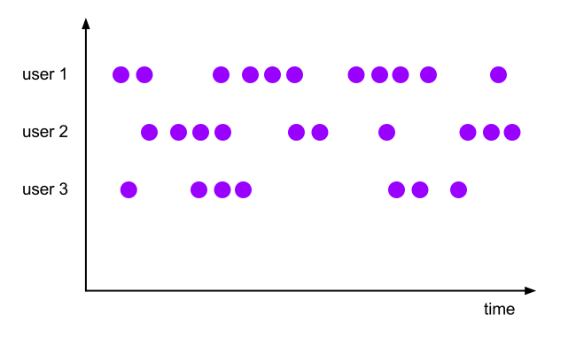

.. role:: todo

.. role:: raw-latex(raw)
            :format: latex html

==========================================
Przetwarzanie równoległe i strumieniowe
==========================================

.. class:: important 

    Uwaga! Kod z którego będziemy korzystać na zajęciach jest dostępny na branchu **ApacheFlinkIntroStart** w repozytorium https://github.com/WitMar/PRS2020 . 

Jeżeli nie widzisz odpowiednich gałęzi na GitHubie wykonaj **Ctr+T**, a jak to nie pomoże to wybierz z menu **Git->Fetch**.   

DataStream
============

Programy wykorzystujące DataStream w Flink to zwykłe programy, które implementują transformacje strumieni danych (np. filtrowanie, aktualizowanie stanu, definiowanie okien, agregowanie). Strumienie danych są początkowo tworzone z różnych źródeł (np. kolejek komunikatów, strumieni gniazd, plików). Wyniki są zwracane przez ujścia, które mogą na przykład zapisywać dane do plików lub na standardowe wyjście (na przykład terminal wiersza poleceń).

Python DataStream API to wersja DataStream API dla języka Python, która umożliwia użytkownikom Pythona pisanie zadań Python dla DataStream API.

Tworzenie StreamExecutionEnvironment 
======================================

StreamExecutionEnvironment to centralne element programu DataStream API. Poniższy przykład kodu pokazuje, jak utworzyć StreamExecutionEnvironment:

.. class:: highlight

.. code:: python

	from pyflink.datastream import StreamExecutionEnvironment

	env = StreamExecutionEnvironment.get_execution_environment()

Tworzenie DataStream 
=======================
DataStream API otrzymuje swoją nazwę od specjalnej klasy DataStream, która jest używana do reprezentowania kolekcji danych w programie Flink. Można je traktować jako niezmienne kolekcje danych, które mogą zawierać duplikaty. Te dane mogą być ograniczone lub nieograniczone.

DataStream jest podobny do zwykłej kolekcji Pythona pod względem użycia, ale pod pewnymi kluczowymi względami jest zupełnie inny. Są niemutowalne, co oznacza, że po ich utworzeniu nie można dodawać ani usuwać elementów. Nie możemy też dostać się do środkowego elementu strumienia, ale tylko pracować z nimi za pomocą operacji API DataStream, które są również nazywane transformacjami.

Początkowy strumień danych można utworzyć, dodając źródło w programie Flink. Następnie możesz wyprowadzić z tego nowe strumienie i przetwarzać je za pomocą metod API, takich jak map, filtr i tak dalej.

Przykłady
===========================

Możesz utworzyć DataStream z obiektu listy. Patrz plik **streamFromCode.py**.

Możesz również utworzyć DataStream przy użyciu łączników (np. do Kafki).

Kafka jako źródło danych
=========================

Zobacz plik **kafka_source.py** żeby zobaczyć jak połączyć się z kafką i pobrać dane z topika jako źródło danych.

DataStream transformacje 
=============================

Operatorzy przekształcają co najmniej jeden DataStream w nowy DataStream. Programy mogą łączyć wiele transformacji w wyrafinowane topologie przepływu danych.

Poniższy przykład przedstawia prosty przykład konwersji DataStream na inny DataStream przy użyciu transformacji map:

.. class:: highlight

.. code:: python

	ds = ds.map(lambda a: a + 1)

Zapoznaj się z operatorami w pliku **transformations.py**.

Zamiana DataStream na tabele 
=============================================

.. class:: highlight

.. code:: python

	# przekonwertuj strumień danych na tabelę
	table = t_env.from_data_stream(ds, 'a, b, c')

	# przekonwertuj tabelę na strumień danych
	ds = t_env.to_append_stream(tabela, Types.ROW([Types.INT(), Types.STRING()]))
	# lub
	ds = t_env.to_retract_stream(tabela, Types.ROW([Types.INT(), Types.STRING()]))

Na koniec należy wywołać metodę StreamExecutionEnvironment.execute, aby przesłać zadanie DataStream API do wykonania.

Jeśli przekonwertujesz DataStream na Table, a następnie zapiszesz go w łączniku ujścia interfejsu API i SQL tabeli, może się zdarzyć, że konieczne będzie przesłanie zadania przy użyciu metody TableEnvironment.execute.

.. class:: highlight

.. code:: python
	
	t_env.execute()

Transformacje 
====================

KeyBy
--------

Logicznie dzieli strumień na rozłączne partycje. Wszystkie rekordy z tym samym kluczem są przypisane do tej samej partycji. 

Reduce 
-------------

Zmniejszenie „rotujące” w strumieniu danych z kluczem. Łączy bieżący element z ostatnią zmniejszoną wartością i emituje nową wartość. Uwaga! Oznacza to, że emitowane są także wartości / kroki pośrednie!

Okna
========

Okna są sercem przetwarzania nieskończonych strumieni. Okna dzielą strumień na „kubełki” o skończonej wielkości, w których możemy wykonywać obliczenia. 

Strumienie możemy tworzyć z kluczem, lub bez klucza. Jedyną różnicą jest wywołanie keyBy(...) dla strumieni z kluczem i window(...), które staje się windowAll(...) dla strumieni bez klucza.

Window Lifecycle 
=================

Krótko mówiąc, okno jest tworzone, gdy tylko nadejdzie pierwszy element, który powinien należeć do tego okna, a okno jest całkowicie usuwane, gdy czas (zdarzenie lub czas przetwarzania) minie jego znacznik czasu zakończenia oraz określone przez użytkownika dozwolone opóźnienie (możliwe opóżnienie nadejścia danych). 

Na przykład, w przypadku strategii okienkowania opartej na czasie zdarzenia, która tworzy nienakładające się okna co 5 minut i ma dozwolone opóźnienie wynoszące 1 minutę, Flink utworzy nowe okno dla przedziału między 12:00 a 12: 05, gdy nadejdzie pierwszy element ze znacznikiem czasu, który mieści się w tym przedziale, i usunie go, gdy znak wodny przekroczy znacznik czasu 12:06.

Ponadto każde okno będzie miało dołączony wyzwalacz i funkcję (ProcessWindowFunction, ReduceFunction lub AggregateFunction). Funkcja ta będzie zawierać obliczenia, które zostaną zastosowane do zawartości okna, podczas gdy wyzwalacz określa warunki, w których okno jest uważane za gotowe do zastosowania funkcji. Polityka wyzwalająca może być podobna do „kiedy liczba elementów w oknie jest większa niż 4” lub „kiedy znacznik czasu przekracza koniec okna”. Wyzwalacz może również zdecydować o wyczyszczeniu zawartości okna w dowolnym momencie między jego utworzeniem a usunięciem. W tym przypadku czyszczenie odnosi się tylko do elementów w oknie, a nie do metadanych okna. Oznacza to, że w tym oknie nadal można dodawać nowe dane.

Window Assigners 
====================

Po określeniu, czy strumień jest z kluczem, czy też nie, następnym krokiem jest zdefiniowanie okna. Narzędzie do przypisywania okien definiuje sposób przypisywania elementów do okien. Odbywa się to poprzez określenie wybranego WindowAssigner w wywołaniu window(...) (dla strumieni z kluczem) lub windowAll() (dla strumieni bez klucza).

WindowAssigner jest odpowiedzialny za przypisanie każdego przychodzącego elementu do jednego lub więcej okien. Flink jest dostarczany z predefiniowanymi typami okien dla najczęstszych przypadków użycia, a mianowicie okien tumbling, okien sliding, okien session i okien globalnych. Możesz również zaimplementować niestandardowy typ okna, rozszerzając klasę WindowAssigner. Wszystkie wbudowane programy do przypisywania okien (z wyjątkiem okien globalnych) przypisują elementy do okien na podstawie czasu, który może być czasem przetwarzania lub czasem zdarzenia.

**Event time** - to czas kiedy wydarzenie zaszło w świecie i było zaobserwowane (np. czas odczytu danych z sensora)

**Processing time** - czas systemowy maszyny gdzie wykonano przetwarzanie za pomocą operatora (np. zmiana wartości z celcuszy na fahrenheity)

Okna oparte na czasie mają sygnaturę czasową rozpoczęcia (włącznie) i sygnaturę czasową zakończenia (wyłączną), które razem opisują rozmiar okna. W kodzie Flink używa TimeWindow podczas pracy z oknami opartymi na czasie, które mają metody do odpytywania znacznika czasu początku i końca, a także dodatkową metodę maxTimestamp(), która zwraca największy dozwolony znacznik czasu dla danego okna.

Poniżej pokazujemy, jak działają predefiniowane przypisujące okna we Flink. Poniższe rysunki przedstawiają ich sposób działania. Fioletowe kółka reprezentują elementy strumienia, które są podzielone według jakiegoś klucza (w tym przypadku użytkownika 1, użytkownika 2 i użytkownika 3). Oś X pokazuje postęp w czasie.

Okna tumbling 
---------------

Przypisujący tumbling okna przypisuje każdy element do okna o określonym rozmiarze okna. Okna uchylne mają stały rozmiar i nie zachodzą na siebie. Na przykład, jeśli określisz okno tumbling o rozmiarze 5 minut, bieżące okno zostanie wyewaluowane i nowe okno będzie uruchamiane co pięć minut, jak pokazano na poniższym rysunku.

.. class:: center
	
	|col|
	

.. class:: highlight

.. code:: python

	input \
		.key_by(<key selector>) \
		.window(<Tumble>) \
		.<windowed transformation>(<window function>)

Okna sliding 
----------------

Programator okien przesuwnych przypisuje elementy do okien o stałej długości. Podobnie jak w przypadku narzędzia do przypisywania okien, rozmiar okien jest konfigurowany przez parametr rozmiaru okna. Dodatkowy parametr przesuwania okna steruje częstotliwością uruchamiania okna przesuwnego. W związku z tym przesuwne okna mogą zachodzić na siebie, jeśli slajd jest mniejszy niż rozmiar okna. W tym przypadku elementy są przypisane do wielu okien.

Na przykład możesz mieć okna o rozmiarze 10 minut, które przesuwają się o 5 minut. Dzięki temu co 5 minut otrzymujesz okno zawierające zdarzenia, które pojawiły się w ciągu ostatnich 10 minut, jak pokazano na poniższym rysunku.

.. class:: center
	
	|col2|
	

.. class:: highlight

.. code:: python

	input \
		.key_by(<key selector>) \
		.window(<Slide>) \
		.<windowed transformation>(<window function>)

Okna sesji
------------

Przypisujący okna sesji grupuje elementy według sesji aktywności. Okna sesji nie nakładają się na siebie i nie mają ustalonego czasu rozpoczęcia i zakończenia, w przeciwieństwie do okien tumbling i okien przesuwnych. Zamiast tego okno sesji zamyka się, gdy nie otrzymuje elementów przez określony czas, tj. gdy wystąpiła przerwa w bezczynności. Przypisujący okno sesji można skonfigurować ze statyczną przerwą sesji lub funkcją wyodrębniania przerw w sesji, która określa, jak długi jest okres nieaktywności. Po upływie tego okresu bieżąca sesja zamyka się, a kolejne elementy są przypisywane do nowego okna sesji.

.. class:: center
	
	|col4|
	

.. class:: highlight

.. code:: python

	input \
		.key_by(<key selector>) \
		.window(<Session>) \
		.<windowed transformation>(<window function>)

Globalne okna 
---------------

Globalny przypisujący okna przypisuje wszystkie elementy z tym samym kluczem do tego samego pojedynczego okna globalnego. Ten schemat okienek jest użyteczny tylko wtedy, gdy określisz również niestandardowy wyzwalacz. W przeciwnym razie nie zostaną wykonane żadne obliczenia, ponieważ okno globalne nie ma naturalnego końca, w którym moglibyśmy przetwarzać zagregowane elementy.

.. class:: center
	
	|col3|
	

Funkcja okna
==============

Funkcja ProcessWindowFunction pobiera obiekt Iterable zawierający wszystkie elementy okna oraz obiekt Context z dostępem do informacji o czasie i stanie okna.

Sygnaturę ProcessWindowFunction możesz znaleźć w klasie **ProcessWindowFunction**.

Przykład:

.. class:: highlight

.. code:: python

	input = ...  # type: DataStream

	input \
		.key_by(lambda v: v[0]) \
		.window(TumblingEventTimeWindows.of(Time.minutes(5))) \
		.process(MyProcessWindowFunction())

	# ...

	class MyProcessWindowFunction(ProcessWindowFunction):
	
		def process(self, key: str, context: ProcessWindowFunction.Context,
					elements: Iterable[Tuple[str, int]]) -> Iterable[str]:
			count = 0
			for _ in elements:
				count += 1
			yield "Window: {} count: {}".format(context.window(), count)

Uwaga! Funkcja **TumblingEventTimeWindows.of(Time.minutes(5))** będzie dostepna dopiero w kolejnej wersji Flinka 1.16.

W przykładzie pokazano ProcessWindowFunction, który zlicza elementy w oknie. Dodatkowo funkcja okna dodaje do wyjścia informacje o oknie.

Rozszerzenia
-------------

Funkcja ProcessWindowFunction może być łączona z funkcją **ReduceFunction** lub **AggregateFunction**, aby przyrostowo agregować elementy w miarę ich pojawiania się w oknie. Gdy okno zostanie zamknięte, funkcja ProcessWindowFunction otrzyma zagregowany wynik. Pozwala to na przyrostowe obliczanie okien, mając jednocześnie dostęp do dodatkowych informacji meta okna ProcessWindowFunction.

Reduce
-------

Poniższy przykład pokazuje, jak można połączyć przyrostowe ReduceFunction z ProcessWindowFunction w celu zwrócenia najmniejszego zdarzenia w oknie wraz z czasem rozpoczęcia okna.

.. class:: highlight

.. code:: python

	input = ...  # type: DataStream

	input \
		.key_by(<key selector>) \
		.window(<window assigner>) \
		.reduce(lambda r1, r2: r2 if r1.value > r2.value else r1,
				window_function=MyProcessWindowFunction(),
				output_type=Types.TUPLE([Types.STRING(), Types.LONG()]))

	# Function definition
	
	class MyProcessWindowFunction(ProcessWindowFunction):
	
		def process(self, key: str, context: ProcessWindowFunction.Context,
					min_readings: Iterable[SensorReading]) -> Iterable[Tuple[int, SensorReading]]:
			min = next(iter(min_readings))
			yield context.window().start, min
			
Aggregate
-------------

Przyrostowa agregacja okien z funkcją AggregateFunction #

Poniższy przykład pokazuje, jak przyrostową AggregateFunction można połączyć z ProcessWindowFunction, aby obliczyć średnią, a także wyemitować klucz i okno wraz ze średnią.
	
.. class:: highlight

.. code:: python			

	input = ...  # type: DataStream
	
	input
		.key_by(<key selector>) \
		.window(<window assigner>) \
		.aggregate(AverageAggregate(),
				window_function=MyProcessWindowFunction(),
				accumulator_type=Types.TUPLE([Types.LONG(), Types.LONG()]),
				output_type=Types.TUPLE([Types.STRING(), Types.DOUBLE()]))

	# Function definitions

	class AverageAggregate(AggregateFunction):
		"""
		The accumulator is used to keep a running sum and a count. The :func:`get_result` method
		computes the average.
		"""
	
		def create_accumulator(self) -> Tuple[int, int]:
			return 0, 0
	
		def add(self, value: Tuple[str, int], accumulator: Tuple[int, int]) -> Tuple[int, int]:
			return accumulator[0] + value[1], accumulator[1] + 1
	
		def get_result(self, accumulator: Tuple[int, int]) -> float:
			return accumulator[0] / accumulator[1]
	
		def merge(self, a: Tuple[int, int], b: Tuple[int, int]) -> Tuple[int, int]:
			return a[0] + b[0], a[1] + b[1]
	
	class MyProcessWindowFunction(ProcessWindowFunction):
	
		def process(self, key: str, context: ProcessWindowFunction.Context,
					averages: Iterable[float]) -> Iterable[Tuple[str, float]]:
			average = next(iter(averages))
			yield key, average	
	
Triggers 
==========

Wyzwalacz określa, kiedy okno (utworzone przez przypisującego okno) jest gotowe do przetworzenia przez funkcję okna. Każdy WindowAssigner jest dostarczany z domyślnym wyzwalaczem. Jeśli domyślny wyzwalacz nie odpowiada Twoim potrzebom, możesz zdefiniować niestandardowy wyzwalacz.

State
======

Podczas gdy wiele operacji w przepływie danych po prostu patrzy na jedno pojedyncze zdarzenie na raz (na przykład analizator zdarzeń), niektóre operacje zapamiętują informacje z wielu zdarzeń (na przykład operatory okien). Te operacje są nazywane stanowymi.

State Persistence 
====================

Flink implementuje odporność na awarie, wykorzystując kombinację odtwarzania strumienia i punktów kontrolnych. Punkt kontrolny oznacza określony punkt w każdym strumieniu wejściowym wraz z odpowiednim stanem dla każdego z operatorów. Strumieniowy przepływ danych można wznowić z punktu kontrolnego, zachowując spójność, przywracając stan operatorów i powtarzając przetwarzanie rekordów od punktu kontrolnego.

	
Rozwiąż problem z przekazywaniem nagłówka CSV. Co jeżeli jakieś pole nie będzie się zgadzało z typem.

.. [*] Wykorzystano materiały z:
	
	| https://nightlies.apache.org/flink/flink-docs-master/docs/concepts/flink-architecture/
	| https://ourairports.com/data/
