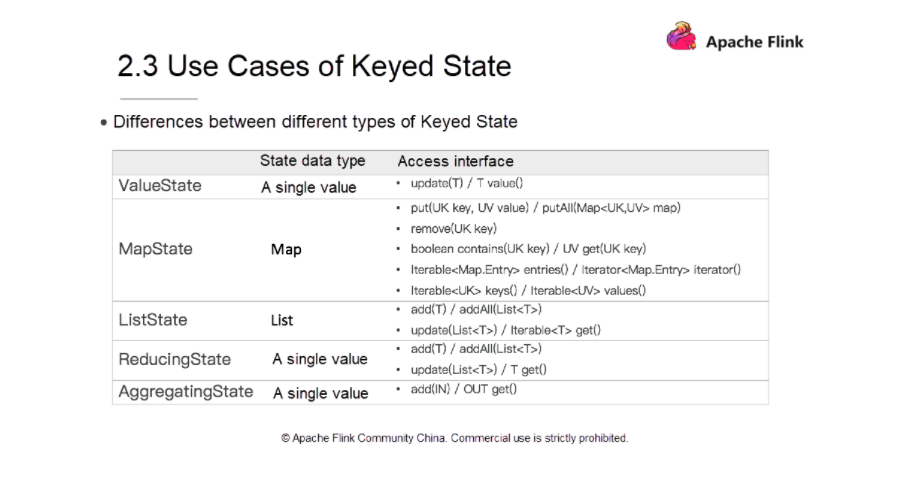

.. role:: todo

.. role:: raw-latex(raw)
            :format: latex html

==========================================
Przetwarzanie równoległe i strumieniowe
==========================================

.. class:: important 

    Uwaga! Kod z którego będziemy korzystać na zajęciach jest dostępny na branchu **ApacheFlinkStateStart** w repozytorium https://github.com/WitMar/PRS2020 . 

Jeżeli nie widzisz odpowiednich gałęzi na GitHubie wykonaj **Ctr+T**, a jak to nie pomoże to wybierz z menu **Git->Fetch**.   

State
============

Podczas gdy wiele operacji w przepływie danych po prostu patrzy na jedno pojedyncze zdarzenie na raz (na przykład analizator zdarzeń), niektóre operacje zapamiętują informacje z wielu zdarzeń (na przykład operatory okien). Te operacje są nazywane stanowymi.

Kilka przykładów operacji stanowych:

	| Gdy aplikacja wyszukuje określone wzorce zdarzeń, stan przechowuje sekwencję zdarzeń, które wystąpiły do ​​tej pory.
	| Podczas agregowania zdarzeń na minutę / godzinę / dzień stan przechowuje oczekujące agregaty.
	| Podczas uczenia modelu uczenia maszynowego w strumieniu punktów danych stan przechowuje bieżącą wersję parametrów modelu.
	| Gdy trzeba zarządzać danymi historycznymi, państwo umożliwia sprawny dostęp do zdarzeń, które miały miejsce w przeszłości.
	
Flink zachowuje stany, aby móc być odpornym na błędy przy użyciu punktów kontrolnych (checkpoints) i punktów zapisu (savepoints).

Wiedza o stanie pozwala również na przeskalowanie aplikacji Flink, gdyż ​​Flink zajmuje się redystrybucją stanu w równoległych instancjach.	

KeyState
=============

Interfejsy stanu z kluczem (keyState) zapewniają dostęp do różnych typów stanu, które są objęte zakresem klucza bieżącego elementu wejściowego. 

Typ stanu może być używany tylko w KeyedStream, który można utworzyć za pomocą stream.keyBy(…) w Java/Scala API lub stream.key_by(…) w Python API.

Typy stanów
============

Dostępne stany to:

	| **ValueState<T>**: zachowuje wartość, którą można aktualizować i pobierać Wartość można ustawić za pomocą update(T) i pobrać za pomocą T value().

	| **ListState<T>**: przechowuje listę elementów. Możesz dołączać elementy i pobierać Iterable nad wszystkimi aktualnie przechowywanymi elementami. Elementy są dodawane za pomocą add(T) lub addAll(List<T>), Iterable można pobrać za pomocą Iterable<T> get(). Możesz również nadpisać istniejącą listę za pomocą update(List<T>)

	| **ReducingState<T>**: zachowuje pojedynczą wartość, która reprezentuje agregację wszystkich wartości dodanych do stanu. Interfejs jest podobny do ListState, ale elementy dodane za pomocą add(T) są redukowane do agregatu przy użyciu określonej funkcji ReduceFunction.

	| **AggregingState<IN, OUT>**: Zachowuje pojedynczą wartość, która reprezentuje agregację wszystkich wartości dodanych do stanu. W przeciwieństwie do ReducingState typ agregatu może różnić się od typu elementów dodawanych do stanu. Interfejs jest taki sam jak w przypadku ListState, ale elementy dodawane za pomocą add(IN) są agregowane przy użyciu określonej funkcji AggregateFunction.

	| **MapState<UK, UV>**: To przechowuje listę mapowań. Możesz umieścić pary klucz-wartość w stanie i pobrać Iterable dla wszystkich aktualnie przechowywanych mapowań. Mapowania są dodawane za pomocą put(UK, UV) lub putAll(Map<UK, UV>). Wartość skojarzoną z kluczem użytkownika można pobrać za pomocą get(UK). Iterowalne widoki mapowań, kluczy i wartości można pobrać za pomocą odpowiednio wpisów(), kluczy() i wartości(). Możesz również użyć isEmpty(), aby sprawdzić, czy ta mapa zawiera mapowania klucz-wartość.

Wszystkie typy stanów posiadają również metodę clear(), która czyści stan dla aktualnie aktywnego klucza, czyli klucza elementu input.

.. class:: center
	
	|col|
	

Aby uzyskać uchwyt stanu, musisz utworzyć **StateDescriptor**. Zawiera on nazwę stanu (jak zobaczymy później, możesz utworzyć kilka stanów i muszą one mieć unikalne nazwy, aby można było się do nich odwoływać), typ wartości, które stan przechowuje i czasem funkcje użytkownika- określona funkcja, taka jak ReduceFunction. W zależności od typu stanu, który chcesz pobrać, tworzysz ValueStateDescriptor, ListStateDescriptor, AggregatingStateDescriptor, ReducingStateDescriptor lub MapStateDescriptor.

Dostęp do stanu uzyskuje się za pomocą RuntimeContext, poprzez implementacje tzw. **rich functions**. Rich functions zapewniają, oprócz funkcji zdefiniowanych przez użytkownika (map, reduce itp.), cztery metody: open, close, getRuntimeContext, and setRuntimeContext. 

Przykład
==========

Spójrz na klasę **counter.py**. Definiuje ona funkcję **map** w pythonie interfejs map jest dostępny tutaj

	| https://nightlies.apache.org/flink/flink-docs-release-1.5/api/java/org/apache/flink/streaming/python/api/functions/AbstractPythonUDF.html
	
Mamy metodę **map** która przyjmuje wartość ze strumienia. Ponadto w interfejsie nadrzędnym (rich function) zdefiniowano metodę **open** do inicjalizowania wartośći.

Sposób inicjalizacji funkcji. Jest wywoływany przed rzeczywistymi metodami (takimi jak map lub filter) i dlatego nadaje się do jednorazowej konfiguracji wartości. 

Obiekt konfiguracyjny przekazany do funkcji może być użyty do konfiguracji i inicjalizacji. Konfiguracja zawiera wszystkie parametry, które zostały skonfigurowane na funkcji w kompozycji programu.

Przykład dla open:

.. class:: highlight

.. code:: python

	public class MyMapper extends FilterFunction<String> {
 
		private String searchString;
     
		public void open(Configuration parameters) {
			this.searchString = parameters.getString("foo");
		}
     
		public boolean filter(String value) {
			return value.equals(searchString);
		}
	}

Stan pobieramy przez definicję nazwy i typu, oraz pobranie o z kontekstu

.. class:: highlight

.. code:: python

		state_desc = ValueStateDescriptor('cnt', Types.LONG())
		#assign value state to local argument
		self.cnt_state = runtime_context.get_state(state_desc)
		
Następnie jak podano wyżej na obiekcie state.cnt_state możemy wykonywać operacje value() i update()

.. class:: highlight

.. code:: python
		
		cnt = self.cnt_state.value()
		self.cnt_state.update(new_cnt)		
		
	| https://nightlies.apache.org/flink/flink-docs-release-1.15/api/python/_modules/pyflink/datastream/state.html		
		
Spójrz na klasę **aggregate.py**. 	

The following methods are mandatory for each AggregateFunction:

	| createAccumulator()
	| accumulate()
	| getValue()	
	
The following methods of AggregateFunction are required depending on the use case:

	| retract() is required for aggregations on bounded OVER windows.
	| merge() is required for many batch aggregations and session window aggregations.
	| resetAccumulator() is required for many batch aggregations.	
		
Musimy dodatkowo zmienić typo pobieranej z kontekstu zmiennej

.. class:: highlight

.. code:: python

	state_desc = AggregatingStateDescriptor('agg', CountAggregateFunction(), Types.LONG())
    # Define value state
    self.cnt_state = runtime_context.get_aggregating_state(state_desc)		

.. [*] Wykorzystano materiały z:
	
	| https://nightlies.apache.org/flink/flink-docs-master/docs/concepts/flink-architecture/
	| https://ourairports.com/data/
